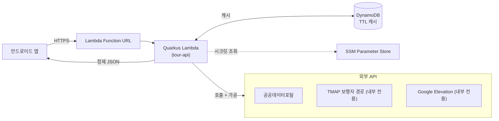
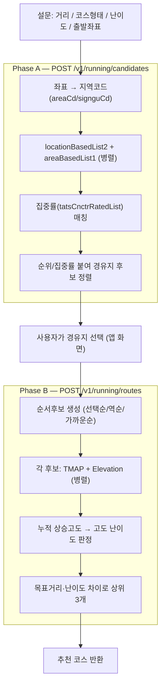

# tour-api

한국 관광 관련 공공/외부 API를 **서버에서 호출·가공해 앱에 깔끔한 JSON으로 내려주는 서버리스 백엔드**.

> 안드로이드 앱이 외부 API(공공데이터포털 · TMAP · Google)를 **직접** 호출하던 구조를,
> 서버가 대신 호출·가공하는 구조로 옮긴 프로젝트입니다.

---

## 1. 왜 만드나 (목적)

```
[기존]  앱 → 외부 API 직접 호출   (API 키가 앱에 노출 · 가공 로직이 앱에 · 응답이 무거움)

[목표]  앱 → 내 서버리스 API → 외부 API 호출 + 가공 → 정제된 JSON
```

얻는 것:

| 이점 | 설명 |
| --- | --- |
| **API 키 은닉** | 공공데이터 · TMAP · Google 키가 **서버에만** 존재 (앱에서 제거) |
| **가공 로직 서버화** | 복잡한 러닝 추천 흐름을 앱이 아닌 **서버가** 처리 |
| **응답 슬림화** | `CommonResponse` 통째 대신 앱에 필요한 필드만 정제 |
| **캐싱** | 외부 API 쿼터 보호 · 응답 속도 개선 |

---

## 2. 아키텍처



핵심 원칙:
- **routes** 는 얇게(파라미터 받기 → 응답), 실제 일은 **services**, 재사용 로직은 **lib**.
- 공공데이터 API의 지저분함(`items.item` 타입 들쭉날쭉, `mapX`/`mapx`, `resultCode`)은 전부 서버에 가둬서 앱은 깨끗한 JSON만 받는다.
- **TMAP · Google Elevation 키는 앱에 절대 노출하지 않고 서버 내부에서만** 사용.

---

## 3. 기술 스택

| 영역 | 선택 | 이유 |
| --- | --- | --- |
| 런타임 | **AWS Lambda** (`java21`) | 서버리스, 저트래픽 무료 |
| HTTP 노출 | **Lambda Function URL** | API Gateway(12개월 후 과금) 회피 → **무료 유지** |
| 언어 | **Java 21** | 기존 Java/Spring 경험 활용, Lambda `java21` 런타임과 일치 |
| 프레임워크 | **Quarkus** + `quarkus-amazon-lambda-http` | 빠른 콜드스타트(native image 가능), Function URL 지원 |
| REST | **RESTEasy (JAX-RS)** | `@Path` / `@GET` (Spring `@RestController`와 유사) |
| 빌드 | **Maven** | |
| 배포(IaC) | **AWS SAM** (`template.yaml`) | Java 1급 지원, Function URL · IAM 자동 생성 |
| 캐시 *(예정)* | **DynamoDB** (provisioned 25/25, TTL) | always-free 범위 |
| 시크릿 *(예정)* | **SSM Parameter Store** (standard) | 무료 |
| 리전 | **ap-northeast-2** (서울) | 한국 지연 최소화 |
| 콜드스타트 대응 *(예정)* | **native image** / SnapStart | JVM 콜드스타트(첫 호출 ~3.5s)를 ~수십 ms로 |

---

## 4. 감싸는 외부 API

| 구분 | API | 호출 URL | 노출 |
| --- | --- | --- | --- |
| 관광정보 | 위치기반 관광정보 | `KorService2/locationBasedList2` | 프록시 |
| 관광정보 | 행사정보 | `KorService2/searchFestival2` | 프록시 |
| 관광정보 | 상세 이미지 | `KorService2/detailImage2` | 프록시 |
| 걷기 | 두루누비 코스 | `Durunubi/courseList` | 프록시 |
| 오디오 | Odii 테마/스토리 | `Odii/themeSearchList` → `storyBasedList` | 프록시(2단계 체인) |
| 중심관광지 | 기초지자체 중심 관광지 | `LocgoHubTarService1/areaBasedList1` | 내부(러닝) |
| 집중률 | 관광지 집중률 추이 | `TatsCnctrRateService/tatsCnctrRatedList` | 내부(러닝) |
| 경로 | TMAP 보행자 경로 | `tmap/routes/pedestrian` | **🔒 내부 전용** |
| 고도 | Google Elevation | `maps/api/elevation/json` | **🔒 내부 전용** |

---

## 5. 엔드포인트 설계

| 메서드 | 경로 | 설명 | 감싸는 API | 상태 |
| --- | --- | --- | --- | --- |
| GET | `/hello` | 샘플(파이프라인 검증용) | — | ✅ 배포됨 (교체 예정) |
| GET | `/v1/tour/nearby` | 주변 관광지 조회 | locationBasedList2 | 🚧 계획 |
| GET | `/v1/tour/festivals` | 행사 조회 | searchFestival2 | 🚧 계획 |
| GET | `/v1/tour/images` | 상세 이미지 | detailImage2 | 🚧 계획 |
| GET | `/v1/tour/hubs` | 중심 관광지 | areaBasedList1 | 🚧 계획 |
| GET | `/v1/walking/courses` | 두루누비 코스 | courseList | 🚧 계획 |
| GET | `/v1/audio/search` | 오디오가이드 | themeSearch→story | 🚧 계획 |
| POST | `/v1/running/candidates` | 러닝 경유지 후보 (**Phase A**) | locationBased + areaBased + 집중률 | 🚧 계획 |
| POST | `/v1/running/routes` | 러닝 경로 추천 (**Phase B**) | TMAP + Elevation | 🚧 계획 |

---

## 6. 러닝 추천 흐름 (가장 복합적인 기능)

사용자 선택이 중간에 끼므로 **백엔드 호출이 2단계**로 나뉜다.



- **병렬 처리**: Phase B의 순서후보 3종은 동시 호출(외부 호출량·동시연결 한도 안에서).
- **TMAP/Elevation 내부화**: 앱은 두 API를 직접 호출하지 않는다(키 보호).
- 고도 난이도: km당 상승고도 10m 이하=하 / 25m 이하=중 / 초과=상.

---

## 7. 데이터 가공 원칙 (공공데이터 함정 → 서버가 흡수)

1. **`items.item` 타입 정규화** — 결과 여럿이면 배열, 1개면 객체, 0개면 `""`/없음 → 항상 배열로.
2. **`resultCode == "0000"` 체크** — HTTP 200이어도 실패일 수 있음.
3. **`mapX`/`mapx`, `mapY`/`mapy` 대소문자 정규화** → 앱은 항상 `lon/lat`만.
4. **serviceKey 인코딩 통일** — 이중 인코딩 시 `SERVICE_KEY_IS_NOT_REGISTERED_ERROR`.
5. **좌표 → 지역코드 변환** — 앱의 `Geocoder + AreaCodeMapper`를 서버로 이식 필요(서버엔 Android Geocoder 없음).

---

## 8. 무료 운영

| 서비스 | 무료 한도 | 비고 |
| --- | --- | --- |
| Lambda | 월 100만 요청 + 40만 GB-초 | always-free (Paid 플랜에서도 적용) |
| Function URL | 추가 비용 없음 | API Gateway 대신 사용 |
| DynamoDB | 25GB + 25 RCU/25 WCU | **provisioned 모드만** 무료(on-demand는 과금) |
| SSM Parameter Store | standard 무료 | SecureString 포함 |
| CloudWatch Logs | 월 5GB | 초과 시 소액 → 로그 보존 7~14일 권장 |
| Google Elevation | 월 5,000건(Pro 등급) | **유일한 유료 가능 지점** — Open-Meteo/OpenTopoData로 대체 가능 |

> AWS 신규 계정 정책(2025-07-15~): 신규는 크레딧 기반이지만 **always-free 한도는 유지**. 본 계정은 기존 계정 → Paid 플랜($200 크레딧 없음, always-free는 동일).

---

## 9. 프로젝트 구조

```
tour-api/
├─ pom.xml                                   # 의존성 (Quarkus 3.37 / java21)
├─ template.yaml                             # SAM: Lambda Function URL, runtime java21
├─ src/main/java/com/tourapi/
│  └─ GreetingResource.java                  # 샘플 엔드포인트 (/hello, 교체 예정)
└─ src/test/java/com/tourapi/
   ├─ GreetingTest.java
   └─ GreetingIT.java
```

향후 구조(계획): `routes/`(엔드포인트) · `services/`(외부 API 호출·가공) · `lib/`(정규화·거리계산·캐시·지역코드).

---

## 10. 개발 · 빌드 · 배포

**사전 요구**: JDK 21, Maven, AWS SAM CLI, AWS CLI(자격증명 설정), 리전 `ap-northeast-2`.
> ⚠️ Homebrew Maven이 JDK 25를 끌어올 수 있어, 빌드 시 `JAVA_HOME`을 21로 지정한다.

```bash
# 로컬 개발 (자동 리로드, 배포 불필요)
JAVA_HOME=$(/usr/libexec/java_home -v 21) mvn quarkus:dev
#   → http://localhost:8080/hello

# 빌드 (target/function.zip, target/sam.*.yaml 생성)
JAVA_HOME=$(/usr/libexec/java_home -v 21) mvn clean package

# 배포 (Function URL 출력됨)
sam deploy --template-file template.yaml --stack-name tour-api \
  --region ap-northeast-2 --capabilities CAPABILITY_IAM \
  --resolve-s3 --no-confirm-changeset

# 전체 제거
sam delete --stack-name tour-api --region ap-northeast-2
```

---

## 11. 현재 상태 & 로드맵

- [x] 프로젝트 셋업 (Quarkus + SAM + Function URL)
- [x] **hello world 배포 & 작동 확인** (`GET /hello` → 200, 콜드 ~3.5s / 워밍 ~52ms)
- [ ] 공통 유틸 (`items.item` 정규화 · resultCode 체크 · 응답 봉투)
- [ ] 시크릿(SSM) + 좌표→지역코드 이식
- [ ] 프록시 엔드포인트 (`/v1/tour/*`, walking, audio)
- [ ] 캐시(DynamoDB)
- [ ] 러닝 추천 Phase A / Phase B
- [ ] native image (콜드스타트 최적화)
- [ ] 앱 키 / rate limit (쿼터 보호)
