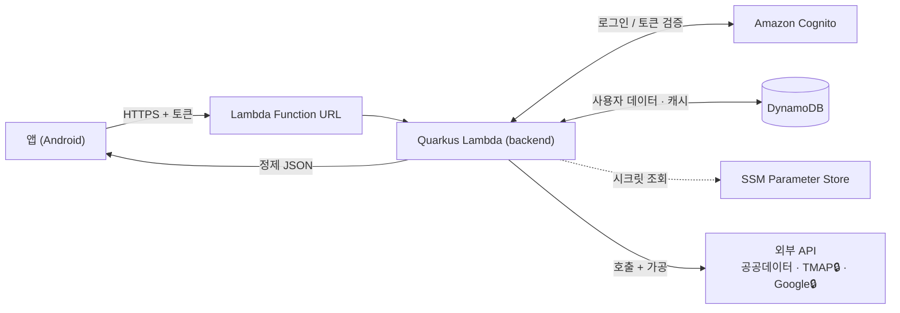
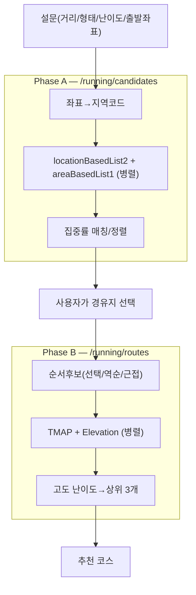

# backend

**한 앱의 전체 백엔드 서버 (서버리스).** 인증·로그인, 사용자 데이터(DB), 그리고 기능별 API를 한 곳에서 제공한다.

> 첫 기능 도메인은 **관광 / 러닝 추천**(공공데이터 · TMAP · Google 등 외부 API를 서버가 호출·가공).
> 이후 다른 기능도 같은 백엔드에 계속 추가한다. (관광은 "이 백엔드의 첫 번째 도메인"일 뿐, 전부가 아님)

---

## 1. 개요 & 범위

이 저장소는 특정 앱의 **백엔드 전체**다.

| 영역 | 내용 | 추가 기술 |
| --- | --- | --- |
| 🔐 인증/로그인 | 회원가입·로그인·토큰 검증 | Amazon Cognito *(예정)* |
| 🗄️ 데이터 | 사용자 데이터 *(예정)* · 응답 캐시 ✅ | DynamoDB |
| 🧩 기능 API | 첫 도메인=관광/러닝, 이후 확장 | Quarkus(JAX-RS) |
| 🔌 외부 API 프록시·집계 | 키 은닉 · 가공 · 캐싱 | — |

```
[기존]  앱 → 외부 API 직접 호출   (키 노출 · 가공 로직이 앱에 · 응답 무거움 · 사용자/DB 없음)
[목표]  앱 → 내 백엔드 → (인증 · DB · 외부 API 호출+가공) → 정제된 JSON
```

---

## 2. 아키텍처



원칙:
- **routes**(얇게) → **services**(외부 호출·가공) → **lib**(정규화·거리·캐시·지역코드) 계층 분리.
- 외부 API의 지저분함을 서버에 가둬서 앱은 깨끗한 JSON만 받는다.
- **TMAP · Google Elevation 키는 앱에 노출 안 함(서버 내부 전용).**

---

## 3. 기술 스택

| 영역 | 선택 | 이유 |
| --- | --- | --- |
| 런타임 | **AWS Lambda** (`java21`) | 서버리스, 저트래픽 무료 |
| HTTP 노출 | **Lambda Function URL** | API Gateway(12개월 후 과금) 회피 → 무료 유지 |
| 언어 | **Java 21** | 기존 Java/Spring 경험 활용, `java21` 런타임 일치 |
| 프레임워크 | **Quarkus** + `quarkus-amazon-lambda-http` | 빠른 콜드스타트(native 가능), Function URL 지원 |
| REST | **RESTEasy (JAX-RS)** | `@Path`/`@GET` |
| 인증/로그인 *(예정)* | **Amazon Cognito** | 관리형 사용자 풀, 토큰 |
| DB / 캐시 | **DynamoDB** (캐시 테이블 ✅ provisioned 5/5 + TTL · 사용자 데이터는 예정) | always-free |
| 시크릿 *(예정)* | **SSM Parameter Store** (standard) | 무료 |
| 빌드 / 배포 | **Maven** / **AWS SAM** (`template.yaml`) | Java 1급 지원 |
| 리전 | **ap-northeast-2** (서울) | 한국 지연 최소 |
| 콜드스타트 *(예정)* | native image / SnapStart | JVM 콜드(첫 ~3.5s) → ~수십 ms |

---

## 4. AWS 무료 한도 (이 백엔드가 쓰는 서비스)

> 핵심: 아래 **always-free** 항목은 **Free/Paid 플랜 둘 다, 기간 제한 없이** 적용된다. 본 계정은 기존 계정이라 **Paid 플랜**(가입 $200 크레딧 없음)이지만 always-free는 동일하게 받으므로 **저트래픽이면 청구액 0원**.

| 서비스 | 용도 | 무료 한도 | 영구? | 주의 |
| --- | --- | --- | --- | --- |
| **Lambda** | 서버 실행 | 100만 요청/월 + 40만 GB-초/월 | ✅ | Provisioned Concurrency/SnapStart 제외 |
| **Function URL** | HTTP 입구 | 추가 비용 없음 | ✅ | Lambda 호출료만 |
| **DynamoDB** | DB·캐시 | 25GB + 25 RCU + 25 WCU | ✅ | **provisioned 모드만** 무료(on-demand는 첫 요청부터 과금) |
| **Cognito** | 로그인/인증 | **10,000 MAU/월** (Lite·Essentials) | ✅ | Plus 등급은 무료 없음 · 외부 IdP(SAML/OIDC)는 50 MAU |
| **SSM Parameter Store** | 시크릿/설정 | standard 무료(10,000개·4KB, SecureString 포함) | ✅ | Advanced 등급·고TPS는 과금 |
| **CloudWatch Logs** | 로그 | 5GB 수집 + 5GB 저장/월 | ✅ | 초과 ~$0.50/GB → 로그 보존 7~14일 권장 |
| **S3** | 파일·배포물 | ⚠️ 기존 계정은 영구무료 아님 | ❌ | 배포물 수십MB=몇 센트 · 표준 ~$0.023/GB·월 |
| (옵션) SNS | 푸시/알림 | 100만 publish/월 | ✅ | 모바일 푸시는 별도 |

출처: [Lambda](https://aws.amazon.com/lambda/pricing/) · [DynamoDB](https://aws.amazon.com/dynamodb/pricing/) · [Cognito](https://aws.amazon.com/cognito/pricing/) · [Free Tier](https://aws.amazon.com/free/) (2026-06 확인)

---

## 5. 기능 도메인 #1 — 관광 / 러닝 추천

### 감싸는 외부 API
| 구분 | API | 노출 |
| --- | --- | --- |
| 관광정보 | `locationBasedList2` · `searchFestival2` · `detailImage2` | 프록시 |
| 걷기 | 두루누비 `courseList` | 프록시 |
| 오디오 | Odii `themeSearchList`→`storyBasedList` | 프록시(2단계) |
| 중심관광지/집중률 | `areaBasedList1` · `tatsCnctrRatedList` | 집중률은 `/popular`로 프록시 · `areaBasedList1`은 내부(러닝) |
| 경로/고도 | TMAP `pedestrian` · Google `elevation` | **🔒 내부 전용** |

### 엔드포인트
| 메서드 | 경로 | 설명 | 상태 |
| --- | --- | --- | --- |
| GET | `/hello` | 샘플(검증용) | ✅ 배포됨(교체 예정) |
| GET | `/v1/tour/places` · `/festivals` · `/images` · `/hubs` | 관광 프록시 | `/places` ✅ · 나머지 🚧 |
| GET | `/v1/tour/popular` | 좌표→시군구 인기 관광지 순위(집중률 30일 평균) | ✅ 배포됨 |
| GET | `/v1/walking/courses` · `/v1/audio/search` | 걷기·오디오 | 🚧 |
| POST | `/v1/running/candidates` (Phase A) | 경유지 후보(주변 관광지 + 집중률 순위 매칭) | ✅ 배포됨 |
| POST | `/v1/running/routes` (Phase B) | 코스 추천(TMAP 경로 + 고도 난이도, 최대 3개) | ✅ 배포됨 |

> 📱 **앱 연동은 [docs/app-api-flow.md](docs/app-api-flow.md)** — 앱이 부르는 건 러닝 2개뿐(호출 순서·요청/응답 예시·에러 처리 체크리스트).

### 러닝 추천 흐름 (사용자 선택이 중간에 껴서 2단계)


### 데이터 가공 원칙 (공공데이터 함정 → 서버가 흡수)
- `items.item` 정규화(배열/객체/빈값) · `resultCode=="0000"` 체크 · `mapX/mapx` 정규화 · serviceKey 인코딩 통일 · 좌표→지역코드(`AreaCodeMapper`) 서버 이식.

---

## 6. 프로젝트 구조

```
backend/  (로컬: /Users/mega/Downloads/tour-api  ← ASCII 경로, 한글 폴더 금지)
├─ pom.xml                         # Quarkus 3.37 / java21
├─ template.yaml                   # SAM: Lambda Function URL, runtime java21
├─ CLAUDE.md                       # 프로젝트 컨텍스트(작업 규칙·결정 기록)
└─ src/{main,test}/java/com/tourapi/GreetingResource.java ...
```
향후: `routes/` · `services/` · `lib/` 분리.

---

## 7. 개발 · 빌드 · 배포

> ⚠️ Homebrew Maven이 JDK 25를 끌어올 수 있어 빌드 시 `JAVA_HOME`을 21로 지정한다.

```bash
# 로컬 개발(자동 리로드)
JAVA_HOME=$(/usr/libexec/java_home -v 21) mvn quarkus:dev        # http://localhost:8080/hello

# 빌드
JAVA_HOME=$(/usr/libexec/java_home -v 21) mvn clean package

# 배포 (Function URL 출력)
sam deploy --template-file template.yaml --stack-name tour-api \
  --region ap-northeast-2 --capabilities CAPABILITY_IAM --resolve-s3 --no-confirm-changeset

# 제거
sam delete --stack-name tour-api --region ap-northeast-2
```

---

## 8. 현재 상태 & 로드맵

- [x] 서버리스 골조 + **hello world 배포·작동 확인** (`GET /hello` 200, 콜드 ~3.5s / 워밍 ~52ms)
- [ ] 공통 유틸(정규화·resultCode·응답 봉투) · 시크릿(SSM) · 좌표→지역코드
- [x] 캐시(DynamoDB, `/popular` 일 단위) — 나머지 프록시 엔드포인트(`/v1/tour/*` 등)는 진행 중
- [ ] **인증/로그인(Cognito)** · 사용자 데이터(DynamoDB)
- [ ] 러닝 추천 Phase A/B
- [ ] native image(콜드스타트) · rate limit(쿼터 보호)
