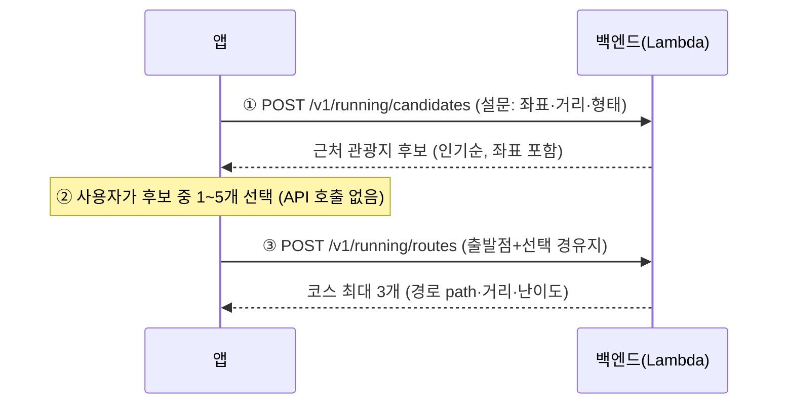

# 앱 API 호출 가이드 (러닝 코스 추천)

앱이 호출하는 API는 두 묶음이다:
- **코스 생성 플로우 2개** (아래 ①~③) — 설문으로 새 코스 만들기
- **편집 코스 카탈로그 2개** — 홈 피드·코스 상세 화면용 ([맨 아래 4️⃣](#4️⃣-편집-코스-카탈로그--get-v1courses) 참고)

생성 플로우 순서는 고정:

```
[화면1 설문] → ① POST /v1/running/candidates → [화면2 경유지 선택(앱 내부)] → ② POST /v1/running/routes → [화면3 코스 표시]
```



---

## 0. 공통

| 항목 | 값 |
| --- | --- |
| Base URL | `https://akt4wffwphw5czb3ofr2hy4hhm0emmil.lambda-url.ap-northeast-2.on.aws` |
| Content-Type | `application/json` (요청·응답 모두) |
| 인증 | 러닝 API는 현재 없음(공개). 계정/로그인 API는 [auth-api-flow.md](auth-api-flow.md) 참고 |
| API 문서 | Swagger UI `{BASE}/q/swagger-ui` · OpenAPI 스펙 `{BASE}/q/openapi?format=json` |

**에러 응답(공통 형식)** — 상태코드와 함께 항상 이 JSON:

```json
{ "error": "bad_request", "message": "lat 필수" }
```

| HTTP | error | 의미 / 앱 처리 |
| --- | --- | --- |
| 400 | `bad_request` | 요청 값 오류. `message`를 개발 중 확인(사용자에겐 일반 문구) |
| 502 | `upstream_error` | 외부 API(공공데이터·TMAP·Google) 실패. **재시도 1회 → 안내 토스트** |
| 500 | `internal_error` | 서버 오류. 안내 토스트 |

**타임아웃 권장**: HTTP 클라이언트 타임아웃 **30초**.
- ①번 API는 시군구당 **하루 첫 호출**만 느릴 수 있음(~10초, 서버가 그날 순위를 처음 집계·캐시). 이후엔 0.5~2초.
- 콜드스타트(서버 유휴 후 첫 호출) +4초쯤 추가될 수 있음.

---

## 1️⃣ 경유지 후보 — `POST /v1/running/candidates`

설문 값을 보내면, 희망 거리로 계산한 반경 안의 관광지를 **인기순(집중률 순위)** 으로 준다. 좌표가 포함되므로 이 응답이 그대로 ②의 입력 재료가 된다.

### 요청

```json
{
  "lat": 37.5665,
  "lng": 126.9780,
  "distanceKm": 5,
  "shape": "loop",
  "count": 10
}
```

| 필드 | 타입 | 필수 | 설명 |
| --- | --- | --- | --- |
| `lat` / `lng` | number | ✅ | 출발점(현재 위치 또는 지도에서 선택). lat -90~90, lng -180~180 |
| `distanceKm` | number | ✅ | 희망 러닝 거리(km). 0.5~50 |
| `shape` | string | | `loop`(출발지 복귀, **기본**) 또는 `oneway`(편도) |
| `count` | int | | 후보 개수. 기본 10, 최대 30 |

> 반경은 서버가 계산한다: loop면 거리의 1/3, oneway면 거리의 2/3 (예: 5km loop → 약 1.7km 반경).

### 응답 (실제 예시)

```json
{
  "lat": 37.5665, "lng": 126.978,
  "shape": "loop", "radiusM": 1667,
  "areaNm": "서울특별시", "signguNm": "중구",
  "count": 5,
  "items": [
    { "name": "명동", "lat": 37.562152093, "lng": 126.984915005,
      "distanceM": 782, "contentTypeId": 12,
      "addr": "서울특별시 중구 명동길 74 (명동2가)",
      "image": "http://tong.visitkorea.or.kr/.../image3_1.jpg",
      "popularityRank": 6, "popularityAvg": 84.2 },
    { "name": "서울 명동성당", "lat": 37.5633131117, "lng": 126.9872814233,
      "distanceM": 898, "contentTypeId": 12, "addr": "...",
      "image": null, "popularityRank": 11, "popularityAvg": 78.9 }
  ]
}
```

| 필드 | 설명 |
| --- | --- |
| `items[].name` | 관광지명 — 카드 제목 |
| `items[].lat/lng` | **②에 그대로 넘길 좌표** (지도 마커 위치) |
| `items[].distanceM` | 출발점에서 직선거리(m) — "782m" 뱃지 |
| `items[].contentTypeId` | 12 관광지 · 14 문화시설 · 28 레포츠 |
| `items[].image` | 썸네일 URL(**null 가능** — 플레이스홀더 준비) |
| `items[].popularityRank` | 시군구 내 인기 순위(1이 최고). **null 가능**(순위 데이터에 없는 곳) — null이면 뱃지 숨김 |
| `items[].popularityAvg` | 향후 30일 평균 집중률(참고 수치, null 가능) |

정렬은 서버가 이미 해줌: **인기순위 있는 것 우선(순위 오름차순) → 나머지는 가까운 순**. 앱은 받은 순서 그대로 리스트에 뿌리면 된다.

---

## 2️⃣ 경유지 선택 (앱 내부 — API 호출 없음)

- 사용자가 후보 중 **1~5개** 선택. **탭한 순서를 기억**할 것(그 순서가 ③의 "선택순" 코스가 된다).
- 선택 항목의 `name`, `lat`, `lng`를 그대로 보관.
- 후보에 없는 지점(사용자가 지도에서 직접 찍은 곳)을 섞어도 된다 — ③은 좌표 배열이면 동작.

---

## 3️⃣ 코스 계산 — `POST /v1/running/routes`

출발점 + 선택한 경유지를 보내면, 방문 순서 후보(선택순/역순/근접순)별로 실제 보행 경로와 고도를 계산해 **코스 최대 3개**를 준다.

### 요청

```json
{
  "start": { "lat": 37.5665, "lng": 126.9780 },
  "waypoints": [
    { "name": "명동", "lat": 37.562152093, "lng": 126.984915005 },
    { "name": "서울 명동성당", "lat": 37.5633131117, "lng": 126.9872814233 }
  ],
  "shape": "loop",
  "targetDistanceKm": 5
}
```

| 필드 | 타입 | 필수 | 설명 |
| --- | --- | --- | --- |
| `start.lat/lng` | number | ✅ | 출발점 (①과 같은 좌표 권장) |
| `waypoints[]` | array | ✅ | **1~5개**. `name`은 선택(없으면 "경유지N"으로 표기됨) |
| `shape` | string | | `loop`(기본) → 출발지로 복귀 / `oneway` → 마지막 경유지가 도착점 |
| `targetDistanceKm` | number | | 희망 거리. 주면 **이 거리에 가까운 코스부터** 정렬, 없으면 짧은 순 |

### 응답 (실제 예시)

```json
{
  "shape": "loop", "count": 2,
  "courses": [
    {
      "label": "선택순",
      "waypointOrder": ["명동", "서울 명동성당"],
      "distanceM": 2764,
      "walkDurationS": 2340,
      "ascentM": 25.7,
      "ascentPerKm": 9.3,
      "difficulty": "하",
      "path": [[37.56649, 126.97797], [37.56653, 126.97812], ...]
    },
    { "label": "역순", "waypointOrder": ["서울 명동성당", "명동"], ... }
  ]
}
```

| 필드 | 설명 / 앱 처리 |
| --- | --- |
| `label` | `선택순` / `역순` / `근접순` — 코스 카드 뱃지. 결과가 같은 순서는 서버가 제거하므로 1~3개만 옴 |
| `waypointOrder` | 방문 순서(이름) — "시청 → 명동 → 명동성당 → 시청" 문구 |
| `distanceM` | 총 거리(m) — "2.76 km" |
| `walkDurationS` | ⚠️ **도보 기준**(TMAP). 그대로 쓰지 말 것 → 아래 러닝 시간 환산 |
| `ascentM` / `ascentPerKm` | 누적 상승고도(m) / km당 상승 — "상승 26m" |
| `difficulty` | `하`/`중`/`상` (km당 상승 10m↓/25m↓/초과) — 색 뱃지 (예: 초록/노랑/빨강) |
| `path` | `[[lat,lng], ...]` 최대 200점 — **그대로 지도 Polyline**으로 그리면 됨 |

**러닝 예상 시간 환산(앱에서)**:

```
예상 시간(분) = distanceM / 1000 × 사용자 페이스(분/km)
예) 2764m, 페이스 6분/km → 약 17분
```

사용자가 코스를 고르면 그 `path`를 러닝 트래킹 화면으로 넘긴다.

---

## 에러/엣지 처리 체크리스트

- [ ] `image`, `popularityRank`, `popularityAvg`는 **null 가능** — NPE 주의 (Kotlin이면 nullable로 선언)
- [ ] ① 결과 `items`가 빈 배열일 수 있음(외진 곳) → "주변에 추천 장소가 없어요, 지도에서 직접 선택해 보세요"
- [ ] 502 → 1회 재시도 후 안내. 400은 앱 버그(검증 로직 확인)
- [ ] 타임아웃 30초 + 첫 호출 로딩 UI(스켈레톤) — 하루 첫 호출/콜드는 몇 초 걸림
- [ ] `waypoints` 6개 이상 선택 못 하게 UI에서 제한 (서버도 400으로 막음)

## 4️⃣ 편집 코스 카탈로그 — `GET /v1/courses`

홈 피드와 코스 상세 화면은 서버가 서빙하는 **수집본 원고**(42코스·24도시)를 쓴다.

| 호출 | 용도 | 응답 |
| --- | --- | --- |
| `GET /v1/courses` | 홈 피드 전체 | `{count, items:[요약]}` — 요약 = id·n·city·cityId·region·km·min·lv·mood·tags·headline·subhead·photo·photoTitle·photoLicense |
| `GET /v1/courses?city=서울` (또는 `city=seoul`) | 도시 탭 | 위와 동일(필터됨) |
| `GET /v1/courses/{id}` | 코스 상세 | 전체 필드 — 위 요약 + `url`(공유용) + `body[]`(어떤 길인지) · `deep[]`(더 알아두면) · `ops[]`(가기 전에) · `unsure[]`(확인 중) · `poi[]`(아래) |

**poi 항목 구조** (지나는 곳 1곳):

```json
{ "n": "노들섬", "d": "코인라커 있음. 500원 동전 필요",
  "photo": "https://tong.visitkorea.or.kr/...",   // null 가능 → 1/2 2/2 페이저 재료
  "addr": "서울특별시 용산구 양녕로 445",           // null 가능
  "lat": 37.5177, "lng": 126.9595,                 // null 가능 (지도 마커)
  "naver": "https://map.naver.com/p/search/노들섬", // 항상 있음 — 이름 아래 네이버지도 연결
  "nextM": 4719 }                                   // 다음 경유지까지 도보 m. null 가능(마지막/미확보)
```

- `url`: 코스 공유 기능에 그대로 사용(목록 요약에도 포함). 웹 상세 페이지가 생기면 서버 설정만 바꿔 교체
- `nextM`·`addr`·`lat/lng`는 **null 가능** — null이면 해당 UI(거리 뱃지·주소 줄)를 숨길 것
- id 예: `seoul-banpo-10k`, `busan-haeundae`. 없는 id → `404 {error:"not_found"}`
- 정적 번들 데이터라 응답이 빠르고(수십 ms + 콜드스타트) 업스트림 실패(502)가 없다
- 한글 city 파라미터는 **URL 인코딩** 필수 (iOS URLComponents 사용 시 자동)
- 사진 표기: `photoLicense`(공공누리) 문구를 상세 화면 하단에 노출할 것

## (참고) 앱에서 호출하지 않는 엔드포인트

`GET /v1/tour/places`(주변 관광지 거리순), `GET /v1/tour/popular`(시군구 인기 순위, 좌표 없음)는 **디버깅·향후 관광 화면용**으로만 유지 중. 러닝 플로우에서는 부르지 않는다.
