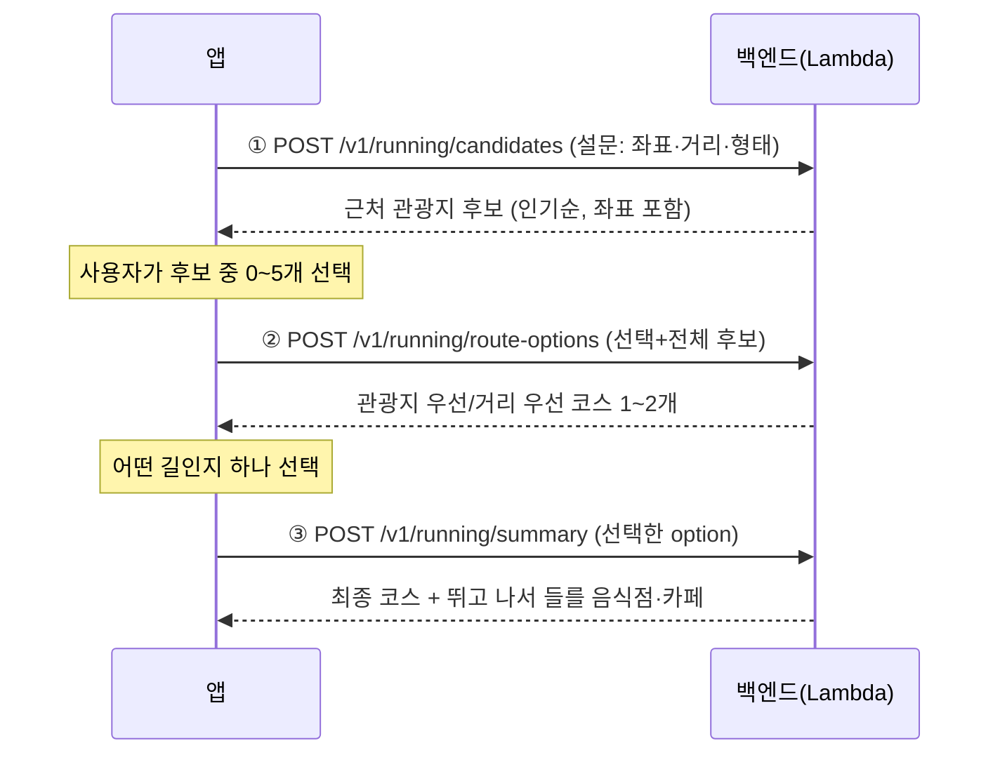

# 앱 API 호출 가이드 (러닝 코스 추천)

앱이 호출하는 API는 두 묶음이다:
- **코스 생성 플로우 3개** — 관광지 후보 → 코스 옵션 → 총정리
- **편집 코스 카탈로그 2개** — 홈 피드·코스 상세 화면용 ([맨 아래 5️⃣](#5️⃣-편집-코스-카탈로그--get-v1courses) 참고)

생성 플로우 순서는 고정:

```
[화면1 거리·왕복] → ① POST /v1/running/candidates → [화면2 관광지 선택]
→ ② POST /v1/running/route-options → [화면3 어떤 길인지 선택]
→ ③ POST /v1/running/summary → [화면4 총정리·맛집·카페]
```

## 앱 팀 전달사항 (보호 변경 배포 전 필수)

- `POST /v1/running/routes`와 `POST /v1/running/route-options` 요청에 `Authorization: Bearer <accessToken>`을 반드시 추가한다. 기존 `/routes`도 이제 무토큰이면 401이다.
- 두 생성 API는 사용자 기준 합산 분당 6회다. 429이면 `Retry-After: 60`을 따르고 생성 버튼을 잠시 비활성화한다.
- 앱 HTTP timeout은 30초로 둔다. 서버는 라우트 진입부터 22초 안에 끝내며 남은 시간이 소진되면 다음 TMAP·Elevation·Odii 호출을 시작하지 않는다.
- 401이면 refresh 토큰으로 access token을 갱신한 뒤 딱 1회만 재시도한다. 다시 401이면 로그인 화면으로 보낸다.
- `candidates`와 `summary`의 인증 계약은 바뀌지 않았다. 기존 `/routes`의 요청·응답 JSON도 그대로다.



---

## 0. 공통

| 항목 | 값 |
| --- | --- |
| Base URL | `https://akt4wffwphw5czb3ofr2hy4hhm0emmil.lambda-url.ap-northeast-2.on.aws` |
| Content-Type | `application/json` (요청·응답 모두) |
| 인증 | 실시간 생성 `routes`·`route-options`는 `Authorization: Bearer <accessToken>` 필수. 후보·총정리는 공개 |
| API 문서 | Swagger UI `{BASE}/q/swagger-ui` · OpenAPI 스펙 `{BASE}/q/openapi?format=json` |

Odii 도슨트는 공공데이터포털 `관광지 오디오 가이드정보_GW` 활용신청 후 배포 파라미터 `TourAudioEnabled=true`로 켠다. 꺼져 있거나 장애가 나도 코스 생성은 계속된다.

**애플리케이션 에러 응답(공통 형식)** — 400·429·500·502는 상태코드와 함께 이 JSON을 쓴다. 인증 필터가 먼저 차단하는 401은 응답 본문에 의존하지 않는다.

```json
{ "error": "bad_request", "message": "lat 필수" }
```

| HTTP | error | 의미 / 앱 처리 |
| --- | --- | --- |
| 400 | `bad_request` | 요청 값 오류. `message`를 개발 중 확인(사용자에겐 일반 문구) |
| 401 | — | 실시간 코스 생성 토큰 누락·만료. refresh 후 1회 재시도 |
| 429 | `rate_limited` | `routes`·`route-options` 합산 사용자별 분당 6회 초과. `Retry-After: 60` 뒤 재시도 |
| 502 | `upstream_error` | 외부 API(공공데이터·TMAP·Google) 실패. **재시도 1회 → 안내 토스트** |
| 500 | `internal_error` | 서버 오류. 안내 토스트 |

**타임아웃 권장**: HTTP 클라이언트 타임아웃 **30초**.
- ①번 API는 시군구당 **하루 첫 호출**만 느릴 수 있음(~10초, 서버가 그날 순위를 처음 집계·캐시). 이후엔 0.5~2초.
- 콜드스타트(서버 유휴 후 첫 호출) +4초쯤 추가될 수 있음.

---

## 1️⃣ 경유지 후보 — `POST /v1/running/candidates`

설문 값을 보내면, 희망 거리로 계산한 반경 안의 관광지를 **인기순(집중률 순위)** 으로 준다. 좌표가 포함되므로 이 응답이 그대로 ②의 입력 재료가 된다.

### 요청

```json
{
  "lat": 37.5665,
  "lng": 126.9780,
  "distanceKm": 5,
  "shape": "loop",
  "count": 10
}
```

| 필드 | 타입 | 필수 | 설명 |
| --- | --- | --- | --- |
| `lat` / `lng` | number | ✅ | 출발점(현재 위치 또는 지도에서 선택). lat -90~90, lng -180~180 |
| `distanceKm` | number | ✅ | 희망 러닝 거리(km). 0.5~50 |
| `shape` | string | | `loop`(출발지 복귀, **기본**) 또는 `oneway`(편도) |
| `count` | int | | 후보 개수. 기본 10, 최대 30 |

> 반경은 서버가 계산한다: loop면 거리의 1/3, oneway면 거리의 2/3. 최솟값 500m, 최댓값 20km다.

### 응답 (실제 예시)

```json
{
  "lat": 37.5665, "lng": 126.978,
  "shape": "loop", "radiusM": 1667,
  "areaNm": "서울특별시", "signguNm": "중구",
  "count": 5, "storyCount": 1,
  "items": [
    { "contentId": "264337", "name": "명동", "lat": 37.562152093, "lng": 126.984915005,
      "distanceM": 782, "contentTypeId": 12,
      "addr": "서울특별시 중구 명동길 74 (명동2가)",
      "image": "http://tong.visitkorea.or.kr/.../image3_1.jpg",
      "popularityRank": 6, "popularityAvg": 84.2, "storyAvailable": true },
    { "contentId": "264350", "name": "서울 명동성당", "lat": 37.5633131117, "lng": 126.9872814233,
      "distanceM": 898, "contentTypeId": 12, "addr": "...",
      "image": null, "popularityRank": 11, "popularityAvg": 78.9,
      "storyAvailable": false }
  ]
}
```

| 필드 | 설명 |
| --- | --- |
| `storyCount` | 반환 후보 중 Odii 도슨트가 있는 장소 수. 오디오 API 비활성/장애면 0 |
| `items[].contentId` | TourAPI 콘텐츠 ID. 화면 2에서 좌표와 함께 보관 |
| `items[].name` | 관광지명 — 카드 제목 |
| `items[].lat/lng` | **②에 그대로 넘길 좌표** (지도 마커 위치) |
| `items[].distanceM` | 출발점에서 직선거리(m) — "782m" 뱃지 |
| `items[].contentTypeId` | 12 관광지 · 14 문화시설 · 28 레포츠 |
| `items[].image` | 썸네일 URL(**null 가능** — 플레이스홀더 준비) |
| `items[].popularityRank` | 시군구 내 인기 순위(1이 최고). **null 가능**(순위 데이터에 없는 곳) — null이면 뱃지 숨김 |
| `items[].popularityAvg` | 향후 30일 평균 집중률(참고 수치, null 가능) |
| `items[].storyAvailable` | 해당 관광지에 도슨트가 있으면 true |

정렬은 서버가 이미 해줌: **인기순위 있는 것 우선(순위 오름차순) → 나머지는 가까운 순**. 앱은 받은 순서 그대로 리스트에 뿌리면 된다.

---

## 2️⃣ 경유지 선택 (앱 내부 — API 호출 없음)

- 사용자가 후보 중 **0~5개** 선택. 건너뛰면 서버가 전체 후보에서 가까운 곳을 자동 선택한다.
- 선택 항목뿐 아니라 ①에서 받은 전체 후보의 `name`, `lat`, `lng`도 ②에 보낸다.
- `storyAvailable`은 카드의 도슨트 유무 표시용이다. 대본·음성 URL은 이 단계에서 노출하지 않는다.

---

## 3️⃣ 어떤 길인지 — `POST /v1/running/route-options`

화면 2의 선택 결과를 보내면 다음 옵션을 최대 2개 반환한다.

이 요청은 로그인 토큰이 필요하다.

```http
Authorization: Bearer <accessToken>
Content-Type: application/json
```

- `waypoint_priority`: 고른 관광지를 모두 지나는 코스
- `distance_priority`: 경유지 조합을 바꿔 희망 거리에 가장 가까운 코스

```json
{
  "start": {"lat": 37.5665, "lng": 126.9780},
  "selectedWaypoints": [
    {"name": "SCC홀", "lat": 37.48, "lng": 127.00}
  ],
  "candidateWaypoints": [
    {"name": "SCC홀", "lat": 37.48, "lng": 127.00},
    {"name": "예술의전당", "lat": 37.47, "lng": 127.01}
  ],
  "shape": "loop",
  "targetDistanceKm": 3
}
```

`selectedWaypoints`는 최대 5개, `candidateWaypoints`는 최대 30개다. 둘 중 하나에는 값이 있어야 한다.

주요 응답 필드:

| 필드 | 설명 |
| --- | --- |
| `options[].strategy` | `waypoint_priority` 또는 `distance_priority` |
| `options[].course` | 거리·도보시간·고도·난이도·지도 path |
| `includedWaypoints` / `excludedWaypoints` | 실제 포함/제외된 관광지. 거리 우선 옵션에서 선택 장소가 빠질 수 있음 |
| `distanceErrorM` | 희망 거리와 실제 거리 차이 |
| `withinTolerance` | 희망 거리 ±10% 안이면 true. false면 제목도 “거리에 가장 가까워요”로 반환 |
| `storyCount` / `stories` | 실제 path 100m 안의 도슨트 수와 트리거 위치. 대본·음성 URL은 포함하지 않음 |
| `segments` | 출발지→경유지→도착지 구간별 거리 |

> 현재 거리 우선은 최대 12개 가까운 후보를 대상으로 Haversine 근사 빔 탐색을 수행한 뒤 상위 조합만 실제 지도 경로로 검증한다. 한 요청의 TMAP 호출은 관광지 우선 후보를 포함해 최대 5회다. 라우트 진입·호출 제한·캐시 조회부터 전체 22초 예산을 공유하고 TMAP·Elevation을 제한 병렬 처리한다. Lambda 30초 중 나머지는 JWT 검증·콜드스타트 여유다. ±10%를 보장하지 않으므로 반드시 `withinTolerance`를 확인한다.

동일 입력의 성공 응답은 5분 캐시된다. `routes`와 합산해 사용자별 분당 6회 제한이며 한도를 넘으면 `429`와 `Retry-After: 60`이 반환된다.

### 기존 앱 호환 — `POST /v1/running/routes`

응답 계약은 기존 앱을 위해 유지하지만 비용 보호를 위해 로그인 토큰은 필수다. 출발점 + 선택한 경유지를 보내면 선택순/역순/근접순별 코스를 최대 3개 반환한다. TMAP·Elevation 후보를 최대 3개 병렬 계산하고, `route-options`와 22초 예산·분당 6회 한도·동일 입력 5분 캐시를 공유한다. 신규 앱은 `/route-options`를 사용한다.

### 요청

```json
{
  "start": { "lat": 37.5665, "lng": 126.9780 },
  "waypoints": [
    { "name": "명동", "lat": 37.562152093, "lng": 126.984915005 },
    { "name": "서울 명동성당", "lat": 37.5633131117, "lng": 126.9872814233 }
  ],
  "shape": "loop",
  "targetDistanceKm": 5
}
```

| 필드 | 타입 | 필수 | 설명 |
| --- | --- | --- | --- |
| `start.lat/lng` | number | ✅ | 출발점 (①과 같은 좌표 권장) |
| `waypoints[]` | array | ✅ | **1~5개**. `name`은 선택(없으면 "경유지N"으로 표기됨) |
| `shape` | string | | `loop`(기본) → 출발지로 복귀 / `oneway` → 마지막 경유지가 도착점 |
| `targetDistanceKm` | number | | 희망 거리. 주면 **이 거리에 가까운 코스부터** 정렬, 없으면 짧은 순 |

### 응답 (실제 예시)

```json
{
  "shape": "loop", "count": 2,
  "courses": [
    {
      "label": "선택순",
      "waypointOrder": ["명동", "서울 명동성당"],
      "distanceM": 2764,
      "walkDurationS": 2340,
      "ascentM": 25.7,
      "ascentPerKm": 9.3,
      "difficulty": "하",
      "path": [[37.56649, 126.97797], [37.56653, 126.97812], ...]
    },
    { "label": "역순", "waypointOrder": ["서울 명동성당", "명동"], ... }
  ]
}
```

| 필드 | 설명 / 앱 처리 |
| --- | --- |
| `label` | `선택순` / `역순` / `근접순` — 코스 카드 뱃지. 결과가 같은 순서는 서버가 제거하므로 1~3개만 옴 |
| `waypointOrder` | 방문 순서(이름) — "시청 → 명동 → 명동성당 → 시청" 문구 |
| `distanceM` | 총 거리(m) — "2.76 km" |
| `walkDurationS` | ⚠️ **도보 기준**(TMAP). 그대로 쓰지 말 것 → 아래 러닝 시간 환산 |
| `ascentM` / `ascentPerKm` | 누적 상승고도(m) / km당 상승 — "상승 26m" |
| `difficulty` | `하`/`중`/`상` (km당 상승 10m↓/25m↓/초과) — 색 뱃지 (예: 초록/노랑/빨강) |
| `path` | `[[lat,lng], ...]` 최대 200점 — **그대로 지도 Polyline**으로 그리면 됨 |

**러닝 예상 시간 환산(앱에서)**:

```
예상 시간(분) = distanceM / 1000 × 사용자 페이스(분/km)
예) 2764m, 페이스 6분/km → 약 17분
```

사용자가 코스를 고르면 해당 `RouteOption` 전체를 ④에 넘긴다.

---

## 4️⃣ 총정리·맛집·카페 — `POST /v1/running/summary`

```json
{
  "option": { "...": "/route-options에서 선택한 option 객체 전체" },
  "nearbyRadiusM": 500
}
```

- 조회 기준점은 최종 `course.path`의 마지막 좌표다. loop면 출발점, oneway면 도착점이다.
- 한국관광공사 TourAPI 음식점(type 39)을 조회해 `restaurant`/`cafe`로 분류하고 최대 8곳을 반환한다.
- 카페는 이름의 카페·커피·베이커리·디저트 등의 키워드로 분류하므로 완전한 업종 분류는 아니다.
- TourAPI 음식점 조회 같은 예상된 외부 장애는 코스만 정상 응답하고 `nearbyCount:0`, `afterRunPlaces:[]`가 된다. 내부 코드 오류는 숨기지 않고 500으로 반환한다.

---

## 에러/엣지 처리 체크리스트

- [ ] `image`, `popularityRank`, `popularityAvg`는 **null 가능** — NPE 주의 (Kotlin이면 nullable로 선언)
- [ ] ① 결과 `items`가 빈 배열일 수 있음(외진 곳) → "주변에 추천 장소가 없어요, 지도에서 직접 선택해 보세요"
- [ ] `storyCount=0`은 주변 도슨트 없음뿐 아니라 Odii 비활성/장애도 포함
- [ ] 거리 우선 옵션은 `withinTolerance=false`일 수 있으므로 “딱 맞아요” 문구를 앱에서 고정하지 말 것
- [ ] 502 → 1회 재시도 후 안내. 400은 앱 버그(검증 로직 확인)
- [ ] 앱 HTTP 타임아웃 30초 + 첫 호출 로딩 UI(스켈레톤). `routes`·`route-options` 애플리케이션 예산은 라우트 진입부터 22초
- [ ] `waypoints` 6개 이상 선택 못 하게 UI에서 제한 (서버도 400으로 막음)

## 5️⃣ 편집 코스 카탈로그 — `GET /v1/courses`

홈 피드와 코스 상세 화면은 서버가 서빙하는 **수집본 원고**(64코스·32도시)를 쓴다.

| 호출 | 용도 | 응답 |
| --- | --- | --- |
| `GET /v1/courses` | 홈 피드 전체 | `{count, items:[요약]}` — 요약 = id·n·city·cityId·region·km·min·lv·mood·tags·headline·subhead·photo·photoTitle·photoLicense |
| `GET /v1/courses?city=서울` (또는 `city=seoul`) | 도시 탭 | 위와 동일(필터됨) |
| `GET /v1/courses/{id}` | 코스 상세 | 전체 필드 — 위 요약 + 원고·`poi[]` + 정적 `polyline`·`guide`·`checkpoints`(아래) |

**경로·안내·도슨트** — 64개 코스 모두 배열을 내려준다.

```json
{
  "routeShape": "loop",
  "distanceM": 5266,
  "walkDurationS": 4370,
  "ascentM": 31.4,
  "ascentPerKm": 6.0,
  "difficulty": "하",
  "polyline": [[35.1581445, 129.1583542], [35.1578, 129.1571]],
  "guide": [
    {"lat": 35.1581, "lng": 129.1583, "text": "50m 앞 우회전"}
  ],
  "checkpoints": [
    {
      "id": "busan-haeundae-1",
      "name": "동백섬",
      "lat": 35.1539199,
      "lng": 129.152185,
      "audioSeconds": 15,
      "description": "최치원이 시를 남긴 자리. 지금은 산책로가 섬을 한 바퀴 돈다."
    }
  ]
}
```

- `polyline`은 `[[위도, 경도], ...]`이며 2~200점이다. 앱은 이 배열이 2점 이상이면 시작 버튼을 열고 TMAP 보강을 호출하지 않는다.
- `guide`는 TMAP 보행 안내 지점이다. 다음 안내 지점에 접근할 때 `text`를 읽어 주는 데 쓴다.
- `checkpoints`는 실제 경로 100m 안의 지점이다. `description`은 응답에는 포함되지만 100m 트리거 전에는 화면에 노출하지 않는다.
- `audioSeconds`는 현재 원고 길이로 계산한 예상 낭독 시간이다. 음원 URL은 없으므로 앱의 TTS/기존 이야기 재생기를 사용한다.
- `walkDurationS`는 TMAP 도보 기준이다. 러닝 예상 시간에는 기존 `min` 또는 사용자 페이스 환산값을 쓴다.

**poi 항목 구조** (지나는 곳 1곳):

```json
{ "n": "노들섬", "d": "코인라커 있음. 500원 동전 필요",
  "photo": "https://tong.visitkorea.or.kr/...",   // null 가능 → 1/2 2/2 페이저 재료
  "addr": "서울특별시 용산구 양녕로 445",           // null 가능
  "lat": 37.5177, "lng": 126.9595,                 // null 가능 (지도 마커)
  "naver": "https://map.naver.com/p/search/노들섬", // 항상 있음 — 이름 아래 네이버지도 연결
  "nextM": 4719 }                                   // 다음 경유지까지 도보 m. null 가능(마지막/미확보)
```

**주변 맛집·카페** — `GET /v1/courses/{id}/nearby[?radius=1500]`

코스 상세 화면의 "주변 식당·카페" 영역용. 상세 본문과 **병렬로 호출**하면 된다(느려도 본문은 먼저 뜬다).

```json
{ "courseId": "seoul-banpo-10k", "basedOn": "잠수교",
  "lat": 37.512861, "lng": 126.997353, "radiusM": 1500, "count": 5,
  "items": [
    { "kind": "restaurant", "name": "○○식당", "addr": "...", "lat": 37.51, "lng": 126.99,
      "distanceM": 941, "tel": "02-...", "image": null,
      "trust": "verified", "category": "한식>육류,고기",
      "link": "https://...", "source": "한국관광공사 TourAPI · 네이버" } ] }
```

| `trust` | 뜻 | 앱 표시 제안 |
| --- | --- | --- |
| `verified` | 관광공사·네이버 **양쪽에 있는 곳** (교차검증됨) | 상단 배치, "검증됨" 뱃지 |
| `trending` | 네이버 리뷰 상위인데 관광공사엔 없음 (**최근 뜬 곳**) | "요즘 인기" 뱃지 |
| `tour` | 관광공사에만 있음 | 뱃지 없음 |

- 정렬은 서버가 이미 함: **교차검증된 곳(verified)만 맨 앞**, 나머지는 거리순. 식당·카페가 한쪽으로 쏠리지 않게 균형을 맞춘다
- `category`·`link`·`image`·`tel`·`distanceM`은 **null 가능**
- 하루 단위 캐시라 두 번째 호출부터는 즉시 응답
- 좌표를 확보하지 못한 코스는 `count: 0`, `basedOn: null`로 내려간다(에러 아님) — 이 영역을 숨기면 된다
- `url`: 코스 공유 기능에 그대로 사용(목록 요약에도 포함). 웹 상세 페이지가 생기면 서버 설정만 바꿔 교체
- `nextM`·`addr`은 **null 가능** — null이면 해당 UI(거리 뱃지·주소 줄)를 숨길 것. 현재 64개 코스는 좌표가 있는 POI를 최소 2곳씩 갖는다
- id 예: `seoul-banpo-10k`, `busan-haeundae`. 없는 id → `404 {error:"not_found"}`
- 정적 번들 데이터라 응답이 빠르고(수십 ms + 콜드스타트) 업스트림 실패(502)가 없다
- 한글 city 파라미터는 **URL 인코딩** 필수 (iOS URLComponents 사용 시 자동)
- 사진 표기: `photoLicense`(공공누리) 문구를 상세 화면 하단에 노출할 것

## (참고) 앱에서 호출하지 않는 엔드포인트

`GET /v1/tour/places`(주변 관광지 거리순), `GET /v1/tour/popular`(시군구 인기 순위, 좌표 없음)는 **디버깅·향후 관광 화면용**으로만 유지 중. 러닝 플로우에서는 부르지 않는다.
