# 화면 명세

화면 22개. 실측 좌표는 375×812 기준 pt.

## 목차

**진입** — [로그인](#login) · [약관 동의](#agree) · [온보딩](#onb)
**탐색** — [홈](#home) · [코스 상세](#detail) · [검색](#search) · [도시 추가](#addcity) · [테마 · 필터 결과](#theme)
**생성** — [생성 · 거리](#gen) · [생성 · 꼭 지날 곳](#pick) · [생성 · 만드는 중](#making) · [생성 실패](#fail)
**러닝** — [러닝 준비](#ready) · [러닝 중](#run) · [잠금화면 · Live Activity](#lock) · [러닝 완료](#done)
**내 것** — [마이페이지](#my) · [설정](#setting) · [목록 (저장·기록·이야기)](#list2) · [러닝 기록 상세](#rec)
**공유** — [공유 · 스토리 카드](#story)
**기타** — [위치 권한](#perm)

---

# 진입

## 로그인 `login`

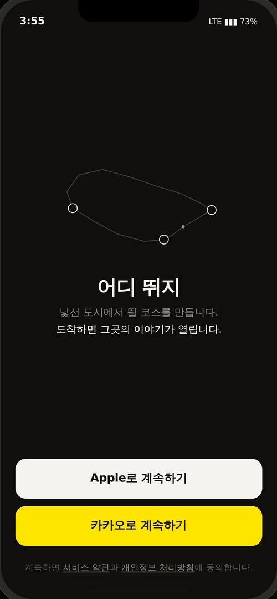

> 제품을 4초에 설명하고 인증 수단을 고른다

### 구성 요소

| 요소 | 설명 |
|---|---|
| 경로 애니메이션 | 경주 3km 실제 좌표. 그리기 3s → 달리기 5.6s → 유지 2.4s → 되감기 1.8s, 무한 순환 |
| 워드마크 + 두 줄 | 어디 뛰지 / 낯선 도시에서 뛸 코스를 만듭니다 · 도착하면 그곳의 이야기가 열립니다 |
| Apple로 계속하기 | 흰 버튼. 어두운 배경에서 가장 밝아 카카오보다 먼저 읽힘 |
| 카카오로 계속하기 | #FEE500 고정. 브랜드 가이드상 유일한 색 예외 |
| 약관 안내 문구 | 묵시적 동의가 아니라 다음 화면에서 명시 동의를 받는다 |

### 실측 레이아웃

| 요소 | 선택자 | x, y | 크기 | 기타 |
|---|---|---|---|---|
| 경로 애니메이션 | `.lh svg` | 68, 207 | **240×143** | — |
| 워드마크 | `.lbrand h1` | 75, 376 | **225×27** | 27px / 600 |
| 태그라인 | `.lbrand p` | 75, 413 | **225×46** | 14px / None |
| Apple 버튼 | `.lapple` | 20, 622 | **335×54** | 15.5px / 600 · radius 14px |
| 카카오 버튼 | `.lkakao` | 20, 686 | **335×54** | 15.5px / 600 · radius 14px |
| 약관 문구 | `.llegal` | 22, 760 | **331×18** | 11.5px / None |

### 동작 규칙

- 버튼과 텍스트는 애니메이션 완료를 기다리지 않는다 (0.95s / 1.1s 등장)
- prefers-reduced-motion이면 최종 상태만 정적 표시
- Apple 먼저 붙이고 카카오는 나중에 붙여도 화면이 흔들리지 않아야 함

### iOS 구현

- ASAuthorizationAppleIDProvider
- 이름·이메일은 첫 로그인 단 한 번만 전달 → Keychain 저장 필수
- 이메일 가리기 시 릴레이 주소. 사용자 식별은 user identifier로
- 카카오 이메일은 비즈 앱 전환·검수 필요

## 약관 동의 `agree`

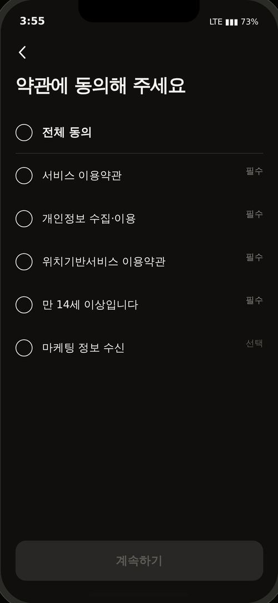

> 국내 법 요건을 만족하는 명시 동의를 받는다

### 구성 요소

| 요소 | 설명 |
|---|---|
| 전체 동의 | 선택 항목까지 켜지지만 CTA 활성 조건에는 영향 없음 |
| 서비스 이용약관 · 필수 | — |
| 개인정보 수집·이용 · 필수 | — |
| 위치기반서비스 이용약관 · 필수 | 근거 법이 달라 개인정보와 분리 |
| 만 14세 이상입니다 · 필수 | 개인정보보호법. 미만은 가입 차단 |
| 마케팅 정보 수신 · 선택 | 기본 꺼짐. 안 해도 진행 가능 |

### 실측 레이아웃

| 요소 | 선택자 | x, y | 크기 | 기타 |
|---|---|---|---|---|
| 제목 | `.permh` | 20, 98 | **335×33** | 25px / 700 |
| 전체 동의 | `.agall` | 20, 151 | **335×56** | 15.5px / 600 |
| 항목 행 | `.agrow` | 20, 207 | **335×58** | — |
| 체크 링 | `.agck` | 20, 167 | **23×23** | 15.5px / 600 · radius 50% |
| CTA | `#aggo` | 20, 728 | **335×54** | 15.5px / 600 · radius 14px |

### 동작 규칙

- 필수 4개가 모두 켜져야 계속하기 활성
- 선택 항목 기본값은 반드시 꺼짐
- 체크 표현은 빈 링 = 미동의 / 채운 원 = 동의 (앱 전체 공통 어휘)

### iOS 구현

- 동의 시각과 항목을 저장해야 분쟁 시 증빙 가능
- 출시 전 약관 3종 문서 작성·호스팅 필요
- 방통위 위치기반서비스사업 신고 (소상공인은 개시 후 1개월 유예)

## 온보딩 `onb`

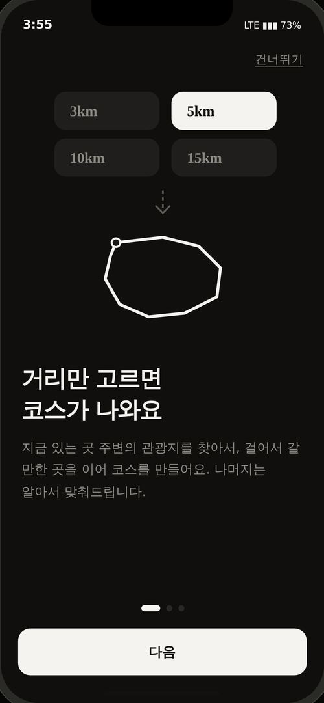

> 홈이 피드라서 안 보이는 핵심 기능 3개를 알린다

### 구성 요소

| 요소 | 설명 |
|---|---|
| 1장 · 거리만 고르면 코스가 나와요 | 거리 칩 4개 중 5km 선택 → 화살표 → 코스. 실제 UI를 그대로 그림 |
| 2장 · 도착하면 이야기가 열려요 | 100m 점선 반경 + 체크. 재방문 동기를 명시 |
| 3장 · 전국 코스를 도시별로 담아요 | 도시 탭과 목록 |
| 건너뛰기 | 마지막 장에서는 숨김 |
| 점 인디케이터 | 현재 장은 알약 형태로 늘어남 |

### 실측 레이아웃

| 요소 | 선택자 | x, y | 크기 | 기타 |
|---|---|---|---|---|
| 설명 그림 | `.onbvis` | 24, 98 | **327×290** | — |
| 제목 | `.onbh` | 24, 420 | **327×71** | 27px / 700 |
| 본문 | `.onbd` | 24, 505 | **327×76** | 15px / None |
| 인디케이터 | `.onbdots` | 20, 699 | **335×7** | — |
| CTA | `#onbnext` | 20, 726 | **335×54** | 15.5px / 600 · radius 14px |

### 동작 규칙

- 첫 실행에만 노출. 이후 스킵
- 설명 그림은 실제 화면 형태를 재사용해 학습이 이어지게 함

### iOS 구현

- UserDefaults 플래그로 1회 노출 관리

---

# 탐색

## 홈 `home`

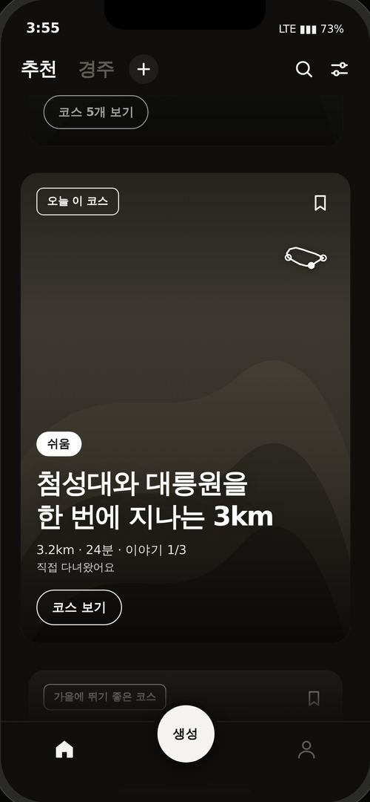

> 달릴 만한 것을 고르고, 생성 입구를 항상 노출한다

### 구성 요소

| 요소 | 설명 |
|---|---|
| 상단 탭 | 추천 + 내가 추가한 도시 + [+]. 가로 스크롤 |
| 검색 아이콘 | 코스명과 지나는 유적을 함께 색인 |
| 필터 아이콘 | 성격·거리·강도·이야기 시트 |
| 대형 카드 세로 캐러셀 | 화면 중앙 스냅. 사진 위에 배지·저장·경로선·태그·제목·CTA |
| 중앙 생성 버튼 | 탭바 위로 16pt 솟은 흰 원. 배경색 링 5pt |
| 탭바 | 홈 · (생성) · 마이. 평평한 아이콘 |

### 실측 레이아웃

| 요소 | 선택자 | x, y | 크기 | 기타 |
|---|---|---|---|---|
| 상단 바 | `.topbar` | 0, 44 | **375×52** | — |
| 탭 스트립 | `.tabs` | 0, 55 | **271×30** | — |
| 대형 카드 | `.card` | 28, -2273 | **318×452** | 13.3333px / None · radius 18px |
| 카드 제목 | `.ctitle` | 44, -1990 | **288×64** | 27px / 700 |
| 카드 CTA | `.cbtn` | 44, -1872 | **83×34** | 12.5px / 600 · radius 100px |
| 생성 버튼 | `.gen` | 159, 714 | **58×58** | 13.3333px / None · radius 50% |
| 탭바 | `.tabbar` | 0, 730 | **375×82** | — |

### 동작 규칙

- 카드는 중앙 스냅 + 무한 순환 (목록 3벌, 양 끝에서 한 벌만큼 되돌림)
- 중앙에서 멀어질수록 5%까지 축소, 42%까지 흐려짐
- 홈은 위치 권한을 요구하지 않는다 → 카드에 '내 위치에서 N km' 표기 금지, 지역명 사용
- 테마 카드는 목록으로, 코스 카드는 상세로 분기

### iOS 구현

- 재사용 셀 필수. 3벌 × N장을 메모리에 올리면 안 됨
- 무한 순환 위치 보정은 scrollViewDidEndDecelerating에서

## 코스 상세 `detail`

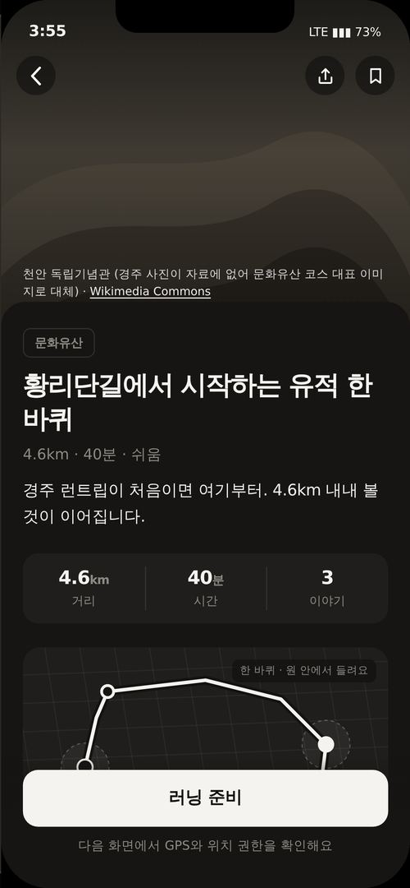

> 실제로 뛸 만한지 판단하게 한다

### 구성 요소

| 요소 | 설명 |
|---|---|
| 사진 히어로 300pt | 경유지 사진 + 출처 표기(CC BY-SA는 촬영자 표기 필요) |
| 상단 바 | 150pt 스크롤 시 불투명 전환 + 코스명 등장. 뒤로·공유·저장 |
| 제목·태그·3분할 수치 | 거리 · 시간 · 이야기 |
| 지도 카드 212pt | 코스 성격별 6형태. 체크포인트 100m 반경 점선 |
| 어떤 길인지 | 원고 본문. 없으면 요약 문장 |
| 추천 흐름 | 세로 타임라인 |
| 이야기 N곳 | 열린 것은 내용+듣기, 잠긴 것은 '도착하면 들을 수 있어요'만 |
| 가기 전에 알아두면 좋아요 | 혼잡·조명·자전거 겸용·짐 보관 |
| 얼마나 확인된 코스인가요 | 3단계 문장 + 원 하나. 내부 6단계를 사용자 말로 변환 |
| 아직 확인 중인 것 | 미검증 항목. 현장 확인 체크리스트가 됨 |
| 러닝 준비 CTA | routed=false면 '코스 정보만 볼 수 있어요'로 비활성 |

### 실측 레이아웃

| 요소 | 선택자 | x, y | 크기 | 기타 |
|---|---|---|---|---|
| 사진 히어로 | `.dhero` | 0, 0 | **375×300** | — |
| 상단 바 | `.dtopbar` | 0, 44 | **375×50** | — |
| 시트 | `.dsheet` | 0, 276 | **375×536** | radius 22px 22px 0px 0px |
| 제목 | `.dtitle` | 20, 337 | **335×62** | 24px / 700 |
| 3분할 | `.dstats` | 20, 506 | **335×64** | radius 14px |
| 지도 카드 | `.dmapcard` | 20, 592 | **335×212** | radius 16px |
| 이야기 행 | `.st` | 20, 1208 | **335×68** | — |
| CTA | `.dcta` | 20, 704 | **335×52** | 15.5px / 600 · radius 14px |

### 동작 규칙

- routed=false → 지도 경로 점선, GPX 잠금, CTA 비활성
- 이야기 잠긴 항목의 내용은 절대 노출하지 않는다 (제품의 핵심)
- poi·total이 없으면 해당 섹션 자체를 숨긴다

### iOS 구현

- MapKit 안정 모드 우선, TMAP 네이티브는 후속 (ADR-001 크래시 이력)

## 검색 `search`

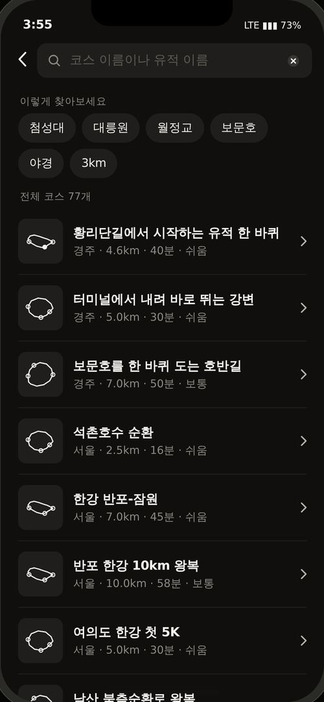

> 코스명이 아니라 가고 싶은 장소로 찾는다

### 구성 요소

| 요소 | 설명 |
|---|---|
| 검색 필드 | 코스 이름이나 유적 이름 |
| 추천어 칩 | 첨성대·대릉원·월정교·보문호·야경·3km |
| 결과 행 | 일치 부분 강조 + 'N 경유' 표시 + 도시명 |
| 결과 없음 | 다른 유적으로 찾기 또는 생성으로 유도 |

### 실측 레이아웃

| 요소 | 선택자 | x, y | 크기 | 기타 |
|---|---|---|---|---|
| 검색 바 | `.searchbar` | 0, 44 | **375×52** | 16px / 400 |
| 검색 필드 | `.sfield` | 42, 50 | **319×40** | 16px / 400 · radius 11px |
| 결과 행 | `.hit` | 20, 131 | **335×76** | 13.3333px / 400 |
| 썸네일 | `.hit .th` | 20, 143 | **52×52** | 13.3333px / 400 · radius 9px |

### 동작 규칙

- 코스명·무드·경유 유적을 모두 색인
- 색인은 전체 코스 목록에서 파생 (별도 목록 금지)

### iOS 구현

- ADR-025 단일 출처 원칙. 목록을 두 개 두면 이름이 어긋난다

## 도시 추가 `addcity`

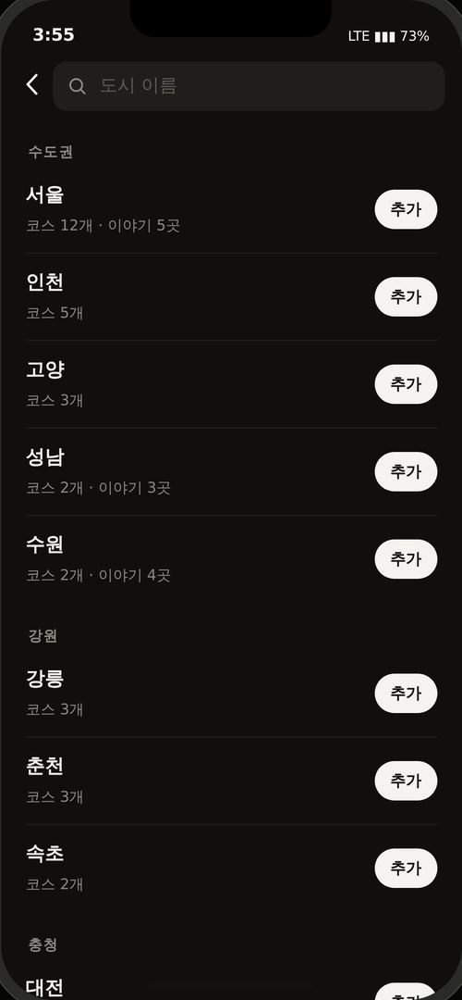

> 관심 있는 도시만 탭에 남긴다

### 구성 요소

| 요소 | 설명 |
|---|---|
| 검색 필드 | 도시 이름 |
| 권역별 목록 | 수도권·강원·충청·전라·경상·부산·제주. 코스 수와 이야기 수 |
| 추가 / 추가됨 토글 | — |
| 없는 도시 | 준비 중 안내 + 알림 신청 |

### 실측 레이아웃

| 요소 | 선택자 | x, y | 크기 | 기타 |
|---|---|---|---|---|
| 검색 바 | `.searchbar` | 375, 44 | **375×52** | 16px / 400 |
| 권역 라벨 | `.rglabel` | 22, 116 | **331×15** | 11.5px / 600 |
| 도시 행 | `.crow` | 20, 135 | **335×70** | 16px / 400 |
| 추가 버튼 | `.addbtn` | 304, 154 | **52×32** | 12.5px / 600 · radius 100px |

### 동작 규칙

- 도시를 미리 깔지 않는다 → 탭이 넘치지 않음
- 알림 신청은 다음에 어느 도시를 열지 정하는 데이터로 축적
- 최소 한 도시는 유지 (전부 지우면 앱이 빈다)

### iOS 구현

- 추가한 도시 목록은 기기 간 이어져야 하는 값 → 로그인의 실질적 이유

## 테마 · 필터 결과 `theme`

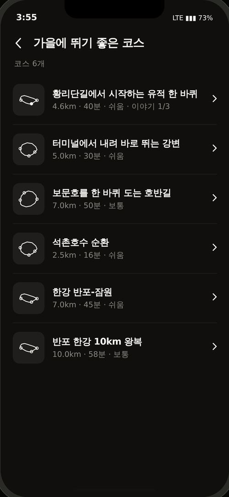

> 조건에 맞는 코스를 모아 보여준다

### 구성 요소

| 요소 | 설명 |
|---|---|
| 제목 | 테마명 또는 '골라 본 코스' |
| 조건 요약 | 적용한 필터와 결과 개수 |
| 코스 행 | 썸네일 + 이름 + 거리·시간·강도·이야기 |
| 빈 상태 | 조건 넓히기 또는 코스 만들기 |

### 실측 레이아웃

| 요소 | 선택자 | x, y | 크기 | 기타 |
|---|---|---|---|---|
| 상단 바 | `.nav2` | 375, 44 | **375×52** | 16px / 400 |
| 조건 요약 | `.mysec` | 397, 271 | **331×17** | 12.5px / 500 |
| 행 | `.rec` | -77, 96 | **335×80** | 13.3333px / 400 |
| 썸네일 | `.rec .rth` | -77, 110 | **52×52** | 13.3333px / 400 · radius 11px |

### 동작 규칙

- 행을 누르면 코스 상세로 이동
- 결과가 0건이면 필터 시트의 적용 버튼 자체가 비활성
- 테마 카드와 필터가 같은 화면을 공유한다

### iOS 구현

- 전체 코스 색인에서 필터링 (별도 목록을 두면 이름이 어긋난다)

---

# 생성

## 생성 · 거리 `gen`

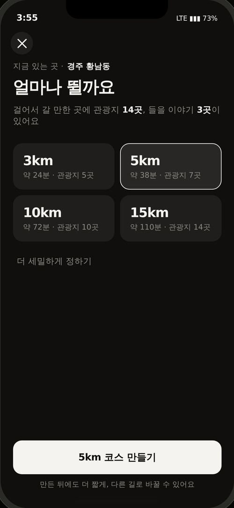

> 묻는 것을 하나로 줄인다

### 구성 요소

| 요소 | 설명 |
|---|---|
| 현재 위치 | 역지오코딩 결과. 조회 중에는 '위치를 확인하고 있어요' |
| 주변 요약 | locationBasedList 결과. 관광지 N곳 · 이야기 N곳 |
| 거리 칩 4개 | 3·5·10·15km. 각 칩에 예상 시간과 실현 가능성 |
| 더 세밀하게 정하기 | 무드·강도·오디오. 접힘 기본. '안 고르면 …로 맞춰요' 명시 |
| 코스 만들기 | 거리 선택 전 비활성 |

### 실측 레이아웃

| 요소 | 선택자 | x, y | 크기 | 기타 |
|---|---|---|---|---|
| 질문 | `.gq` | 20, 123 | **335×35** | 27px / 700 |
| 거리 칩 영역 | `.gdist` | 20, 229 | **335×157** | — |
| 거리 칩 | `.gcard` | 20, 229 | **163×74** | 13.3333px / None · radius 15px |
| CTA | `#gmake` | 20, 704 | **335×54** | 15.5px / 600 · radius 14px |

### 동작 규칙

- 묻는 것은 거리 하나. 무드는 분류 코드 분포, 강도는 고저차, 오디오는 API 결과로 결정
- 주변 관광지가 부족한 거리는 고르기 전에 비활성 + 이유 표시
- 조회가 느려도 막지 않는다 → 칩 먼저 표시, 값은 나중에 채움

### iOS 구현

- locationBasedList2(mapX, mapY, 거리·형태별 동적 반경 500m~20km, contentTypeId=12·14·28)
- cat1·cat2·cat3 분포로 무드 유도

## 생성 · 꼭 지날 곳 `pick`

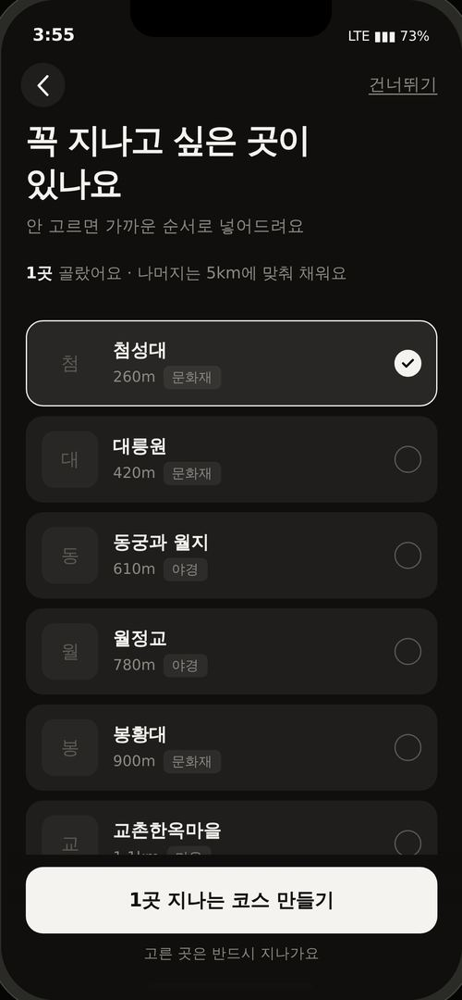

> 원하는 사람만 경유지를 지정한다

### 구성 요소

| 요소 | 설명 |
|---|---|
| 건너뛰기 | 우상단. 기본 경로 |
| 경유지 목록 | 집중률 인기순 우선, 순위 없는 곳은 가까운 순. 사진 썸네일 + 거리 + 분류 |
| 선택 개수 안내 | 권장보다 많으면 '더 길어질 수 있어요' 경고 |
| CTA | N곳 지나는 코스 만들기 / 알아서 골라 만들기 |

### 실측 레이아웃

| 요소 | 선택자 | x, y | 크기 | 기타 |
|---|---|---|---|---|
| 경유지 행 | `.pitem` | 20, 260 | **335×70** | 13.3333px / None · radius 14px |
| 썸네일 | `.pthumb` | 33, 272 | **46×46** | 13.3333px / None · radius 10px |
| CTA | `#pmake` | 20, 704 | **335×54** | 15.5px / 600 · radius 14px |

### 동작 규칙

- `waypoint_priority`는 고른 곳만 반드시 경유한다. 자동으로 다른 장소를 채우지 않는다
- `distance_priority`는 거리 오차를 줄이기 위해 선택 장소 일부를 제외하거나 다른 후보를 사용할 수 있다
- 권장 초과를 막지 않는다. 대신 실제 거리가 늘어난다 (곳당 약 0.55km)

### iOS 구현

- 서버가 정렬한 순서(집중률 순위 우선 → 나머지 `dist` 가까운 순)를 유지. `firstimage`로 썸네일

## 생성 · 만드는 중 `making`

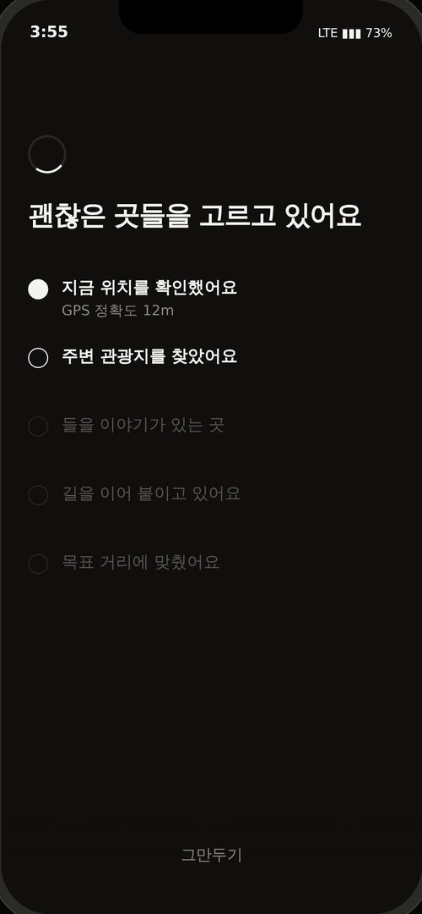

> 기다림을 견디게 하고 실패 원인을 남긴다

### 구성 요소

| 요소 | 설명 |
|---|---|
| 단계 5개 | 위치 확인 → 관광지 → 이야기 → 길 잇기 → 거리 맞추기. `이야기`는 가는 길 또는 경유지의 Odii 도슨트 유무 |
| 각 단계 값 | GPS 정확도 12m · 14곳 중 8곳 · 3곳 · 보행로만 15.2km · 오차 1% |
| 제목 4단 변화 | 코스를 만들고 있어요 → 괜찮은 곳들을 → 길을 이어 → 거의 다 |
| 그만두기 | — |

### 실측 레이아웃

| 요소 | 선택자 | x, y | 크기 | 기타 |
|---|---|---|---|---|
| 스피너 | `.mspin` | 17, 113 | **48×48** | radius 50% |
| 제목 | `.mhead` | 24, 176 | **327×31** | 24px / 700 |
| 단계 행 | `.ms` | 24, 235 | **327×61** | — |

### 동작 규칙

- 스피너 금지. 단계마다 실제 값을 보여준다
- 고른 경유지가 있으면 '고른 곳을 넣었어요 · 첨성대, 대릉원 포함 4곳'
- 완료 후 이 화면은 스택에서 제거 (뒤로 눌러도 재등장 금지)

### iOS 구현

- ADR-001 CourseGenerationDiagnostics를 이 단계 값으로 노출

### 다음 화면: 어떤 길로 뛸까요

- `/v1/running/route-options`의 `waypoint_priority`는 **고른 곳을 지나요**로 표시한다.
- `distance_priority`는 `withinTolerance=true`일 때만 **거리가 딱 맞아요**로 표시한다.
- `withinTolerance=false`면 서버 제목인 **거리에 가장 가까워요**를 사용한다.
- 사용자가 옵션을 고른 뒤 `/v1/running/summary`를 호출해 총정리와 뛰고 나서 들를 음식점·카페를 표시한다.

## 생성 실패 `fail`

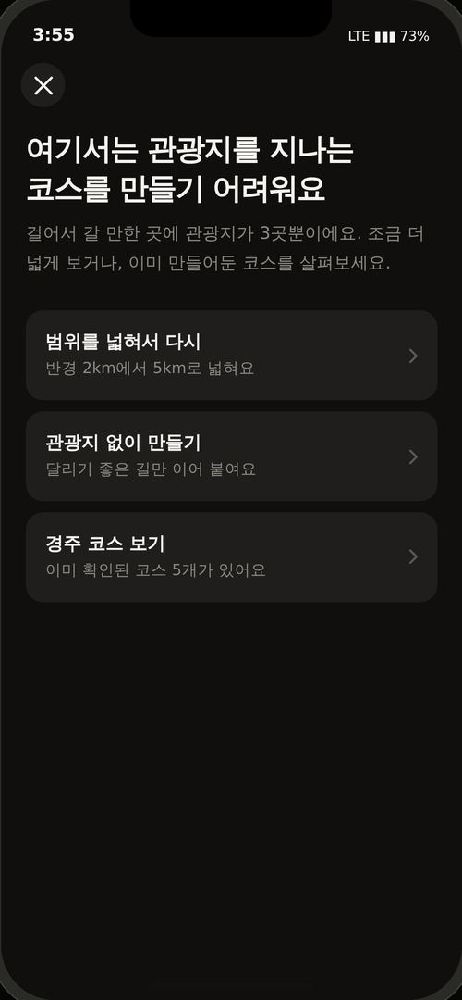

> 막다른 길을 만들지 않는다

### 구성 요소

| 요소 | 설명 |
|---|---|
| 관광지 부족 | 범위 넓히기 / 관광지 없이 / 기존 코스 보기 |
| 거리 초과 | 그대로 받기 / 하나 빼고 / 다른 조합 |
| 길 계산 실패 | 다시 시도 / 다른 조합 / 기존 코스 |

### 실측 레이아웃

| 요소 | 선택자 | x, y | 크기 | 기타 |
|---|---|---|---|---|
| 제목 | `.fhead` | 20, 106 | **335×63** | 24px / 700 |
| 설명 | `.fdesc` | 20, 179 | **335×47** | 14px / 400 |
| 선택지 | `.fopt` | 20, 252 | **335×73** | 13.3333px / 400 · radius 14px |
| 선택지 제목 | `.fopt b` | 36, 268 | **284×19** | 14.5px / 600 |

### 동작 규칙

- '실패'라는 말을 쓰지 않는다. 무슨 일이 있었는지 숫자로 설명
- 선택지는 반드시 동작한다 (조건을 바꿔 재생성)
- 진입 조건: 주변 관광지 < 필요 수 또는 모든 지도 경로 계산 실패. 거리 오차 >10%는 실패 화면으로 보내지 않고 `withinTolerance=false` 대체 옵션을 보여준다

### iOS 구현

- 오차 10%는 ADR-001 기준

---

# 러닝

## 러닝 준비 `ready`

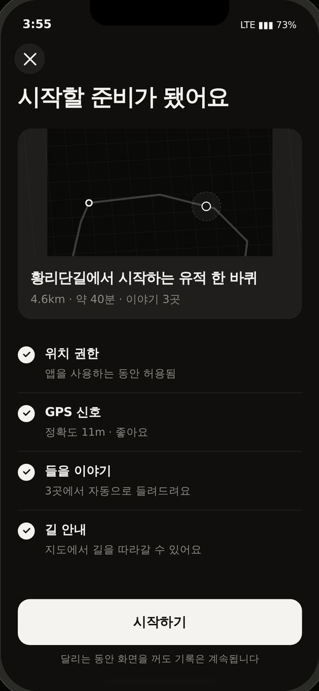

> 시작 전 조건을 확인시킨다

### 구성 요소

| 요소 | 설명 |
|---|---|
| 코스 미리보기 | 지도 + 이름 + 거리·시간·이야기 |
| 체크리스트 4개 | 위치 권한 · GPS 신호 · 들을 이야기 · 길 안내 |
| 시작하기 | 카운트다운 3초 후 러닝 |
| 안내 문구 | 달리는 동안 화면을 꺼도 기록은 계속됩니다 |

### 실측 레이아웃

| 요소 | 선택자 | x, y | 크기 | 기타 |
|---|---|---|---|---|
| 코스 카드 | `.rdcard` | 20, 151 | **335×224** | radius 16px |
| 지도 | `.rdcard svg` | 20, 151 | **335×150** | — |
| 체크 행 | `.ck` | 20, 393 | **335×68** | — |
| CTA | `#rdstart` | 20, 704 | **335×54** | 15.5px / 600 · radius 14px |

### 동작 규칙

- routed=false면 시작 불가
- GPS·권한 상태를 실제 값으로 표시

### iOS 구현

- 시작 직후 UIScreen.brightness 상향 검토 (야외 가독성)

## 러닝 중 `run`

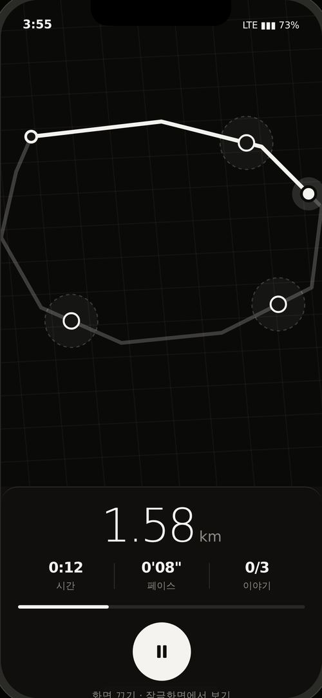

> 달리면서 볼 수 있는 최소 정보만 크게

### 구성 요소

| 요소 | 설명 |
|---|---|
| 지도 전체 | 진행 경로 진하게 / 남은 경로 연하게. 체크포인트 100m 반경 |
| 거리 대형 | 54px 300 weight. 러닝의 주인공 |
| 시간·페이스·이야기 | 3분할 |
| 진행 게이지 | — |
| 오디오 미니 패널 | 재생 중 이름·남은 시간·건너뛰기·진행 바 |
| 경고 배너 | GPS 약함 → 경로 이탈 → 워밍업 순. 백그라운드 복귀 알림이 최우선 |
| 일시정지 68pt 원 | — |
| 일시정지 상태 | 정지(회색·길게 누르기) + 재개(흰색) |
| 화면 끄기 | 잠금화면 Live Activity로 |

### 실측 레이아웃

| 요소 | 선택자 | x, y | 크기 | 기타 |
|---|---|---|---|---|
| 지도 | `.rmap` | 0, 0 | **375×566** | — |
| 하단 패널 | `.rpanel` | 0, 566 | **375×246** | radius 20px 20px 0px 0px |
| 거리 숫자 | `.rhero b` | 117, 585 | **109×54** | 54px / 300 |
| 3분할 | `.rsub` | 20, 651 | **335×38** | — |
| 게이지 | `.rgauge` | 20, 704 | **335×4** | radius 3px |
| 일시정지 버튼 | `.rbig` | 154, 724 | **68×68** | 13.3333px / None · radius 50% |
| 경고 배너 | `.rbanner` | 14, 52 | **347×0** | — |

### 동작 규칙

- 일시정지 시 시간·거리·오디오가 모두 멈춘다
- 종료는 0.9초 길게 눌러야 발동 (달리는 중 오조작 방지)
- 상단 우선순위: 오디오 패널 > 경고 배너
- 트리거: 반경 100m · 정확도 50m 이하 · 2회 연속 진입 · 세션당 1회 · 출발 300m 보류
- 건너뛴 지점은 같은 세션에서 재진입해도 자동 재생하지 않는다

### iOS 구현

- UIBackgroundModes = location, audio
- allowsBackgroundLocationUpdates = true, showsBackgroundLocationIndicator = true
- 세션 상태를 주기적으로 디스크에 저장 → 강제종료 후 복구
- GPS 신호 불안정 시 종료가 아니라 일시 중지

## 잠금화면 · Live Activity `lock`

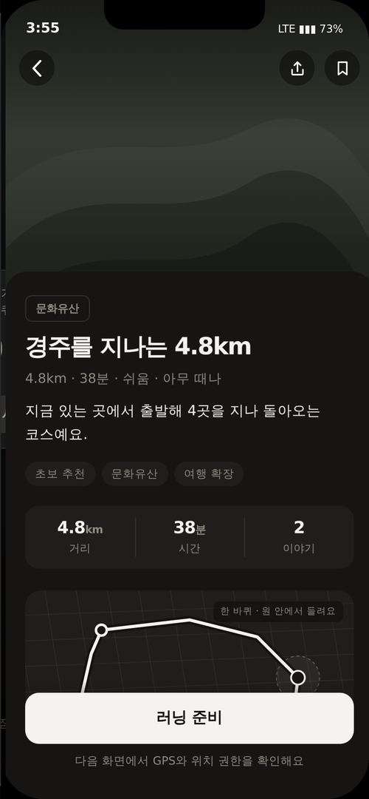

> 화면을 꺼도 기록이 이어짐을 보여준다

### 구성 요소

| 요소 | 설명 |
|---|---|
| 다이내믹 아일랜드 | 거리 · 시간 요약 |
| Live Activity 카드 | 거리·시간·페이스 + 일시정지 + 앱 열기 |
| 복귀 알림 | 화면이 꺼진 동안에도 기록했어요 · N분 동안 N km |

### 실측 레이아웃

| 요소 | 선택자 | x, y | 크기 | 기타 |
|---|---|---|---|---|
| 다이내믹 아일랜드 | `.island` | 6, 54 | **168×32** | 12px / None · radius 18px |
| Live Activity | `.lacard` | -77, 274 | **335×182** | radius 20px |
| 시계 | `.lclock` | 12, 120 | **155×89** | 76px / 200 |

### 동작 규칙

- 잠금화면에서 일시정지가 실제로 동작해야 한다
- 복귀 시 백그라운드 경과를 알려준다 (4초 후 사라짐)

### iOS 구현

- ActivityKit. 워치에도 그대로 표시됨 → 초기 워치 대응은 이것으로 충분

## 러닝 완료 `done`

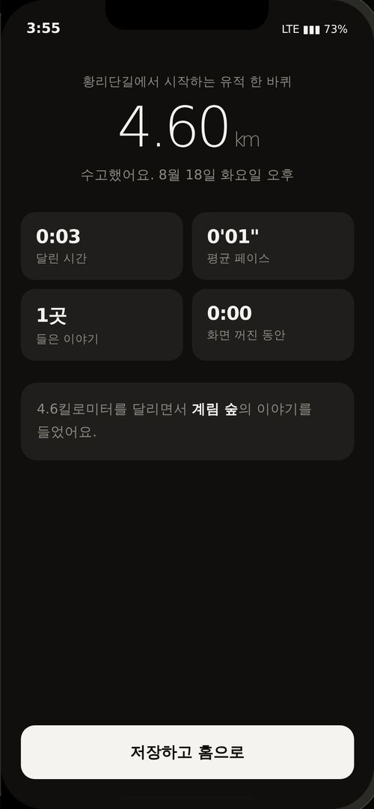

> 기록을 저장하고 성취를 남긴다

### 구성 요소

| 요소 | 설명 |
|---|---|
| 거리 대형 | 완주 거리 |
| 4분할 | 시간 · 평균 페이스 · 들은 이야기 · 화면 꺼진 동안 |
| 그날의 기록 | 들은 이야기 이름을 문장으로. 건너뛴 곳은 다음에 다시 안내 |
| 저장하고 홈으로 | — |

### 실측 레이아웃

| 요소 | 선택자 | x, y | 크기 | 기타 |
|---|---|---|---|---|
| 거리 | `.dnhero .n` | 20, 101 | **335×56** | 56px / 300 |
| 4분할 | `.dngrid` | 20, 213 | **335×149** | — |
| 문장 | `.dnstamp` | 20, 384 | **335×78** | 13.5px / None · radius 16px |

### 동작 규칙

- 완료 시 기록이 마이페이지에 즉시 반영
- 러닝·잠금 화면은 스택에서 제거

### iOS 구현

- HealthKit 연동은 후속 (지금 범위 아님)

---

# 내 것

## 마이페이지 `my`

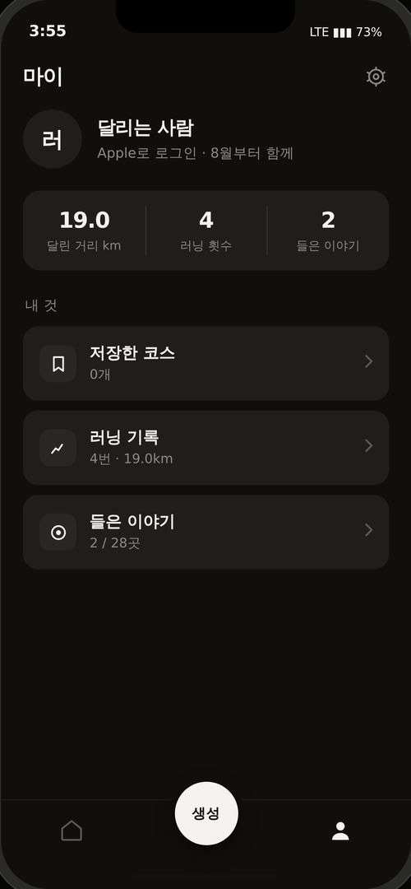

> 쌓인 것을 보여주고 설정으로 잇는다

### 구성 요소

| 요소 | 설명 |
|---|---|
| 프로필 요약 | 로그인 수단 · 시작 시점 |
| 누적 3분할 | 달린 거리 · 러닝 횟수 · 들은 이야기 |
| 저장한 코스 / 러닝 기록 / 들은 이야기 | 각 개수 표시 |
| 우상단 톱니 | 설정 |

### 실측 레이아웃

| 요소 | 선택자 | x, y | 크기 | 기타 |
|---|---|---|---|---|
| 프로필 | `.mysum` | 20, 96 | **335×78** | — |
| 누적 3분할 | `.mystat` | 20, 174 | **335×73** | radius 16px |
| 메뉴 행 | `.myrow` | 20, 298 | **335×68** | 13.3333px / None · radius 14px |

### 동작 규칙

- 누적 값은 기록에서 계산. 하드코딩 금지
- 목록이 비면 '코스 보러 가기'로 유도

### iOS 구현

- 저장·기록은 로컬 우선. 기기 간 동기화는 서버 결정 후

## 설정 `setting`

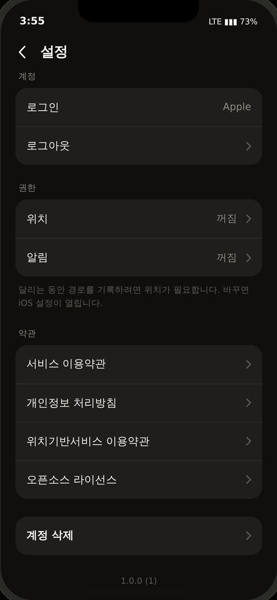

> 심사 필수 항목을 제공한다

### 구성 요소

| 요소 | 설명 |
|---|---|
| 계정 | 로그인 수단 · 로그아웃 |
| 권한 | 위치 · 알림. 변경 시 iOS 설정 열기 |
| 약관 4종 | 이용약관 · 개인정보 · 위치기반 · 오픈소스 |
| 계정 삭제 | 지워질 항목을 실제 개수로 보여주는 확인창 |
| 버전 | — |

### 실측 레이아웃

| 요소 | 선택자 | x, y | 크기 | 기타 |
|---|---|---|---|---|
| 설정 카드 | `.setcard` | 20, 119 | **335×104** | radius 16px |
| 설정 행 | `.setrow` | 20, 119 | **335×52** | — |

### 동작 규칙

- 계정 삭제는 App Store 심사 지침 5.1.1(v) 필수
- 무채색이라 destructive를 색으로 못 알림 → 맨 아래 단독 배치 + 확인창 + 삭제 대상 명시

### iOS 구현

- Apple 로그인 사용 시 계정 삭제에서 토큰 폐기까지 처리

## 목록 (저장·기록·이야기) `list2`

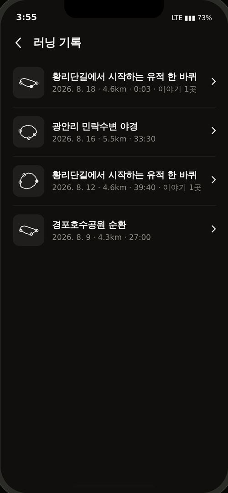

> 마이페이지의 세 갈래를 같은 형식으로 보여준다

### 구성 요소

| 요소 | 설명 |
|---|---|
| 저장한 코스 | 경로 썸네일 + 이름 + 거리·시간·강도 |
| 러닝 기록 | 날짜 + 거리 + 시간 + 들은 이야기 |
| 들은 이야기 | 이야기를 들은 러닝만 필터 |
| 빈 상태 | 각기 다른 안내 + '코스 보러 가기' |

### 실측 레이아웃

| 요소 | 선택자 | x, y | 크기 | 기타 |
|---|---|---|---|---|
| 상단 바 | `.nav2` | 375, 44 | **375×52** | 16px / 400 |
| 행 | `.rec` | 20, 96 | **335×80** | 13.3333px / 400 |
| 썸네일 | `.rec .rth` | 20, 110 | **52×52** | 13.3333px / 400 · radius 11px |

### 동작 규칙

- 세 목록이 같은 행 컴포넌트를 공유한다
- 비면 막다른 길이 아니라 다음 행동을 준다

### iOS 구현

- 행 하나를 재사용 셀로 만들고 데이터만 갈아끼운다

## 러닝 기록 상세 `rec`

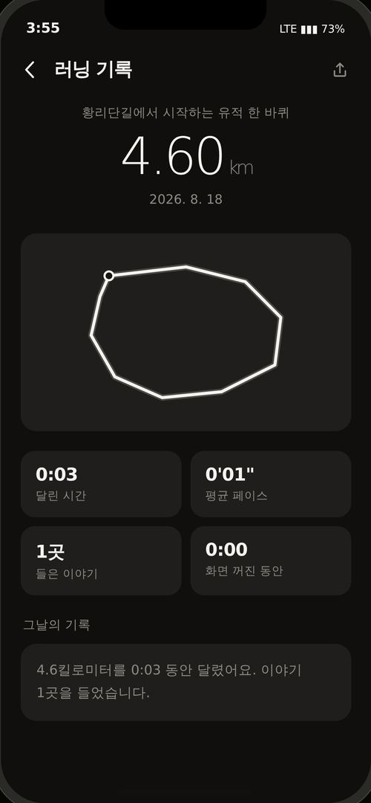

> 지난 러닝을 다시 보고 공유한다

### 구성 요소

| 요소 | 설명 |
|---|---|
| 거리 대형 + 코스명 + 날짜 | — |
| 경로 지도 200pt | — |
| 4분할 | 시간 · 평균 페이스 · 들은 이야기 · 화면 꺼진 동안 |
| 그날의 기록 | 문장으로 요약 |
| 우상단 공유 | 이 기록으로 스토리 카드 생성 |

### 실측 레이아웃

| 요소 | 선택자 | x, y | 크기 | 기타 |
|---|---|---|---|---|
| 거리 | `.rechero .n` | 20, 133 | **335×52** | 52px / 300 |
| 지도 | `.recmap` | 20, 236 | **335×200** | radius 16px |
| 4분할 | `.recgrid` | 20, 456 | **335×146** | — |

### 동작 규칙

- 완료 화면과 같은 정보 구조를 쓴다 (사용자가 두 번 배우지 않게)

### iOS 구현

- 기록은 로컬 저장. 스키마에 백그라운드 경과 시간을 포함

---

# 공유

## 공유 · 스토리 카드 `story`

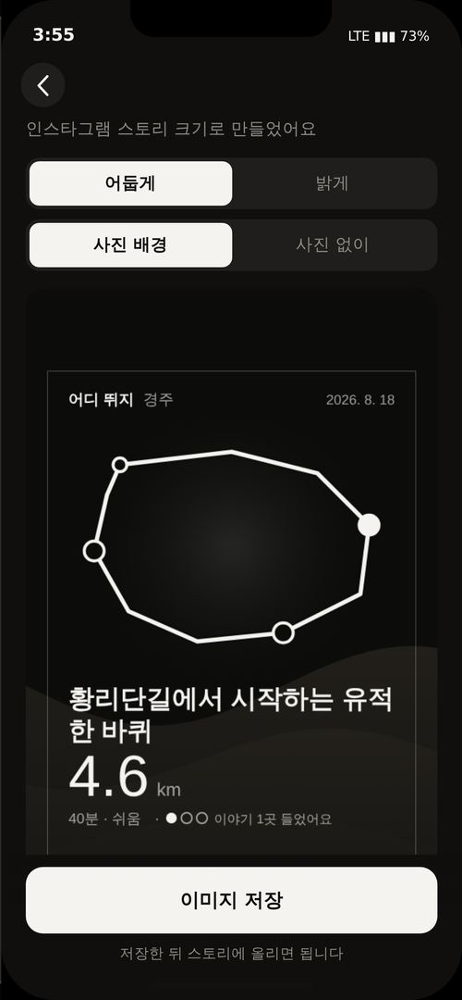

> 앱을 안 쓰는 러너에게도 코스를 보내고, 스토리에 올릴 이미지를 만든다

### 구성 요소

| 요소 | 설명 |
|---|---|
| 공유 시트 4갈래 | GPX 파일 · 스토리 이미지 · 링크 복사 · 다른 앱으로 |
| 미리보기 캔버스 | 540×960 · 실제 저장 이미지와 동일 |
| 어둡게 · 밝게 | 두 버전 |
| 사진 배경 · 사진 없이 | — |
| 이미지 저장 | PNG |

### 실측 레이아웃

| 요소 | 선택자 | x, y | 크기 | 기타 |
|---|---|---|---|---|
| 캔버스 | `#stcv` | 20, 234 | **335×596** | — |

### 동작 규칙

- GPX에는 trkpt와 지나는 곳 wpt가 함께 들어간다 (가민 화면에 지점명 표시)
- routed=false면 GPX 잠금 — 대략 형태가 파일로 나가면 사용자가 믿고 따라간다
- 인스타는 상단 14%·하단 20%를 덮는다 → 내용은 y 126~768 안에만
- 사진 4장이면 2×2 격자, 2~3장 위아래, 1장 꽉 채우기, 없으면 결 배경
- 경로선에 배경색 외곽선을 둘러 어떤 사진에서도 끊기지 않게 한다

### iOS 구현

- UIActivityViewController
- UIImage는 CORS 제약 없음 (웹은 crossOrigin=anonymous 필수)
- GPX metadata에 관광공사·TMAP 출처 표기

---

# 기타

## 위치 권한 `perm`

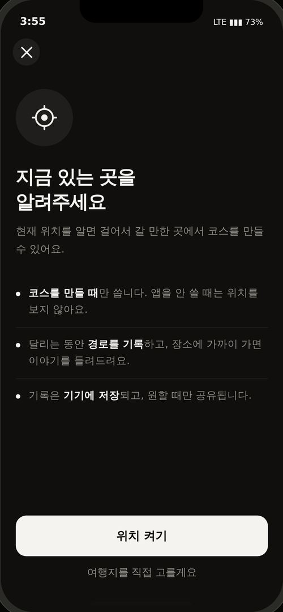

> 필요한 시점에 이유와 함께 요청한다

### 구성 요소

| 요소 | 설명 |
|---|---|
| 요청 화면 | 왜 필요한지 3줄. 코스 만들 때만 · 경로 기록 · 기기 저장 |
| 거부 복구 | 설정 열기 + 여행지를 직접 고를게요 |

### 실측 레이아웃

| 요소 | 선택자 | x, y | 크기 | 기타 |
|---|---|---|---|---|
| 아이콘 | `.permic` | 20, 118 | **76×76** | 16px / 400 · radius 50% |
| 제목 | `.permh` | 395, 98 | **335×33** | 25px / 700 |
| 설명 | `.permd` | 20, 296 | **335×47** | 14px / 400 |
| 이유 항목 | `.permwhy` | 20, 367 | **335×67** | 16px / 400 |
| 하단 CTA | `.gfoot` | 375, 716 | **375×96** | 16px / 400 |
| 주 버튼 | `#permok` | 20, 684 | **335×54** | 15.5px / 600 · radius 14px |

### 동작 규칙

- 홈이 아니라 생성 진입 시점에 요청 (허용률이 가장 높음)
- 거부해도 막지 않는다 → 도시 추가로 우회

### iOS 구현

- WhenInUse 먼저, 백그라운드는 러닝 시작 시 승급
