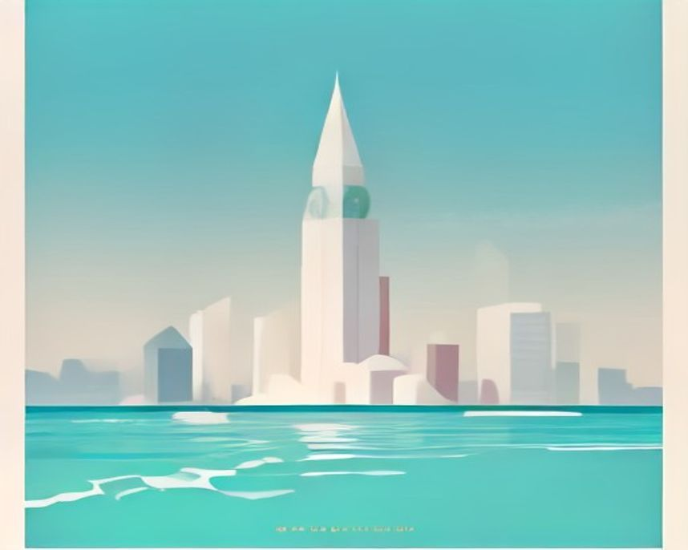
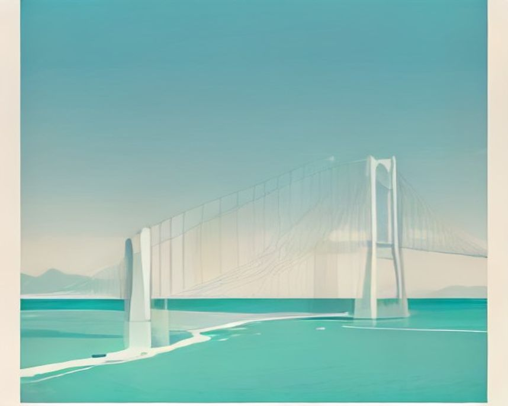
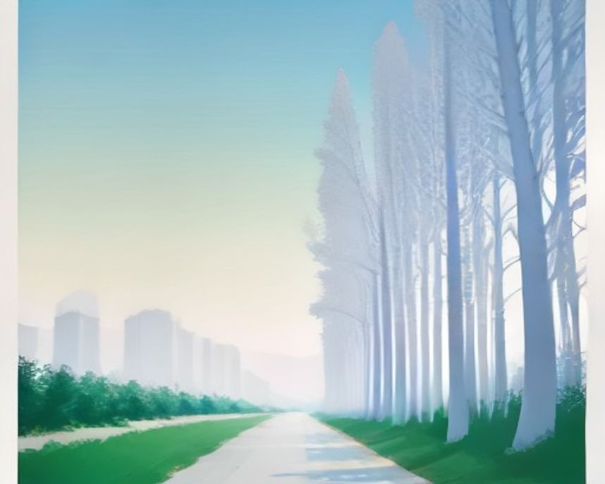
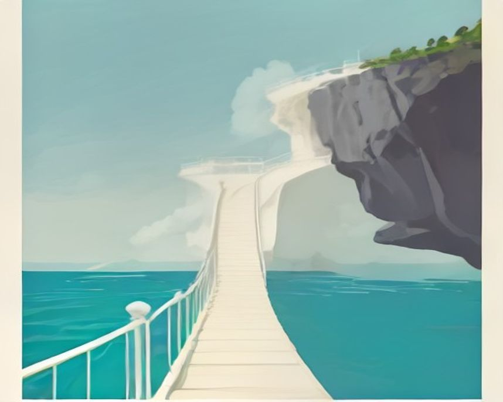

# 부산 러닝 코스

---

`러닝 코스 · 부산`

# 해운대, 부산에서 처음 바다를 따라 뛴다면

해변에서 동백섬 데크를 돌아 미포까지 간다. 파도와 관광객 사이에서 속도를 고르는 5km다.

`5.0km` `30분` `쉬움` `풍경`

[**지도에서 출발점 열기**  →](https://map.kakao.com/?q=해운대)

### 어떤 길인지

수영만요트경기장에서 출발해 동백섬으로 향한다. 요트 계류장을 왼쪽에 끼고 도는 초반 1km는 폭이 넓고 평탄해 몸을 데우기 좋다. 동백섬 해안산책로에 들어서면 나무데크가 시작되고, 파도가 데크 바로 아래까지 들어오는 구간이 이어진다.

동백섬은 이름과 달리 지금은 섬이 아니다. 오랜 세월 모래가 쌓이면서 육지와 붙었고, 신라 학자 최치원이 바위에 '해운대(海雲臺)' 세 글자를 새긴 것이 지명의 기원으로 전해진다. 섬 남단의 누리마루APEC하우스는 2005년 APEC 정상회의가 열린 곳으로, 앞 전망 데크에서 광안대교와 오륙도가 한눈에 잡힌다.

누리마루를 지나면 해운대해수욕장 백사장이 열린다. 여기서 미포까지 약 2.9km, 이 코스에서 가장 긴 직선 구간이다. 백사장 옆 산책로는 포장이 고르고 폭이 넓지만, 해수욕장 한복판이라 시간대에 따라 사람 밀도가 크게 달라진다.

전 구간 고도차가 거의 없고 계단도 없다. 데크·포장·보도블록이 번갈아 나오지만 발에 걸리는 턱이 드물어, 첫 바다 러닝이나 회복런 코스로 부산에서 부담이 적다.

부산 장거리 러너들은 이 구간을 광안리와 수영강까지 이어 쓴다. 여름에는 거리보다 습도가 먼저 발목을 잡으므로, 해가 뜨기 전 출발하고 미포나 광안리에서 물을 보충하는 편이 현실적이다.

종점 미포는 작은 포구다. 방파제 너머로 고층 빌딩과 어선이 한 프레임에 잡히는, 해운대에서 가장 부산다운 장면이 있다. 달맞이길 초입 카페 골목으로 바로 이어져 러닝 후 동선도 깔끔하다.

### 더 알아두면 좋은 것

거리를 늘리려면 미포에서 블루라인파크 그린레일웨이(옛 동해남부선 철길 산책로)를 따라 청사포·송정 방면으로 연장할 수 있다. 해안 절벽 위 철길을 그대로 걷는 길이라 풍경은 눈에 남지만 관광객이 많아 속도는 포기해야 한다.

야경이 목적이면 같은 바다라도 광안리가 낫다. 해운대는 조명이 은은한 쪽이고, 다리 야경은 광안대교를 정면으로 보는 민락수변 방면이 눈에 띈다.

동백섬만 도는 짧은 순환도 가능하다. 인터벌이라면 백사장 직선 구간, 가벼운 조깅이라면 동백섬 숲 그늘 쪽이 어울린다.

코스는 편도 약 5km다. 같은 길로 되짚어 오면 10km 거리 훈련이 되고, 시간이 없는 날은 미포까지 가지 않고 백사장 동쪽 끝에서 돌아서는 식으로 거리를 줄일 수 있다.

### 가기 전에 알아두면 좋아요

- 여름 성수기 낮의 백사장 구간은 통행이 어려울 정도로 붐빈다. 6~8시 이른 아침이 가장 쾌적하고, 관광 인파가 나오기 전에 미포까지 다녀올 수 있다.
- 나무데크는 비 온 뒤 많이 미끄럽다. 동백섬 구간은 속도를 줄이는 게 안전하다.
- 해수욕장 개장 기간에는 백사장 쪽 진입이 통제되는 구간이 생길 수 있다.
- 미포 방면 마지막 구간은 그늘이 거의 없다. 한여름 낮이라면 모자를 쓰고 물을 챙기는 편이 낫다.
- 동백섬 데크는 폭이 좁아지는 지점이 있다. 산책 인파가 몰리는 주말 낮에는 무리한 추월을 삼가는 게 낫다.

### 확인한 자료

- [해운대-광안리-수영강 20km 주행 후기](https://gall.dcinside.com/mgallery/board/view/?id=running&no=687712) · community · 2026-09-01

### 지나는 곳

| | 장소 |
|---|---|
| — | **해운대해수욕장** — 출발점. 백사장 옆 산책로는 폭이 넓고 바닥이 골라, 몸을 데우며 페이스를 잡기 좋은 구간이다. |
| — | **동백섬** — 숲 그늘 아래 데크가 깔린 순환 구간. 파도 소리가 가장 가깝게 들리는 곳이다. |
| — | **누리마루APEC하우스** — 동백섬 끝에 자리한 2005년 APEC 정상회의장. 앞 전망 데크에서 광안대교와 오륙도가 한눈에 들어온다. |
| — | **미포** — 코스 동쪽 반환점이 되는 작은 포구. 방파제 너머 어선과 고층 빌딩이 한 프레임에 잡히고, 달맞이길 카페 골목으로 이어진다. |

---

`러닝 코스 · 부산`

# 광안리, 다리 조명이 물에 반사되는 걸 보려고 다시 오는 코스

낮보다 밤이 훨씬 좋다. 민락수변공원 쪽에서 달릴 때 광안대교가 정면으로 들어온다.

`5.0km` `30분` `쉬움` `야경`

[**지도에서 출발점 열기**  →](https://map.kakao.com/?q=광안리)

### 어떤 길인지

광안리해수욕장 서쪽에서 출발해 백사장을 오른쪽에 두고 동쪽으로 달린다. 해변 산책로 어디에서든 광안대교가 시야에 들어오고, 약 2km 지점에서 백사장이 끝나면서 민락수변공원 구간으로 넘어간다.

민락수변공원은 이 길의 핵심이다. 바다와 바로 맞닿은 너른 광장에서 광안대교를 정면으로 마주 보게 되는데, 다리 조명이 수면에 반사되는 장면이 가장 잘 보이는 자리다. 이걸 보려고 다시 오는 러너가 많다. 공원에서 약 800m를 더 가면 수영강 하구의 민락교에 닿고, 여기서 돌아서는 왕복이 이 길의 기본 얼개다.

광안대교는 부산을 대표하는 해상 교량으로, 시간대와 요일에 따라 조명 연출이 바뀐다. 광안리 백사장은 가을이면 부산불꽃축제가 열리는 자리로도 유명하다. 민락수변공원은 한때 밤바다 앞에 먹거리를 펼쳐 놓고 즐기던 명소였지만, 금주구역으로 지정된 뒤 밤 분위기가 한결 차분해져 달리기에는 오히려 나아졌다.

전 구간 평지라 페이스 조절이 쉽고, 야경에 정신이 팔려도 발밑을 크게 신경 쓸 일이 없다. 백사장 옆은 보도블록과 데크가 번갈아 나오고 수변공원 쪽은 너른 포장 광장이라 노면 변화도 완만하다. 가로등과 상가 불빛 덕에 밤에도 어두운 구간이 거의 없다.

기록을 재려면 백사장 앞보다 민락교 이후 수영강 쪽이 덜 붐빈다. 광안리 안에서 끝내면 여행 조깅, 수영강으로 연장하면 10km 이상 거리주로 성격이 바뀐다.

이 코스는 낮보다 밤이 훨씬 좋다. 해가 완전히 진 뒤에는 다리 조명과 맞은편 마린시티의 불빛이 바다 위에 겹치고, 돌아오는 길 마지막 1km는 해변 상가의 불빛을 보며 속도를 정리하기 좋다. 러닝 후에는 해변 뒤 골목의 카페·식당 거리로 바로 이어진다.

### 더 알아두면 좋은 것

5km가 짧으면 민락교에서 수영강 산책로를 따라 상류 데크 방향으로 연장할 수 있다. 강변 구간은 해변보다 인적이 적어 속도를 유지하기 낫고, 연장 거리는 몸 상태에 맞춰 끊으면 된다.

같은 야경이라도 성격을 바꾸고 싶으면 황령산 정상 전망대가 있다. 업힐 훈련과 부산 시내 야경 마무리를 한 번에 가져가는 코스로, 광안리 평지 러닝과는 완전히 다른 자극이다.

해운대 방면과 이어 붙이면 부산 해안을 길게 잇는 장거리가 된다. 광안리에서 수영강을 건너 해운대까지 이어 가는 식으로, 바다를 계속 옆에 두고 달리는 LSD 훈련 경로로 쓸 수 있다.

낮에 달린다면 이른 아침이 낫다. 해변이 아직 한산하고 바다 쪽에서 해가 떠올라 아침 빛도 볼만하다. 저녁의 화려함과는 전혀 다른, 차분한 광안리를 만나는 시간대다.

### 가기 전에 알아두면 좋아요

- 저녁 백사장 일대는 관광객이 매우 많다. 러닝은 백사장보다 민락수변 방면 데크 쪽이 낫다.
- 야간 코스인 만큼 반사 소재 의류나 라이트를 챙기는 게 좋다. 인파 사이에서는 이어폰 볼륨도 낮추는 편이 안전하다.
- 부산불꽃축제 같은 대형 행사 날은 해변 전체가 통제 수준으로 붐빈다. 일정을 미리 확인하고 피하는 게 낫다.
- 주말 밤 수변공원 광장은 산책 인파가 몰린다. 속도를 내는 구간은 백사장 동쪽 끝에서 민락교 사이가 낫다.
- 여름밤에도 습도가 높은 날이 많다. 해변을 따라 편의점이 있어 수분 보충은 어렵지 않다.

### 지나는 곳

| | 장소 |
|---|---|
| — | **광안리해수욕장** — 출발점. 백사장 어디에서든 광안대교가 정면으로 보이고, 옆 산책로는 평탄해 몸 풀기 좋다. |
| — | **민락수변공원** — 다리 조명이 수면에 반사되는 장면을 정면으로 보는 야경의 핵심 구간. 러닝 후 회복 산책 자리로도 좋다. |
| — | **민락교** — 수영강 하구를 건너는 다리이자 기본 반환점. 강변 산책로로 연장할 때의 갈림점이기도 하다. |
| — | **광안대교** — 코스 내내 시야에 들어오는 기준점. 시간대에 따라 조명 연출이 바뀌어 같은 길도 다르게 보인다. |

---

`러닝 코스 · 부산`

# 온천천, 부산 사람들이 매일 뛰는 생활 러닝 라인

동래에서 연제까지 이어지는 하천. 지하철에서 바로 내려 자전거와 분리된 길을 달린다.

`8.0km` `48분` `쉬움` `평지`

[**지도에서 출발점 열기**  →](https://map.kakao.com/?q=온천천)

### 어떤 길인지

온천천시민공원에서 출발해 하천 산책로를 따라간다. 출발 후 약 1.3km 지점에 세병교가 나오고, 거기서 약 1km 간격으로 연안교와 온천천 카페거리가 차례로 이어진다. 다리가 일정한 간격의 이정표 역할을 해서, 시계를 자주 보지 않아도 구간별 페이스를 가늠하기 쉽다.

관광 코스가 아니라 생활 코스다. 동래구와 연제구를 잇는 하천을 따라 산책로가 이어지고, 도시철도역에서 바로 둔치로 내려설 수 있어 어느 지점에서든 시작하고 끝낼 수 있다. 부산 사람들이 퇴근 후 매일 나와 뛰는 길이라 저녁이면 러너가 끊이지 않는다.

온천천이라는 이름은 상류의 동래온천에서 왔다. 동래온천은 조선시대 기록에도 등장할 만큼 오래된 온천지이고, 이 물길은 금정산 자락에서 내려와 수영강으로 합류한다. 한때 오염이 심했던 하천을 생태하천으로 되살린 사례로 자주 언급되는 곳이기도 하다.

노면은 평탄한 둔치 포장길이고 자전거도로가 분리돼 있어 뒤에서 오는 자전거에 신경 쓸 일이 적다. 하천으로 내려서면 횡단보도 없이 길게 이어져 페이스가 끊기지 않고, 다리 아래를 지날 때마다 짧은 그늘이 반복돼 여름에도 숨 돌릴 틈이 있다.

봄에는 이 길의 성격이 완전히 바뀐다. 하천 양쪽으로 벚꽃이 피고 둔치에 유채가 함께 깔려 부산에서 유난히 붐비는 러닝로가 된다. 벚꽃 아래를 달리는 맛에 봄에만 나오는 러너도 있지만, 그 시기 주말엔 달리기보다 걷기에 가까워진다.

다리 간격이 일정해 워치만 보며 달리지 않아도 된다. 퇴근 시간에는 러너와 자전거가 함께 늘고, 벚꽃철에는 훈련로보다 산책로에 가까워진다.

마무리는 온천천 카페거리가 정석이다. 하천 바로 옆으로 카페가 줄지어 있어 쿨다운 산책과 커피까지 동선이 한 번에 정리된다. 거리를 더 채우고 싶으면 하류로 계속 내려가 수영강 방면으로 잇는 선택지도 있다.

### 더 알아두면 좋은 것

장거리가 필요하면 삼락생태공원이 낫다. 낙동강 둔치라 폭이 넓고 사람이 적어 10km 이상을 끊김 없이 채울 수 있다. 온천천은 일상 러닝, 삼락은 거리를 채우는 날로 나누면 된다.

하류로 계속 내려가면 수영강 산책로와 이어진다. 온천천에서 수영강을 잇는 왕복 조합이면 장거리 훈련까지 소화할 수 있어, 도심에서 거리를 크게 늘리는 표준 확장 경로로 통한다.

세병교~연안교~카페거리 구간은 다리 간격이 약 1km 안팎이라 인터벌에 쓰기 좋다. 다리에서 다리까지 빠르게, 다음 다리까지 천천히 가는 식으로 짜면 시계를 볼 일이 줄어든다.

도시철도로 접근해 편도로만 달리고 도착지 근처 역에서 복귀하는 방식도 잘 맞는 길이다. 벚꽃철에 조용히 달리고 싶다면 평일 이른 아침이 그나마 한산하다.

### 가기 전에 알아두면 좋아요

- 벚꽃철 주말은 인파로 통행 자체가 느려진다. 이 시기엔 새벽이나 평일 밤이 낫다.
- 하천 둔치 길이라 비가 많이 온 뒤에는 일부 구간이 잠길 수 있다. 폭우 뒤에는 상태를 살피고 나가는 게 안전하다.
- 자전거도로가 분리돼 있지만 다리 아래와 진입로에서는 동선이 겹칠 수 있다. 교차 지점에서는 속도를 줄이는 게 좋다.
- 저녁 시간대는 산책 인파와 러너가 함께 몰린다. 속도를 내는 훈련이라면 이른 아침이 낫다.
- 다리 밑 그늘 구간은 여름 낮에 쉬어 가기 좋지만, 비 온 뒤에는 바닥이 미끄러울 수 있다.

### 지나는 곳

| | 장소 |
|---|---|
| — | **온천천시민공원** — 출발점. 도시철도역에서 바로 둔치로 내려설 수 있어 짐 없이 가볍게 시작하기 좋다. |
| — | **세병교** — 출발 후 약 1.3km 지점의 다리. 동래 구간에 들어섰다는 표지로, 첫 페이스를 점검하기 좋은 지점이다. |
| — | **연안교** — 연제 방면으로 돌아서는 반환점. 다리 간격이 일정해 구간 훈련의 기준으로 삼기 좋다. |
| — | **온천천 카페거리** — 하천 옆으로 카페가 줄지은 마무리 구간. 쿨다운 산책과 커피까지 동선이 한 번에 끝난다. |

---

`러닝 코스 · 부산`

# 삼락생태공원, 낙동강 옆에서 오래 달리는 날

메타세쿼이아와 넓은 둔치를 지나 하구둑 방향으로 길게 뻗는다.

`12.0km` `72분` `보통` `평지`

[**지도에서 출발점 열기**  →](https://map.kakao.com/?q=삼락생태공원)

### 어떤 길인지

삼락생태공원 들머리에서 출발해 낙동강 둔치를 남쪽으로 내려간다. 약 2.1km 지점의 연꽃단지까지 갔다가 되짚어 오면 4km 남짓의 예열 구간이 되고, 삼락강변축구장 앞을 지나면서 본 구간이 시작된다. 예열과 본 훈련이 자연스럽게 나뉘는 구성이다.

축구장을 지나면 낙동강하구둑까지 약 7.6km의 긴 직선이 이어진다. 이 길의 승부처로, 중간에 크게 꺾이는 곳이 없어 시야가 멀리까지 트인다. 강 건너 김해 방면의 낮은 지평선과 갈대밭이 함께 가는 구간으로, 이정표 삼을 구조물이 드물어 GPS 시계가 있으면 구간 관리가 수월하다.

삼락생태공원은 강서와 사상 방면 낙동강 둔치에 조성된 공원으로, 부산의 하천 둔치 공원 가운데 가장 넓은 축에 든다. 갈대밭과 습지, 연꽃단지가 이어지는 생태공원이고, 낙동강 하구 일대는 겨울 철새가 모여드는 도래지로 오래전부터 유명하다. 메타세쿼이아가 양쪽으로 늘어선 직선 길이 이 공원의 얼굴로 꼽힌다.

노면은 평탄한 포장 위주라 12km 내내 발에 걸리는 요철이 드물다. 부지가 넓어 해안 코스처럼 인파에 막히는 일이 없고, 메타세쿼이아 구간은 그늘이 이어져 여름에도 해안보다 낫다. 다만 강바람이 부는 날은 달리는 방향에 따라 체감이 크게 달라진다.

신호 없이 오래 달릴 수 있지만 편의점으로 빠지기 어렵다. LSD 날에는 물과 젤을 직접 챙기고, 맞바람이면 초반 목표 페이스를 낮추는 편이 낫다.

종점 낙동강하구둑에 서면 강이 바다로 빠져나가는 하구의 너른 수면이 눈앞에 펼쳐진다. 도심 러닝과는 완전히 다른, 하늘이 넓은 코스다. 돌아오는 거리가 부담스러우면 하단 방면으로 빠져 도시철도로 복귀하는 동선을 미리 그려 두는 게 낫다.

### 더 알아두면 좋은 것

10km 이상 장거리를 부산 안에서 소화해야 할 때 첫 번째 선택지다. 신호도 인파도 없어 LSD에 최적이고, 일정한 페이스로 긴 시간을 버티는 연습에 특히 어울린다.

짧게 끝내는 날은 온천천으로 바꾸면 된다. 도심 접근은 온천천이 훨씬 쉽고, 삼락은 거리를 제대로 채우는 날을 위해 아껴 두는 편이 이동 시간 대비 낫다.

더 길게 가려면 낙동강 자전거길을 따라 연장할 수 있다. 하구둑에서 다대포해수욕장 방면으로 방향을 잡으면 강 하구와 바다를 한 번에 잇는 장거리가 된다.

연꽃단지는 여름이 볼거리다. 개화기에 맞춰 이른 아침에 나서면 예열 구간이 코스에서 가장 그림이 되는 구간으로 바뀌고, 사진 찍는 사람들이 모이기 전이라 달리기에도 낫다.

### 가기 전에 알아두면 좋아요

- 부지가 넓은 만큼 급수 지점 간격이 넓다. 물은 반드시 챙겨 나가는 게 좋다.
- 야간에는 조명이 부족한 구간이 있다. 장거리는 해가 있는 시간에 끝내는 계획이 안전하다.
- 그늘은 메타세쿼이아 구간에 몰려 있다. 한여름 낮에는 나머지 구간의 직사광을 감안해 시간대를 고르는 게 낫다.
- 강바람이 강한 날은 나갈 때 맞바람, 돌아올 때 등바람이 되도록 방향을 짜면 후반 체력 관리에 유리하다.
- 도심에서 접근에 시간이 걸리는 위치다. 이동 시간까지 훈련 일정에 넣어 계획하는 게 낫다.

### 지나는 곳

| | 장소 |
|---|---|
| — | **삼락생태공원** — 출발점. 낙동강 둔치의 너른 들머리로, 어느 방향으로든 길이 길게 뻗어 있다. |
| — | **삼락생태공원 연꽃단지** — 출발 후 약 2.1km 지점. 여름 개화기에는 코스에서 가장 그림이 되는 구간이다. |
| — | **삼락강변축구장** — 예열을 끝내고 본 구간으로 들어서는 표지. 여기서 하구둑까지 긴 직선이 시작된다. |
| — | **낙동강하구둑** — 코스 남쪽 끝 반환점. 강이 바다로 빠져나가는 하구의 너른 수면이 한눈에 들어온다. |

---

`러닝 코스 · 부산`

# 송도, 구름산책로 아래로 파도가 보이는 길

해수욕장에서 바다 위 산책로를 지나 암남공원 쪽 오르막으로 이어진다.

`3.0km` `20분` `보통` `풍경`

[**지도에서 출발점 열기**  →](https://map.kakao.com/?q=송도)

### 어떤 길인지

송도해수욕장 백사장 앞에서 출발한다. 해안산책로를 따라 약 760m를 가면 거북섬과 구름산책로 입구가 나오고, 바다 위로 놓인 보행교를 따라 물 위를 그대로 달리는 구간이 이어진다. 발아래로 파도가 들여다보이는, 이 길의 절정이다.

구름산책로를 나와 300m 남짓이면 해상케이블카 승강장 앞이고, 여기서 암남공원 방면 해안 길로 붙으면 오르막이 섞이기 시작한다. 평지 해안 코스인 해운대·광안리보다 난이도는 한 칸 높지만, 바다 위로 나간 구름산책로의 풍경은 세 곳 중 가장 드라마틱하다.

송도는 우리나라에서 가장 먼저 문을 연 공설 해수욕장으로 알려진 곳이다. 한동안 잊혔다가 해상케이블카와 구름산책로가 들어서며 다시 사람이 모이는 해변이 됐다. 머리 위로 케이블카가 바다를 건너고 그 아래를 달리는 그림은 부산의 다른 해변에는 없는 장면이다.

편도 약 3km 중 순수하게 속도를 낼 수 있는 구간은 백사장 옆 산책로 정도다. 구름산책로는 관광객 통행이 많아 걷듯이 지나는 게 현실적이고, 암남공원 방면은 오르막 대응이 필요하다. 기록보다 풍경과 언덕 자극을 얻어 가는 코스로 접근하는 게 맞다.

구름산책로는 보행자와 사진 찍는 사람이 많아 훈련 구간으로 쓰기 어렵다. 해변에서 몸을 풀고 산책로는 천천히 통과한 뒤, 암남공원 쪽 오르막에서 운동량을 채우는 구성이 맞다.

암남공원 방면으로 들어서면 해안 절벽 위 숲으로 분위기가 바뀐다. 시가지 소음이 잦아들고 파도 소리와 숲 그늘이 남는다. 되돌아 나와 해수욕장 앞 횟집·카페 거리에서 마무리하면, 짧은 거리치고 밀도가 높은 한 바퀴가 된다.

### 더 알아두면 좋은 것

이기대 해안 절벽 구간과 성격이 비슷하다. 오전에 송도, 오후에 이기대 식으로 묶으면 부산 해안 트레일로 하루가 꽉 차는 조합이 되고, 각각 짧아 부담도 크지 않다.

거리가 짧아 단독 훈련보다 언덕 반복에 쓰기 좋다. 케이블카 승강장 부근에서 암남공원 방면 오르막을 몇 차례 왕복하면 심박을 끌어올리는 짧은 힐 트레이닝이 된다.

3km가 아쉬우면 백사장을 먼저 왕복해 평지 예열을 충분히 하고 오르막에 들어가는 순서가 낫다. 짧은 코스일수록 워밍업을 제대로 하고 시작하는 게 몸에 덜 걸린다.

케이블카를 회수 수단으로 쓰는 방법도 있다. 암남공원 방면까지 달린 뒤 케이블카로 해수욕장 쪽에 돌아오면 오르막을 두 번 겪지 않는 편도 러닝으로 끝낼 수 있다.

### 가기 전에 알아두면 좋아요

- 구름산책로는 관광객 통행이 많아 빠르게 달리기 어렵다. 이 구간은 속도를 접고 풍경 구간으로 받아들이는 게 낫다.
- 강풍이 부는 날은 구름산책로 통행이 막힐 수 있다. 바람이 심한 날은 백사장 왕복으로 대체하는 게 안전하다.
- 오르막은 짧아도 경사가 있다. 무릎이 예민하면 내리막에서 보폭을 줄이는 게 좋다.
- 여름 낮 백사장과 해안 길은 그늘이 거의 없다. 한여름엔 이른 아침이 한결 쾌적하다.
- 관광 성수기 주말엔 케이블카 승강장 주변으로 인파가 몰린다. 그 일대는 걷기로 전환하는 게 현실적이다.

### 지나는 곳

| | 장소 |
|---|---|
| — | **송도해수욕장** — 출발점. 백사장 옆 산책로가 이 코스에서 속도를 낼 수 있는 드문 평지 구간이다. |
| — | **송도구름산책로** — 거북섬 곁에서 바다 위로 이어지는 보행교. 발아래로 파도가 들여다보이는 코스의 절정 구간이다. |
| — | **송도해상케이블카** — 머리 위로 케이블카가 바다를 건너는 중간 조망 지점. 여기서부터 암남공원 방면 오르막이 시작된다. |
| — | **암남공원** — 해안 절벽 위 숲에 자리한 종점. 시가지 소음이 잦아들고 숲 그늘과 파도 소리만 남는다. |
