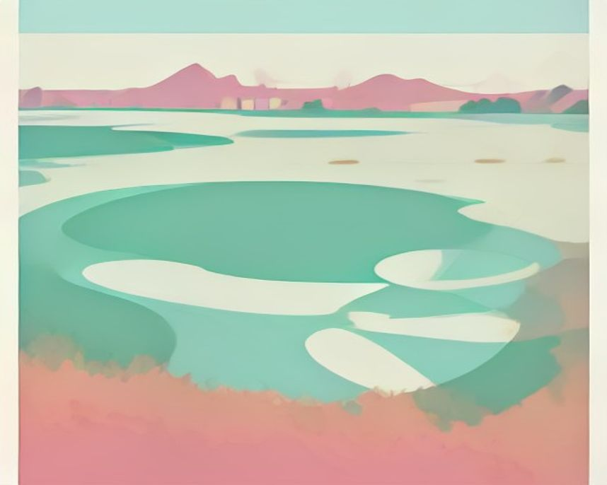
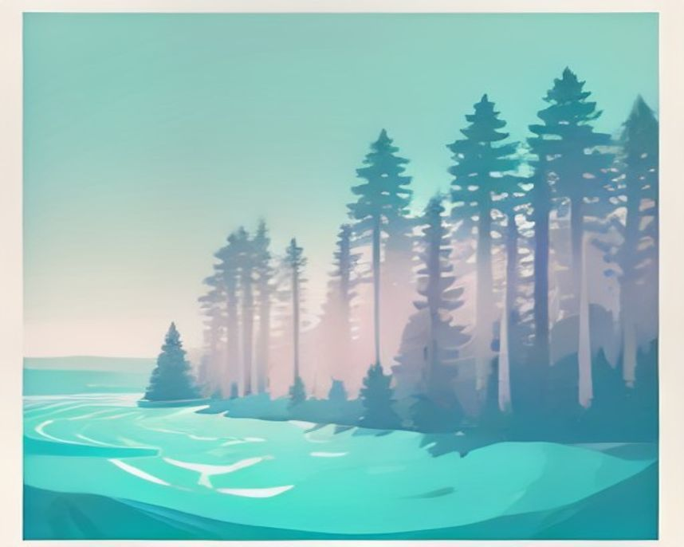

# 창원 러닝 코스

---

`러닝 코스 · 창원`

# 용지호수, 한 바퀴 1.2km로 거리를 정확히 세는 법

탄성 포장이라 무릎이 편하다. 다섯 바퀴면 6km, 열 바퀴면 12km.

`6.0km` `36분` `쉬움` `평지`

[**지도에서 출발점 열기**  →](https://map.kakao.com/?q=용지호수)

### 어떤 길인지

호수 한 바퀴가 1.2km다. 다섯 바퀴 6km, 열 바퀴 12km. 창원에서 거리를 가장 정확하게 셀 수 있는 코스다.

노면이 탄성 포장이라 무릎 부담이 적다. 반복 주행이 많은 코스에서 이 조건은 생각보다 크게 작용한다.

단점도 분명하다. 순환 특성상 같은 자리를 계속 돈다. 지역 커뮤니티에서 뺑뺑이가 지루하다는 반응이 나오는 이유다.

### 더 알아두면 좋은 것

지루함이 문제라면 창원천으로 넘어가면 된다. 사림교에서 봉곡동을 거쳐 반송교까지 왕복하면 8~9km이고, 자전거도로와 보행로가 분리돼 있다. 중간에 벤치와 화장실이 두세 곳 있다.

사화공원에서 창원대로 자전거도로로 연결하면 10km를 넘긴다.

트랙은 창원 스포츠파크 보조경기장 400m와 종합운동장 뒤편 산책로 2.1km가 있다.

### 가기 전에 알아두면 좋아요

- 출발점은 용지호수공원 주차장을 쓴다.
- 저녁 시간대에는 산책하는 사람이 늘어난다.

### 아직 확인 중인 것

- 화장실 위치
- 야간 조명 범위

### 지나는 곳

| | 장소 |
|---|---|
|  | **창원천** — 사림교~반송교 왕복 8~9km |
|  | **진해 드림로드** — 체력 훈련·트레일 |
|  | **창원 스포츠파크** — 400m 트랙 |
|  | **사화공원** — 10km 확장 연결 |

이미지는 한국관광공사 사진의 색을 참고해 직접 그린 것입니다 · 원본 용지호수공원

---

`러닝 코스 · 창원`

# 진해 드림로드, 네 갈래 산길이 한 점에서 만난다

장복하늘마루길·천자봉 해오름길·백일아침고요산길·소사생태길. 어디서 시작해도 된다.

`9.0km` `75분` `어려움` `트레일`

[**지도에서 출발점 열기**  →](https://map.kakao.com/?q=진해)

### 어떤 길인지

네 개 노선이 한 지점에서 교차해서 어느 쪽에서 시작하든 코스가 된다. 장복하늘마루길, 천자봉 해오름길, 백일아침고요산길, 소사생태길이다.

휴게소와 화장실, 운동기구, 약수터가 갖춰져 있고 전망대도 여러 곳이다. 평일에도 이용객이 많아 산길치고 적적하지 않다.

순환으로 돌려면 풍호공원운동장에서 천자암과 해병훈련체험 테마쉼터, 목재문화체험관을 거쳐 풍호공원으로 복귀하는 구성이 있다.

### 더 알아두면 좋은 것

평지 러너가 처음 온다면 용지호수에서 다리를 만들고 오는 편이 낫다.

트레일화는 챙기는 게 좋다. 노면이 젖으면 미끄럽다.

### 가기 전에 알아두면 좋아요

- 천자봉 해오름길 종점 구간은 경사가 뚝 떨어지고 곡각이 심하다. 초보는 무리하지 않는 게 좋다.
- 산지라 일몰 후 급격히 어두워진다.

### 아직 확인 중인 것

- 노선별 정확한 거리
- 누적 고도
- 순환 코스 총 거리

### 지나는 곳

| | 장소 |
|---|---|
|  | **장복하늘마루길** — 능선 구간 |
|  | **천자봉 해오름길** — 종점 급경사 주의 |
|  | **풍호공원운동장** — 순환 코스 기점 |
|  | **용지호수공원** — 다음날 회복런 |

이미지는 한국관광공사 사진의 색을 참고해 직접 그린 것입니다 · 원본 용지호수공원 (드림로드 사진이 없어 같은 지역 이미지로 대신함)
