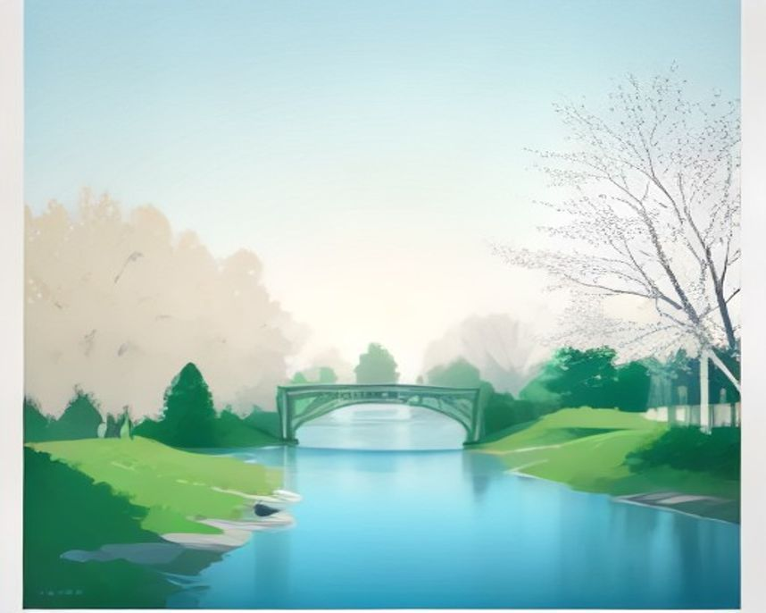

# 춘천 러닝 코스

---

`러닝 코스 · 춘천`

# 의암호 호반길, 춘천의 가을을 한 바퀴 도는 길

의암호를 따라 길게 돌고, 공지천에서 천천히 풀어주는 춘천의 대표 러닝 여행.

`9.0km` `54분` `보통` `풍경`

[**지도에서 출발점 열기**  →](https://map.kakao.com/?q=의암호)

### 어떤 길인지

춘천은 물의 도시라는 말이 과장이 아니다. 의암호가 도심을 반쯤 감싸고 있어 어디서 출발하든 몇 분만 뛰면 물가가 나온다. 호반길은 공지천유원지에서 출발해 그 물을 왼쪽에 두고 계속 달리는 코스다. 약 3.2km 지점에서 스포츠타운 앞 의암호 수변 데크 구간에 닿고, 여기서 2.7km쯤 더 가면 호수 위로 나간 의암호스카이워크에 이른다.

한 바퀴로 치면 8~10km인데, 스카이워크쯤에서 끊고 돌아와도 되고 그대로 이어 붙여도 된다. 그날 컨디션에 맞춰 거리를 정하기 좋은 구조라, 여행지에서 몸 상태를 살피며 달리기에 맞는 길이다.

의암호는 북한강 물줄기를 의암댐이 막으면서 생긴 호수다. 춘천이 호반의 도시로 불리게 된 배경이 이 물이고, 호수 가운데에는 붕어섬이 떠 있으며 건너편으로 삼악산 능선이 이어진다. 스카이워크 데크 끝에 서면 호수 한가운데서 보는 듯한 시야가 나온다.

노면은 자전거길과 나란히 가는 평탄한 포장로다. 가로수가 이어져 여름에도 그늘이 제법 있고, 잔잔한 호수라 바람도 덜하다. 오르내림이 거의 없어 페이스를 일정하게 끌고 가기 좋은데, 뒤집어 말하면 심박을 올릴 언덕이 없다는 뜻이라 인터벌보다는 긴 거리 훈련에 맞는다.

호반길만으로 부족하면 공지천 수변길을 붙이면 된다. 소양강 쪽 수변길은 약 4km라 회복런에 알맞고, 메타세쿼이아길 약 5km는 흙과 나무가 섞여 발바닥에 오는 감촉이 완전히 다르다.

자전거 여행자가 많은 길이라 코너와 데크 진입부에서 뒤를 확인해야 한다. ITX 당일 러닝이라면 공지천을 출발점으로 잡아 짐과 식사 동선을 함께 해결하기 쉽다.

해 질 무렵이면 잔잔한 호수 면이 통째로 주황빛으로 바뀐다. 돌아온 공지천유원지 주변에는 앉아 쉴 자리가 많고, 닭갈비나 막국수 같은 춘천 음식으로 마무리하는 동선도 짧다.

### 더 알아두면 좋은 것

춘천은 ITX로 용산에서 한 시간대다. 새벽에 내려와 아침에 호수를 돌고 점심까지 먹은 뒤 올라가는 당일 런트립이 가능한 몇 안 되는 도시라, 하루를 통째로 비우기 어려운 주말에 꺼내기 좋은 카드다.

숙소는 호수 남쪽보다 공지천 유원지 근처가 낫다. 호반길 진입이 빠르고 뛰고 나서 씻고 밥 먹기까지 동선이 짧다. 남이섬 쪽에 잡으면 이동 시간이 러닝 시간보다 길어진다.

춘천마라톤이 열리는 도시라 가을 대회 시즌에는 호반길에 러너가 눈에 띄게 늘어난다. 평탄하고 길게 이어지는 길이어서 대회를 앞둔 장거리 훈련 코스로도 잘 맞는다.

거리를 줄이고 싶은 날은 약 3.2km 지점인 스포츠타운 앞 수변에서 돌아서는 6km대 왕복이 무난하다. 더 늘리고 싶으면 공지천이나 소양강 수변길을 이어 붙여 10km 넘게 만들 수 있다.

### 가기 전에 알아두면 좋아요

- 주말 아침에는 자전거와 러너가 섞인다. 자전거길 쪽으로 붙어 달리지 않고 보행로 쪽을 지키는 편이 안전하다.
- 호수 코스라 편의점이 드문 구간이 있다. 특히 여름에는 물을 챙겨 나가는 게 좋다.
- 겨울에는 호수 바람이 체감온도를 크게 깎는다. 같은 기온이어도 시내보다 춥다고 보고 한 겹 더 입는 게 낫다.
- 그늘은 가로수 구간에 몰려 있다. 한여름에는 낮을 피해 아침이나 저녁에 나가는 편이 낫다.
- 행락철 주말 낮에는 산책 인파가 늘어난다. 조용히 달리려면 이른 아침이 비교적 한산하다.

### 지나는 곳

| | 장소 |
|---|---|
| — | **공지천유원지** — 출발점. 주차와 화장실이 있는 유원지로, 물가에 앉을 자리가 많아 러닝 전후의 거점으로 삼기 좋다. |
| — | **의암호** — 출발에서 약 3.2km, 스포츠타운 앞 수변 데크 구간. 호수 폭이 넓어지고 건너편 능선이 시야에 들어온다. |
| — | **의암호스카이워크** — 호수 위로 나간 데크 조망 지점. 코스 후반의 기준점이라 여기서 끊고 돌아가는 변형도 자연스럽다. |
| — | **붕어섬** — 의암호 가운데 떠 있는 섬. 수변 구간 내내 시선의 기준이 되는, 이 호수의 표지 같은 존재다. |

---

`러닝 코스 · 춘천`

# 공지천, 의암호를 돌고 나서 천천히 풀어주는 4km

짧고 평탄해서 회복런과 첫 러닝에 맞는 수변길. 의암호 코스의 짝이 되는 구간.

`4.0km` `26분` `쉬움` `평지`

[**지도에서 출발점 열기**  →](https://map.kakao.com/?q=공지천)

### 어떤 길인지

공지천은 의암호로 흘러드는 하천이고, 그 수변길이 춘천에서 부담이 적은 러닝 구간이다. 공지천유원지에서 출발해 물가를 따라가면 약 500m 지점에 공지천 조각공원이 나온다. 물가를 따라 조각 작품이 띄엄띄엄 서 있어 몸이 풀리기 전 구간의 눈요기가 된다.

조각공원부터는 200~300m 간격으로 에티오피아 한국전 참전기념관과 공지천교가 차례로 이어진다. 공지천교가 이 길의 반환점이다. 전체 약 4km, 언제든 돌아설 수 있는 물가 왕복이라 처음 뛰는 사람에게 부담이 없다.

이 물가에는 춘천만의 이력이 있다. 한국전쟁에 참전한 에티오피아를 기리는 기념관이 하천변에 서 있고, 앞 도로 이름도 이디오피아길이다. 기념관 곁의 오래된 커피집과 유원지의 오리배까지, 춘천 사람들이 공지천 하면 떠올리는 장면이 이 짧은 구간에 몰려 있다.

전 구간이 평지이고 노면은 고른 수변 포장로다. 오르막이 없고 턱이 드물어 몸에 걸리는 게 없다. 속도를 올릴 이유가 없는 길이니 심박을 낮게 묶어 두는 회복런 본연의 용도에 충실한 편이 낫고, 처음 뛰는 사람이 거리 감각을 잡는 데도 맞다.

거리가 아쉬우면 소양강 방향으로 이어 붙여 늘릴 수 있고, 메타세쿼이아길 쪽으로 빠지면 노면이 흙으로 바뀐다. 의암호 호반길과 이어 붙이면 장거리로도 전환된다.

평탄하고 중간에 돌아서기 쉬워 여행 첫날 몸 상태를 확인하는 데 맞는다. 주말 낮에는 산책객이 많으므로 빠른 주자는 의암호 쪽으로 일찍 빠지는 편이 안전하다.

유원지가 붙어 있어 뛰고 나서 앉아 쉴 자리가 많다. 오리배가 떠 있는 잔잔한 수면과 낮은 다리들, 관광지라기보다 동네의 속도로 흘러가는 물가라서 러닝을 마친 뒤 천천히 걷는 맛도 있다.

### 더 알아두면 좋은 것

숙소를 공지천 근처에 잡으면 의암호 진입도 빨라서 춘천 런트립의 거점으로 삼기 좋다. 첫날 공지천에서 가볍게 몸을 풀고 다음 날 호반길을 길게 도는 식으로 이틀을 짜면 두 코스가 자연스럽게 이어진다.

가장 흔한 쓰임새는 의암호 호반길을 길게 돈 다음 날의 회복런이다. 평지 4km라 다리에 남은 피로를 살피며 천천히 돌기에 알맞고, 상태가 좋으면 그 자리에서 거리를 늘리면 된다.

겨울 결빙기에는 수변 데크가 미끄러울 수 있다. 이 시기에는 데크 구간에서 보폭을 줄이고, 해가 든 뒤에 나가는 편이 낫다. 물가라 시내보다 쌀쌀하게 느껴지는 날이 많다.

짧은 반복 훈련에도 쓸 수 있다. 조각공원과 공지천교 사이처럼 구간이 또렷한 곳을 오가면 된다. 다만 산책 인파가 있는 시간대라면 속도 훈련보다 조깅에 맞는 길이라는 점은 감안해야 한다.

### 가기 전에 알아두면 좋아요

- 유원지 구간은 산책하는 사람이 많다. 이른 아침이 가장 한산하고 주말 낮이 유난히 붐빈다.
- 야간 조명 범위가 구간마다 다르다. 어두워진 뒤에는 유원지와 가까운 밝은 쪽 위주로 도는 게 낫다.
- 오리배 선착장 주변은 관광객이 몰리는 지점이다. 속도를 줄여 지나는 게 서로 편하다.
- 비 온 뒤에는 물가 쪽 낮은 길이 젖어 있을 수 있다. 미끄러워 보이면 위쪽 길로 우회하면 된다.
- 자전거가 지나는 길과 겹치는 구간이 있다. 이어폰 음량을 낮추면 뒤에서 오는 자전거를 놓치지 않는다.

### 지나는 곳

| | 장소 |
|---|---|
| — | **공지천유원지** — 출발점. 오리배 선착장이 있는 물가 유원지로, 러닝 전후에 앉아 쉬어 가기 좋다. |
| — | **공지천 조각공원** — 출발 약 500m 지점의 수변 공원. 물가를 따라 조각 작품이 서 있어 워밍업 구간의 볼거리가 된다. |
| — | **에티오피아한국전참전기념관** — 한국전쟁에 참전한 에티오피아를 기리는 기념관. 앞길 이름도 이디오피아길이다. 코스 중간의 표지가 된다. |
| — | **공지천교** — 이 길의 반환점이 되는 다리. 여기서 돌아서면 짧은 왕복, 물길을 더 따라가면 거리가 늘어난다. |
