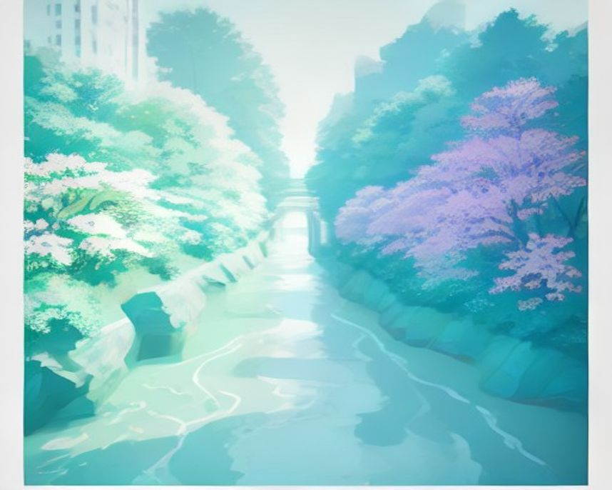

# 대구 러닝 코스

---

`러닝 코스 · 대구`

# 신천, 대구 크루가 정규런을 도는 도심 하천

도심을 관통해 접근성이 가장 좋고 노면이 평탄하다. 대구 러닝의 자주 쓰는 코스.

`10.0km` `60분` `쉬움` `평지`

[**지도에서 출발점 열기**  →](https://map.kakao.com/?q=신천)

### 어떤 길인지

신천 둔치에서 출발해 하천을 따라 남쪽으로 내려간다. 첫 구간은 약 3.5km, 이 코스에서 가장 긴 직선이다. 강 양옆으로 둔치 러닝로가 나란히 나 있고 다리는 대부분 아래로 통과하게 돼 있어, 신호에 끊기지 않고 한 호흡으로 페이스를 끌고 갈 수 있다.

대봉교를 지나면 900m도 되지 않아 수성교가 나온다. 다리 간격이 좁아지는 이 구역은 구간을 쪼개 세기 좋아 인터벌이나 템포런의 반복 단위를 잡기에 알맞다. 대봉교 서편 방천시장 일대에는 김광석 다시 그리기 길이 있어, 달리기를 마치고 걸어 들어가 볼 만한 골목이 그대로 붙어 있다.

수성교에서 방향을 북으로 돌리면 침산교까지 5km 남짓이 한 번에 이어진다. 신천은 대구 도심을 남북으로 관통해 북쪽 끝에서 금호강과 만나는 하천이다. 도심을 그대로 가로지르는 만큼 어느 동네에서든 걸어서 둔치로 내려설 수 있고, 그 접근성 덕에 지역 러닝크루 정규런의 기본 무대로 자리 잡았다.

노면은 평탄하고 오르내림이 거의 없다. 둔치로 내려서는 진입로에만 짧은 경사가 있을 뿐 본 구간에는 계단도 급한 턱도 드물다. 10km를 처음 완주해 보려는 러너에게 대구에서 부담이 적은 선택지인 이유다. 대신 둔치에는 그늘이 부족해 여름 한낮이면 같은 페이스도 훨씬 무겁게 느껴진다.

대구 장거리 후기에서는 금호강에서 신천 방향으로 마치는 동선이 후반 지루함을 덜어준다고 했다. 급수대는 계절에 따라 잠길 수 있으므로 겨울 거리주에는 물을 따로 준비하는 편이 안전하다.

침산교 부근에서 신천은 큰 물줄기와 합류하며 시야가 넓게 트인다. 여기서 되짚어 오면 왕복 10km가 되고, 더 달리고 싶은 날에는 금호강 방면으로 그대로 넘어가면 된다. 어느 지점에서 끊어도 도심이라 대중교통으로 빠져나오기 쉬운 것도 이 길의 장점이다.

### 더 알아두면 좋은 것

거리를 늘릴 생각이라면 침산교에서 금호강 쪽으로 넘어가는 게 정석이다. 금호강은 좌우로 길게 이어져 장거리 세션을 붙이기 쉽고, 신천보다 인파도 적다.

업힐이 필요하면 진밭골이 대구의 답이다. 성격이 완전히 반대라 같은 주에 신천과 진밭골을 나눠 배치하면 평지 볼륨과 근력 훈련의 균형이 잡힌다.

달서권에서 출발한다면 월광수변공원과 두류공원 일대가 크루들의 거점이다. 두 곳의 짧은 순환으로 몸을 푼 뒤 신천 둔치로 넘어오면 하루에 성격이 다른 두 코스를 이어 붙일 수 있다.

다리와 다리 사이가 일정하게 끊기는 구조라 훈련 설계가 쉽다. 회복런은 대봉교와 수성교 사이를 왕복하고, 장거리는 침산교까지 한 번에 밀어붙이는 식으로 나누면 된다.

### 가기 전에 알아두면 좋아요

- 자전거 통행이 잦은 구간이 있다. 폭이 좁아지는 다리 아래에서는 우측을 유지하는 게 안전하다.
- 출퇴근 시간대 도심 구간은 보행자가 몰린다. 속도를 낼 계획이면 그 시간대를 피하는 편이 낫다.
- 둔치는 그늘이 거의 없다. 한여름 낮이라면 해가 기운 뒤에 나오고 물을 챙기는 게 좋다.
- 비가 많이 온 뒤에는 둔치 일부가 잠기거나 흙이 밀려 있을 수 있다. 수위를 보고 들어가자.
- 다리 아래 통과 구간은 낮에도 어둡고 시야가 짧다. 반대편에서 오는 자전거를 미리 살피자.

### 확인한 자료

- [금호강-신천 장거리 주행 후기](https://gall.dcinside.com/mgallery/board/view/?id=running&no=931103) · community · 2026-09-01
- [대구광역시 신천 안내](https://tour.daegu.go.kr/index.do?menu_id=00002943&menu_link=%2Ffront%2Ftour%2FtourMapsView.do%3FtourId%3DKOATTR_258) · official · 2026-09-01

### 지나는 곳

| | 장소 |
|---|---|
| — | **신천** — 출발점이 되는 도심 하천 둔치. 러닝로가 강 양옆으로 나 있어 어느 쪽으로 내려서도 바로 달릴 수 있다. |
| — | **대봉교** — 남쪽 구간의 기준이 되는 다리. 서편 방천시장 골목이 김광석 다시 그리기 길로 이어진다. |
| — | **수성교** — 중간 반환 후보. 여기서 북으로 방향을 돌리면 침산교까지 긴 직선 구간이 시작된다. |
| — | **침산교** — 북쪽 반환점. 신천이 큰 물줄기와 만나는 곳이라 시야가 넓게 트이고, 금호강 코스로 넘어가는 연결 지점이 된다. |

---

`러닝 코스 · 대구`

# 진밭골, 숨이 먼저 차오르는 대구의 업힐

범물동에서 숲 안쪽으로 고도를 올린 뒤 같은 길을 천천히 내려온다.

`8.0km` `70분` `어려움` `업힐`

[**지도에서 출발점 열기**  →](https://map.kakao.com/?q=진밭골)

### 어떤 길인지

진밭골 임도 입구에서 곧장 오르막이 시작된다. 약 4km에 상승고도 265m. 숫자만 봐도 성격이 분명하다. 경치를 보며 뛰는 곳이 아니라 다리를 만드는 곳이다. 수성구 생활권이 끝나는 자리에서 바로 산으로 붙기 때문에, 도심에서 접근해 곧장 훈련에 들어갈 수 있다는 점이 이 길의 값이다.

출발점을 지나 진밭골자연휴양림 구간에 들어서면 경사가 본격적으로 붙는다. 대구 남쪽 산자락을 파고드는 골짜기라 시가지 소음이 금세 멀어지고, 고도를 올릴수록 숲이 사방을 덮는다. 용지봉 능선이 갈리는 지점이 이 코스에서 가장 높이 올라선 곳이다.

숲 안으로 들어갈수록 차 소리는 멀어지고 호흡만 가까워진다. 용지봉 쪽 능선이 보이기 시작하면 고도가 쌓였다는 감각도 선명해진다.

업힐 편도 기준 1회전 27~40분, 2회전 60~80분이 걸린다. km당 60m 넘게 올리는 경사라 평지 페이스는 의미가 없고 심박과 케이던스로 관리하는 편이 낫다. 숲이 우거져 한여름에도 도심보다 시원하지만, 산지라 해가 기울면 밝기가 급격히 떨어진다.

오를 때는 숲이 천천히 시야를 닫고, 돌아설 때는 대구 시가지가 다시 열린다. 오르막은 심박으로 버티고 내리막은 보폭을 줄이면 같은 길이 전혀 다른 두 구간처럼 남는다.

능선에 올라서면 대구 시가지가 아래로 펼쳐지고 올라온 골짜기가 한눈에 들어온다. 두 번째 회전을 마치면 다리에 남는 게 없다. 하산 지점인 범물동은 생활권이 바로 붙어 있어 회복과 식사 동선을 잡기 어렵지 않다.

### 더 알아두면 좋은 것

진밭골 공영주차장을 출발점으로 삼을 수 있다. 첫 방문에는 한 번만 올라 같은 길로 내려오며 경사와 노면을 익히는 편이 낫다.

평지 세션은 신천이나 금호강으로 균형을 맞추는 게 좋다. 같은 주에 업힐과 평지 장거리를 나눠 두면 다리에 걸리는 부하가 분산돼 회복이 훨씬 수월하다.

회전 수로 강도를 조절할 수 있다. 처음이라면 1회전 4km로 끊고, 익숙해진 뒤 2회전으로 늘리는 방식이 현실적이다. 세 번째 회전은 대부분 다음 날까지 부담이 남는다.

업힐 반복만으로 벅차다면 다음 날 두류공원 순환 같은 짧은 평지 코스를 회복런으로 붙이는 구성이 무난하다. 거리를 늘리기보다 다리를 푸는 데 목적을 두면 된다.

### 가기 전에 알아두면 좋아요

- 두 번 오르는 훈련을 계획했다면 내리막까지 직접 소화할 체력을 남겨 두자.
- 산지 코스라 해가 지면 급격히 어두워진다. 늦은 오후 출발이면 헤드랜턴을 챙기는 게 안전하다.
- 급수 지점을 기대하기 어렵다. 회전 사이에 마실 물을 차에 두고 오르는 편이 낫다.
- 비 온 뒤 산길은 젖어서 미끄러워진다. 경사가 붙는 구간일수록 발밑을 살피며 오르자.
- 여름철 숲 구간은 벌레가 많다. 이른 아침이나 늦은 오후 쪽이 그나마 견딜 만하다.

### 지나는 곳

| | 장소 |
|---|---|
| — | **진밭골** — 출발점이 되는 임도 입구. 여기서부터 곧장 오르막이라 몸을 데울 평지 구간이 거의 없다. |
| — | **용지봉** — 능선이 갈리는 지점. 고도를 가장 많이 올린 곳이고, 대구 남쪽 시가지가 아래로 트여 보인다. |
| — | **범물동** — 하산 후 다시 출발하는 지점. 생활권이 바로 붙어 있어 회복과 식사 동선을 잡기 쉽다. |

---

`러닝 코스 · 대구`

# 두류공원, 대구 러너들이 즐겨 찾는 한 바퀴

83타워 아래 공원 순환로. 대구 서남권 생활 러닝의 기본 코스.

`3.0km` `20분` `쉬움` `평지`

[**지도에서 출발점 열기**  →](https://map.kakao.com/?q=두류공원)

### 어떤 길인지

83타워 아래에서 출발해 공원 순환로를 돈다. 한 바퀴가 약 3km, 두 바퀴면 6km, 세 바퀴면 10km에 가까워진다. 후기에 따라 2.5~3km로 갈리는 정도의 차이는 있지만, 바퀴 수를 늘려 거리를 쌓는 생활권 코스라는 성격은 그대로다.

83타워는 두류공원 안에 선 전망 타워로 대구 시내 어느 방향에서든 눈에 들어오는 표지다. 달리는 내내 타워가 시야에 걸리기 때문에 초행자도 방향을 잃을 일이 거의 없다. 순환로를 절반쯤 돌면 약 2.1km 지점에서 야외음악당 쪽 광장이 나온다.

두류공원은 대구 서남권을 대표하는 도시공원이다. 야외음악당은 대규모 공연과 시민 행사가 열리는 곳이고, 공원 안에 문화·체육 시설이 함께 모여 있어 주말이면 도시 전체가 나들이를 나온 듯한 밀도가 된다. 러닝갤 지도에도 대구 러너들이 즐겨 찾는 코스로 표시돼 있다.

공원 안에서만 도는 구조라 차량과 마주칠 일이 없고 신호에 끊기지도 않는다. 순환로는 대체로 평탄하고 급한 경사가 없어, 3km를 20분에 도는 페이스라면 부담이 되는 수준은 아니다. 다만 여름 대구의 더위를 감안하면 저녁 러닝이 사실상 자주 쓰는 코스이다.

대구 서남권 러너들이 반복주로 쓰는 생활 코스다. 여름에는 해가 진 뒤에도 열기가 남으므로 첫 바퀴를 워밍업으로 두고, 야외음악당의 행사·인파를 확인하는 편이 낫다.

해가 지면 공원 조명이 켜지고 83타워 불빛이 순환로 위로 떠오른다. 여름 저녁이면 공원 전체가 걷는 사람과 뛰는 사람으로 채워진다. 야외음악당 앞 광장은 러닝 전후로 넓게 쓸 수 있고, 공원 밖으로 나가면 생활권 상권이 바로 이어져 마무리 동선이 짧다.

### 더 알아두면 좋은 것

두류수영장과 야외음악당 쪽 광장은 러닝 전후 스트레칭 장소로 넓고 좋다. 크루 단위로 모여 몸을 풀기에도 공간이 넉넉해 정규런 집결지로 자주 쓰이는 자리다.

거리를 늘리려면 바퀴 수를 더하는 게 단순하다. 인터벌이라면 광장 앞 직선 구간을 반복 단위로 잡고, 회복런이라면 나무 그늘이 많은 안쪽 길을 고르면 된다.

본격적인 거리 훈련이 필요하면 신천이나 금호강 둔치로 넘어가는 편이 낫다. 3km 순환은 볼륨을 쌓기보다 자주 나오는 습관을 만드는 데 어울리는 길이다.

벚꽃철과 단풍철에는 공원 전체가 나들이 코스로 바뀐다. 풍경은 이때가 눈에 남지만 인파 때문에 속도는 포기하게 되는 시기이기도 해서, 기록이 목적이면 계절을 피하는 편이 낫다.

### 가기 전에 알아두면 좋아요

- 여름 한낮은 피하고 일몰 후에 뛰자. 대구 더위는 유명하다. 해가 남아 있으면 페이스가 그대로 무너진다.
- 나들이 인파가 많은 주말 낮은 조깅 페이스로 도는 게 낫다. 광장 앞 구간이 특히 붐빈다.
- 순환로 거리는 후기마다 2.5~3km로 갈린다. 시계 기록을 기준으로 삼는 편이 정확하다.
- 행사가 열리는 날에는 광장 쪽 동선이 막힐 수 있다. 우회로를 미리 봐 두자.
- 야간에는 빛이 닿지 않는 안쪽 샛길이 있다. 어두운 구간에서는 순환로 본선을 유지하자.

### 확인한 자료

- [러닝갤 지역별 러닝 코스 지도](https://gall.dcinside.com/mgallery/board/view/?id=running&no=572132) · community · 2026-09-01

### 지나는 곳

| | 장소 |
|---|---|
| — | **83타워** — 코스의 기준점이 되는 전망 타워. 공원 어디서든 보여 초행자도 방향을 잡기 쉽다. |
| — | **두류공원 야외음악당** — 순환로 절반쯤에서 만나는 광장. 공연과 행사가 열리는 곳이고 러닝 전후 스트레칭 공간으로 넓다. |

---

`러닝 코스 · 대구`

# 수성못, 저녁 바람 따라 도는 2km

수성구의 호수 순환로. 나들이철엔 산책 인파가 많아 조깅에 어울리는 코스.

`2.0km` `14분` `쉬움` `호수·강변`

[**지도에서 출발점 열기**  →](https://map.kakao.com/?q=수성못)

### 어떤 길인지

수성못 수변데크에서 출발해 못을 한 바퀴 돈다. 둘레가 약 2km라 다섯 바퀴면 10km, 거리 계산이 간단한 코스다. 데크와 포장로가 번갈아 나오지만 턱이 드물어 발이 걸리는 지점은 거의 없고, 출발 지점을 어디로 잡든 한 바퀴 길이가 같아 랩을 세기도 쉽다. 신호에 끊길 일도 없다.

수성못은 원래 농사에 쓰던 저수지였다. 도시가 넓어지면서 못을 둘러싸고 카페와 식당이 들어섰고, 지금은 수성구 사람들이 저녁마다 걸어 나오는 유원지가 됐다. 물 위로는 오리배가 떠 있고, 못 한켠에는 시인 이상화를 기리는 공간이 자리해 있다.

해가 지면 성격이 완전히 달라진다. 수변을 따라 조명이 켜지고 음악분수가 물 위로 솟아오르면 못 전체가 밝아진다. 물가 카페의 불빛까지 수면에 겹치는 시간대라, 이 코스가 저녁 코스로 굳어진 이유가 여기 있다.

고도차가 없고 신호도 없다. 문제는 사람이다. 나들이객이 많은 계절에는 빡런에 적합하지 않다는 러닝갤 후기가 대부분이고, 실제로 산책 인파 사이를 조깅 페이스로 도는 쪽이 만족도가 높다. 속도를 내야 하는 날이라면 신천 둔치로 가는 편이 낫다.

한 바퀴가 짧아 회복런이나 초보자의 거리 확인에 맞는다. 페이스 훈련은 산책객이 적은 이른 아침에 하고, 저녁에는 추월을 줄이는 조깅 코스로 보는 편이 현실적이다.

한 바퀴를 돌고 나면 2km 남짓 떨어진 들안길 먹거리 골목이 이어진다. 호수와 수변 데크, 주변 카페 거리가 어우러져 대구에서 러닝과 회복을 한 동선에 담기 가장 좋은 곳이고, 못 둘레 카페에서 바로 끊어도 마무리가 된다. 달린 거리보다 끝맺음이 좋은 코스로 기억되는 편이다.

### 더 알아두면 좋은 것

들안길 먹거리 골목이 가까워 러닝 후 식사 동선이 자연스럽다. 못 둘레 카페 거리에서 바로 마무리해도 되고, 걸어서 이동할 만한 거리라 차를 두고 와도 무리가 없다.

2km 순환은 인터벌 단위로 쓰기 좋다. 한 바퀴를 밀고 한 바퀴를 풀어 도는 식으로 나누면 짧은 시간에도 세션이 성립한다. 다만 인파가 적은 시간대라야 가능한 방식이다.

거리가 필요한 날에는 신천 둔치로 넘어가는 게 정석이다. 수성못은 볼륨보다 분위기와 회복에 어울리는 코스라, 가벼운 조깅이나 마무리 러닝으로 쓰는 편이 낫다.

봄가을 저녁은 인파가 가장 두꺼운 시간대다. 조용히 달리고 싶다면 이른 아침 쪽이 훨씬 한산하고, 물안개가 남아 있는 시간대의 못 풍경도 저녁 못지않다.

### 가기 전에 알아두면 좋아요

- 나들이철(봄가을) 저녁은 인파가 많다. 빡런 금지, 조깅 추천. 사람 사이로 속도를 내기는 어렵다.
- 여름엔 해 진 뒤에도 지열이 남는다. 수분을 챙기자. 한 바퀴가 짧아도 방심하기 쉽다.
- 수변데크는 비에 젖으면 미끄럽다. 젖은 날에는 안쪽 포장로 쪽을 고르는 게 안전하다.
- 음악분수가 가동되는 시간에는 분수 앞으로 관람 인파가 몰린다. 그 구간만 속도를 줄이자.
- 둘레가 짧아 같은 사람과 여러 번 마주친다. 추월할 때는 미리 소리를 내 알리는 편이 낫다.

### 확인한 자료

- [러닝갤 지역별 러닝 코스 지도](https://gall.dcinside.com/mgallery/board/view/?id=running&no=572132) · community · 2026-09-01

### 지나는 곳

| | 장소 |
|---|---|
| — | **수성못 수변데크** — 출발점이 되는 호수 순환로. 둘레 약 2km에 고도차가 없어 바퀴 수로 거리를 세기 쉽다. |
| — | **들안길** — 러닝 후 식사 동선이 되는 먹거리 골목. 못에서 2km 남짓이라 걸어서 이동할 만하다. |

---

`러닝 코스 · 대구`

# 금호강, 어디서 올라타도 쾌적한 대구의 장거리 축

대구를 동서로 가로지르는 큰 하천. 신천보다 한적해 장거리 몰입에 좋다.

`10.0km` `65분` `보통` `평지`

[**지도에서 출발점 열기**  →](https://map.kakao.com/?q=금호강)

### 어떤 길인지

동촌유원지에서 출발해 하천길을 따라 달린다. 약 2.3km 지점에 아양기찻길이 있어 첫 구간의 목표가 분명하다. 강폭이 넓은 만큼 둔치도 여유가 있고, 시야가 멀리까지 트여 페이스를 잡기 편하다. 출발점 진입로가 넓어 몸을 푸는 데도 부족함이 없다.

금호강은 대구를 동서로 가로지르는 큰 하천이다. 동촌유원지는 그 강변에 오래전부터 자리해 온 유원지로 나룻배와 구름다리로 알려진 곳이고, 아양기찻길은 옛 철교를 보행 전망교로 바꾼 다리다. 다리 위에 전망 공간과 카페가 들어서 있어 반환점 삼아 잠시 서 있기 좋다.

러닝갤 후기 그대로 어디에서 올라타든 하천길을 따라 쾌적하게 이어진다. 신천보다 인파가 눈에 띄게 적어 장거리 특유의 몰입 상태에 들어가기 쉽고, 아양교와 동촌유원지 같은 지점들이 자연스럽게 구간 표지가 되어 준다.

고도차가 거의 없어 10km는 기본 단위에 가깝다. 다만 구간마다 노면이 달라진다는 후기가 있어, 처음 달릴 때는 페이스를 조금 낮춰 길을 익히는 쪽이 안전하다. 자전거도로와 겸용인 구간이 있어 우측을 유지하는 습관도 필요하고, 보급 지점이 드물다는 점은 장거리에서 가장 크게 걸린다.

금호강만 왕복하면 후반 풍경이 단조롭다는 후기가 있다. 장거리 날에는 금호강에서 출발해 신천 도심 구간으로 끝내고, 공원 급수대는 운영 여부를 현장에서 확인한다.

강폭만큼 코스의 여유도 크다. 되짚어 오면 거리가 배로 늘고, 시간이 부족한 날은 아양기찻길에서 끊어도 균형이 맞는다. 해 질 무렵 다리 위에서 보는 강줄기가 이 코스에서 가장 좋은 장면이고, 동촌유원지 쪽으로 돌아오면 유원지 상권이 바로 이어진다.

### 더 알아두면 좋은 것

아양기찻길(폐철교 전망대)이 중간 볼거리다. 반환점으로 삼기 좋다. 다리 위에서 강 상류와 하류가 한 번에 보이고, 전망 공간과 카페가 붙어 있어 잠시 서 있기도 좋다.

LSD 세션에 어울리는 코스다. 신호가 없고 시야가 길어 페이스를 일정하게 유지하기 쉽고, 거리는 되짚어 오는 폭으로 조절하면 돼 하프 거리까지도 무리 없이 늘어난다.

신천에서 이어 붙이면 도심 하천과 큰 강을 한 코스로 묶을 수 있다. 두 하천이 만나는 북쪽 구간이 연결 지점이고, 침산교 방면에서 넘어오는 방식이 단순하다.

겨울 강바람이 정면으로 부는 날은 체감이 크게 달라진다. 바람을 안고 나갔다가 등지고 돌아오는 방향으로 잡으면 지친 후반이 훨씬 편해진다. 강폭이 넓어 바람을 막아 줄 것도 없다.

### 가기 전에 알아두면 좋아요

- 구간에 따라 보급 지점이 드물다. 물을 챙기자. 장거리라면 되돌아설 지점도 미리 잡아 두면 좋다.
- 자전거도로 겸용 구간에서는 우측을 유지하자. 속도가 붙은 자전거가 뒤에서 들어온다.
- 구간별 노면이 고르지 않다는 후기가 있다. 야간에는 특히 발밑을 살피며 달리자.
- 여름 둔치는 그늘이 부족하다. 이른 아침이나 해가 기운 뒤가 낫고, 모자 한 장이 크게 도움 된다.
- 비가 많이 온 뒤에는 둔치 일부가 잠길 수 있다. 수위를 보고 진입하자.

### 확인한 자료

- [러닝갤 지역별 러닝 코스 지도](https://gall.dcinside.com/mgallery/board/view/?id=running&no=572132) · community · 2026-09-01

### 지나는 곳

| | 장소 |
|---|---|
| — | **동촌유원지** — 출발점으로 무난한 강변 유원지. 나룻배와 구름다리로 알려진 곳이고 진입로가 넓어 몸을 풀기 좋다. |
| — | **아양기찻길** — 옛 철교를 보행 전망교로 바꾼 다리. 강 상류와 하류가 한눈에 들어와 반환 표지로 삼기 좋다. |
