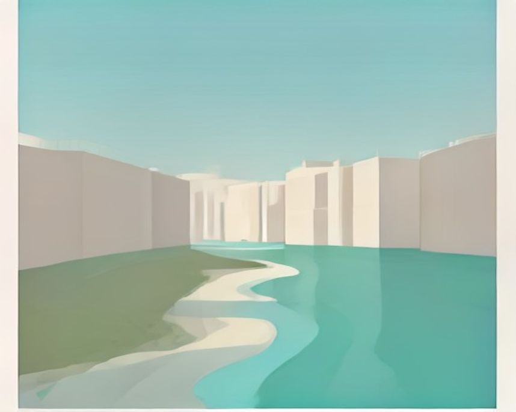

# 대전 러닝 코스

---

`러닝 코스 · 대전`

# 갑천, 대전의 저녁이 모이는 강변

엑스포다리와 한빛탑을 지나며 10km를 만든다. 강 건너 도시 불빛이 후반 길잡이가 된다.

`10.0km` `60분` `보통` `평지`

[**지도에서 출발점 열기**  →](https://map.kakao.com/?q=갑천)

### 어떤 길인지

도안동 갑천 둔치에서 출발한다. 물길을 왼쪽에 두고 하류로 방향을 잡으면 길이 끊기지 않고 이어진다. 대전에서 러닝 얘기를 하면 갑천이 자주 쓰는 코스인 이유가 여기 있다. 신호 없이 10km를 통으로 채울 수 있는 길이 도심 한복판을 관통한다.

초반은 둔치 사이를 지나고, 월평동을 넘어서면 오른쪽으로 둔산 신도심의 건물이 벽처럼 늘어선다. 대전 서구는 넓은 공원과 한적한 강변길, 도심 숲길이 겹치는 동네라 러닝 환경이 특히 좋다는 평을 받는데, 갑천이 그 중심축이다.

약 7.7km 지점에서 엑스포다리를 만난다. 갑천을 가로질러 둔산과 도룡동을 잇는 다리로, 밤이면 조명이 들어와 멀리서도 위치를 가늠할 수 있다. 다리를 건너 500m 남짓 더 가면 한빛탑이고, 그 바로 뒤가 엑스포과학공원이다.

한빛탑과 엑스포과학공원 일대는 1993년 대전엑스포가 열린 자리다. 행사가 끝난 뒤 주변은 많이 바뀌었지만 한빛탑은 그대로 남아 대전의 상징으로 통한다. 강 건너에는 도심 한가운데 조성된 한밭수목원이 붙어 있어, 강변길과 숲길을 한 번에 묶을 수 있는 구조다.

노면은 대부분 평탄한 포장 둔치길이고 고도차가 거의 없다. 다리 밑을 통과하는 구간이 많아 차도와 만나는 지점이 드물고, 그래서 페이스를 일정하게 유지하기 쉽다. 다만 둔치라 그늘이 고르지 않아 한여름 낮에는 볕을 그대로 받는 구간이 길게 이어진다.

짧게 뛰는 날에는 한밭수목원을 붙이고, 거리주 날에는 유등천이나 금강 방향으로 연장한다. 자전거 통행이 늘어나는 시간에는 보행선 안쪽을 지키는 것이 페이스보다 중요하다.

돌아오는 길은 왔던 둔치를 되짚거나, 엑스포다리에서 한밭수목원 쪽으로 빠져 수목원 루프를 붙이는 두 가지다. 편도 8km에 무엇을 덧대느냐로 10km를 맞추면 된다. 러닝을 마치고는 유성온천 일대로 이동해 몸을 푸는 동선이 흔하다.

### 더 알아두면 좋은 것

거리를 짧게 끊고 싶으면 한밭수목원으로 들어가면 된다. 2~3km 루프에 나무 그늘과 잔디가 많아 여름에도 시원하고 평탄하다. 강변 구간에 수목원 한 바퀴를 붙이는 조합이 부담이 적다.

대전은 갑천, 한밭수목원, 계족산이 삼각형으로 붙어 있어 일주일 훈련을 도시 하나에서 다 소화할 수 있다. 평일은 갑천에서 일정 페이스 지속주, 주말은 계족산 임도에서 언덕 훈련으로 나누는 식이다.

서구에 인접한 유성천도 평탄한 강변이라 장거리에 붙이기 좋다. 갑천과 만나는 지점에서 그대로 이어 달리면 왕복 거리를 크게 늘릴 수 있어, 하프 거리 연습에도 쓸 만하다.

봄가을에는 해 질 무렵이 낫다. 조명이 켜지는 시간에 맞춰 하류 방향으로 코스를 잡으면 후반부가 밝은 구간에 들어와 페이스를 유지하기 편하다.

### 가기 전에 알아두면 좋아요

- 한밭수목원은 주말에 산책하는 사람이 많다. 이른 아침이나 늦은 저녁이 낫다.
- 강변 구간은 그늘이 고르지 않아 한여름 낮에는 부담이 된다. 볕이 약한 시간으로 옮기는 게 낫다.
- 둔치길은 자전거와 함께 쓰는 구간이 있다. 굽은 지점에서는 안쪽으로 붙는 게 안전하다.
- 비가 많이 온 뒤에는 둔치에 진흙이 남는다. 이때는 상단 제방길로 우회하는 편이 낫다.
- 엑스포다리 주변은 저녁에 산책 인파가 몰린다. 다리 위에서는 속도를 줄인다.

### 지나는 곳

| | 장소 |
|---|---|
| — | **갑천** — 출발점. 도안동 둔치에서 하류로 잡으면 신호에 끊기지 않는 포장 러닝로가 시작된다. |
| — | **엑스포다리** — 약 7.7km 지점의 다리. 밤이면 조명이 들어와 야간 러닝의 기준점 역할을 한다. |
| — | **한빛탑** — 1993년 대전엑스포의 상징탑. 다리에서 500m 남짓 거리로, 코스에서 가장 알아보기 쉬운 표지다. |
| — | **엑스포과학공원** — 북쪽 반환점. 엑스포가 열렸던 자리이고, 여기서 되돌아오거나 한밭수목원 루프로 넘어간다. |

---

`러닝 코스 · 대전`

# 계족산 황톳길, 붉은 임도를 오래 도는 날

장동산림욕장에서 계족산성까지 산허리를 돈다. 황토길에서는 걷는 사람의 속도를 먼저 살핀다.

`14.5km` `110분` `어려움` `트레일`

[**지도에서 출발점 열기**  →](https://map.kakao.com/?q=계족산)

### 어떤 길인지

대전 대덕구 장동 산 85 일원, 장동산림욕장에서 시작한다. 입구를 지나 임도삼거리에 들어서면 곧바로 붉은 흙길이 시작된다. 여기서 계족산성 갈림목까지 약 7.3km, 다시 절고개까지 3km 남짓. 장동산림욕장에서 임도삼거리와 절고개를 거쳐 이현동 갈림길까지 총 14.5km다. 산허리를 빙 두르는 임도라 경사가 완만하고, 한국기록원이 인증한 국내 최장 황톳길이다.

2006년 한 지역 기업이 전북 김제와 익산에서 고운 황토 2만여 톤을 공수해 깔았고, 매년 봄 새 황토를 다시 깐다. 한국관광 100선에 세 번 연속 선정됐고 연간 100만 명이 찾는다. 맨발로 걷는 사람이 눈에 띄는으로 많은 길이라는 뜻이기도 하다.

러너라면 알고 가야 할 게 하나 있다. 황톳길은 푹푹 빠지고 미끄러워 평소 페이스로 달릴 수 있는 노면이 아니다. 다행히 옆으로 신발을 신고 걷는 구간이 나란히 나 있어서, 러닝은 그쪽을 쓰는 게 현실적이다. 맨발로 걷는 사람들과 길 폭을 나눠 쓰는 만큼 뒤에서 접근할 때는 속도를 줄이는 게 맞다.

중간에 갈라져 오르는 계족산성은 백제가 쌓은 것으로 전해지는 산성이고 사적으로 지정돼 있다. 산 이름은 뻗어나간 능선의 모양이 닭발을 닮았다는 데서 왔다고 전해진다. 성벽에 올라서면 대청호 방면과 대전 시내가 함께 내려다보인다.

경사는 완만하지만 거리가 길고 노면 저항이 커서 난이도가 올라간다. 임도는 폭이 넓고 급한 커브가 없어 발목 부담은 적은 편이지만, 흙길 특유의 무른 반발이 다리에 쌓인다. 트레일 경험이 많지 않다면 절고개까지 왕복으로 끊는 편이 낫다.

황토길은 걷는 사람이 우선이다. 달릴 때는 다져진 가장자리나 신발 구간을 이용하고, 젖은 황토에서는 추월보다 감속을 택해야 한다.

해 질 무렵 서쪽으로 트인 구간에서는 붉은 흙과 노을 색이 겹친다. 다만 산속 임도라 해가 넘어가면 금세 어두워지니, 늦게 들어갈 계획이면 되돌아 나올 시간을 넉넉히 잡는다. 내려와서는 입구 세족장에서 흙을 씻어내면 된다.

### 더 알아두면 좋은 것

거리를 조절할 수 있다. 종주 코스는 주차장에서 장동산림욕장과 황톳길, 계족산성, 성재산, 계족산, 산디마을을 거쳐 돌아오는 약 10km에 4시간. 체력 부담이 있으면 법동 구민휴식공원에서 진입하는 약 4.1km, 2시간 코스가 있다.

입장료와 주차비 모두 무료다. 장동산림욕장 입구에 신발 보관 장소와 세족장이 있어, 맨발로 걷는 구간과 신발을 신고 달리는 구간을 섞어 쓰는 방식에도 부담이 없다.

황톳길 중간에서 약 20분 오르면 해발 420m 계족산성에 닿는다. 코스에 전망대 하나를 끼워 넣고 싶을 때 좋은 반환점이고, 오르막이 짧고 가팔라 언덕 훈련 구간으로 떼어 쓰기도 한다.

장거리 지구력 훈련에 맞는 길이다. 노면 저항 때문에 같은 시간을 달려도 도로보다 거리가 덜 나오니, 시계에 찍히는 페이스 대신 체감 강도로 구간을 끊는 편이 낫다.

### 가기 전에 알아두면 좋아요

- 매년 5월 둘째 주 주말에 맨발축제가 열린다. 이 시기엔 사람이 몰리니 훈련 목적이면 피하는 게 좋다.
- 전 구간은 4~5시간 걸린다. 임도 특성상 러닝으로 접근해도 시간이 크게 줄지 않으니 물과 간식을 챙기는 게 맞다.
- 비 온 뒤에는 황토가 더 미끄럽다. 접지력 있는 신발이 아니면 신발 구간으로만 붙는 게 안전하다.
- 주말 낮에는 맨발로 걷는 사람이 길 폭을 채운다. 러닝은 이른 아침이 훨씬 편하다.
- 해가 지면 임도가 빠르게 어두워진다. 노을 시간에 맞춰 들어간다면 조명 장비를 준비한다.

### 지나는 곳

| | 장소 |
|---|---|
| — | **장동산림욕장** — 출발점이자 황톳길 입구. 신발 보관 장소와 세족장이 있어 맨발 구간과 신발 구간을 섞어 쓰기 좋다. |
| — | **임도삼거리** — 황톳길이 본격적으로 갈라지는 지점. 여기서 계족산성 갈림목까지 7km 넘게 임도가 이어진다. |
| — | **계족산성** — 해발 420m, 백제가 쌓은 것으로 전해지는 산성. 20분 남짓 올라야 하지만 대전 시내 조망을 얻는다. |
| — | **절고개** — 임도 반환점. 여기까지 왕복으로 끊으면 전 구간 종주보다 부담이 크게 줄어든다. |
