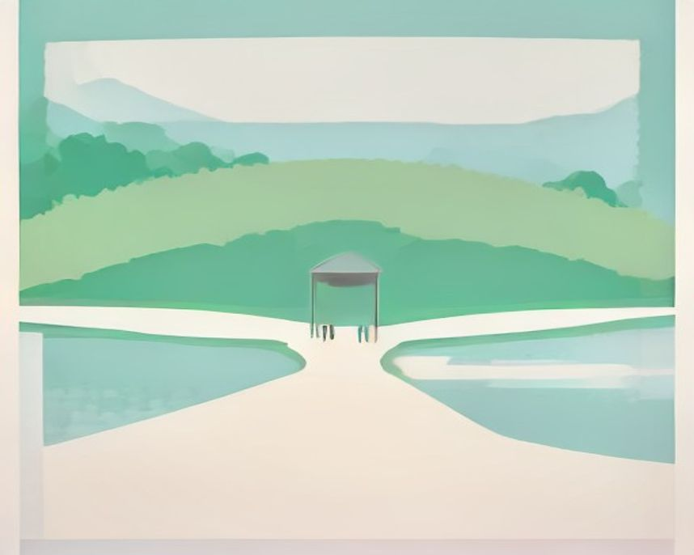
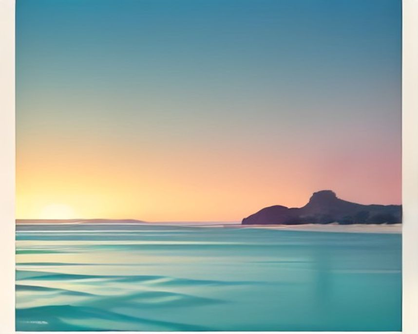

# 강릉 러닝 코스

---

`러닝 코스 · 강릉`

# 경포호, 4.3km마다 같은 물가로 돌아오기

경포대와 가시연습지, 초당 솔숲이 한 바퀴 안에서 차례로 지나간다.

`4.3km` `26분` `쉬움` `풍경`

[**지도에서 출발점 열기**  →](https://map.kakao.com/?q=경포호)

### 어떤 길인지

경포호수공원 순환로는 한 바퀴가 약 4.3km다. 이 숫자가 이 길의 거의 전부라고 해도 된다. 두 바퀴면 8.6km, 세 바퀴면 12.9km로 계산이 딱 떨어져 훈련 계획을 짜기 편하고, 현장에는 12km 코스를 안내하는 표지판도 서 있다.

저동 쪽 호숫가에서 출발하면 약 800m 지점에 경포대가 나온다. 예부터 관동팔경으로 꼽혀 온 정자로, 여기서 내려다보는 호수가 이 길의 첫 장면이다. 이후 순환로는 호수 남쪽의 가시연습지를 지나 초당 솔숲의 허난설헌 생가터 방향으로 이어진다.

경포호는 달구경으로 이름난 호수다. 하늘과 호수, 바다와 술잔, 그리고 마주 앉은 사람의 눈동자에 달이 하나씩 떠서 다섯 개의 달을 본다는 이야기가 전해 온다. 호수 남쪽 초당동에는 홍길동전을 쓴 허균과 시인 허난설헌 남매의 생가터가 솔숲에 남아 있다.

노면은 평탄한 포장 순환로이고 가로등이 끝까지 켜져 있다. 어두울 때 처음 와도 길을 헤맬 일이 없다는 게 현지 러너들이 공통으로 꼽는 장점이다. 오르막과 계단이 없어 첫 러닝부터 페이스 감각 훈련까지 두루 받아 주고, 바퀴 수로 거리가 조절되니 바퀴마다 속도를 올리는 훈련도 짜기 쉽다.

거리를 키우고 싶으면 경포해변과 이어 붙이는 게 정석이다. 해변에서 호수 둘레길로 넘어가면 자연스럽게 8~9km가 나온다. 바다와 호수를 한 번에 밟는 강릉다운 구성이다.

한 바퀴 거리가 일정해 이지런과 템포런 모두 계획하기 쉽다. 대회 후기에서는 경포호 주변 무료 공영주차장을 이용하는 러너가 많았고, 성수기에는 오전 일찍 도착해야 여유가 있었다.

겨울에는 호수가 얼어붙는다. 바닷바람을 맞으며 언 호수를 끼고 도는 풍경은 이 코스에서만 나오는 그림이다. 뛰고 나면 초당순두부마을과 안목 커피거리가 지척이라, 아침 러닝 뒤의 동선이 강원에서 매끄러운 축에 든다.

### 더 알아두면 좋은 것

출발점은 경포해변 공영주차장이 편하다. 성수기에는 유료, 비수기에는 무료로 운영된다. 차를 세우고 호수까지 걸어 들어가는 몇 분이 그대로 워밍업이 된다.

강릉은 러닝 후 동선이 좋은 도시다. 안목해변 커피거리가 차로 몇 분이고 초당순두부마을도 가깝다. 아침런 다음 순두부, 그다음 커피가 현지에서 반쯤 공식 코스처럼 굳어져 있다.

일출런을 노린다면 호수보다 안목·경포해변 쪽이 맞다. 호수는 사방이 막혀 해가 늦게 보인다. 해변에서 해를 본 뒤 호수로 넘어와 본 러닝을 하는 순서로 짜면 둘 다 챙길 수 있다.

봄에는 호수 주변이 벚꽃길로 바뀌어 강릉에서 손꼽히는 꽃놀이 장소가 된다. 한 해 중 풍경이 눈에 남지만 인파도 가장 많은 시기라, 러닝이 목적이면 이른 아침을 노리는 게 낫다.

### 가기 전에 알아두면 좋아요

- 여름 성수기 주말 낮은 피하는 게 좋다. 관광객이 몰려 순환로가 산책 인파로 채워진다.
- 겨울 결빙기에는 호수 쪽 데크가 미끄럽다. 데크 구간에서는 보폭을 줄이는 게 안전하다.
- 벚꽃 철 주말은 한 해 중 유난히 붐빈다. 이 시기에 조용히 달리려면 이른 아침뿐이다.
- 호수 주변은 바람을 막아 줄 것이 적다. 겨울 바닷바람이 부는 날은 방풍 상의를 챙긴다.
- 대여 자전거가 다니는 길과 겹친다. 움직임이 불규칙한 관광객 자전거와는 거리를 두는 게 안전하다.

### 확인한 자료

- [경포마라톤 주차·코스 후기](https://gall.dcinside.com/mgallery/board/view/?id=running&no=453362) · community · 2026-09-01

### 지나는 곳

| | 장소 |
|---|---|
| — | **경포호** — 출발점. 한 바퀴 약 4.3km의 평탄한 순환로가 호수를 감싸고 있어 어느 방향으로 돌아도 된다. |
| — | **경포대** — 출발에서 약 800m 지점, 호수 북쪽의 정자. 예부터 관동팔경으로 꼽혀 온 경포 조망의 기준점이다. |
| — | **경포가시연습지** — 호수 남쪽의 습지 구간. 가시연을 되살린 습지로, 계절에 따라 물풀과 새가 만드는 풍경이 크게 바뀐다. |
| — | **허난설헌생가터** — 초당 솔숲의 허난설헌·허균 남매 생가터. 소나무 그늘 아래를 지나는, 코스에서 가장 차분한 구간이다. |

---

`러닝 코스 · 강릉`

# 안목해변, 해 뜨는 걸 보면서 커피까지 이어지는 5km

바다를 오른쪽에 두고 달리다 커피거리에서 끝내는, 강릉에서만 가능한 아침 동선.

`5.0km` `32분` `쉬움` `일출`

[**지도에서 출발점 열기**  →](https://map.kakao.com/?q=안목해변)

### 어떤 길인지

경포호가 훈련용이라면 안목은 여행용이다. 안목해변 백사장 앞에서 출발해 바다를 끼고 남쪽으로 내려간다. 약 500m 지점에 강릉항이 나오고, 방파제와 정박한 배들 사이로 항구의 새벽 풍경이 이어진다.

항구를 지나면 곧 안목 커피거리 앞이다. 여기서 약 1.1km, 남대천이 바다와 만나는 하구를 건너면 이 길의 반환점인 남항진해변에 닿는다. 돌아서는 순간 바다가 오른쪽에 오고, 동해라 해가 수평선에서 정면으로 떠올라 돌아오는 내내 그 빛을 받으며 달리게 된다.

안목의 진짜 강점은 끝나는 지점이다. 백사장 바로 뒤가 커피거리라 뛰고 나서 씻지 않아도 바로 앉을 데가 있다. 방파제 앞 커피 자판기 몇 대로 이름을 알리기 시작해 지금의 카페 거리로 자란 곳으로, 강릉이 커피 도시로 불리게 된 출발점 같은 장소다.

노면은 해변 산책로의 포장 구간과 모래가 섞인다. 포장로 위주로 달리면 평탄해서 부담이 없지만, 모래 위로 내려서면 같은 거리도 훨씬 힘들어진다. 오르막이 없어 처음 온 사람도 페이스 잡기가 쉽고, 사람이 많은 구간에서만 속도를 낮추면 된다.

5km가 짧게 느껴지면 반대편 강문해변 쪽으로 이어 붙여 경포까지 넘어가면 된다. 해변과 호수가 이어지는 동네라 거리는 어디까지 가느냐로 조절하면 된다.

해가 뜨는 방향을 보며 돌아오려면 남항진 쪽으로 먼저 내려갔다가 북쪽으로 복귀하면 된다. 커피거리는 러닝 중간보다 종료 후 동선으로 두는 편이 보행자와 덜 겹친다.

일출런이라면 어둠 속에 출발해 반환점을 돌 때쯤 하늘이 붉어지는 배분이 이상적이다. 수평선이 밝아지고 항구의 배들이 움직이기 시작하는 아침을 통과해, 커피 향이 도는 거리에서 끝난다. 아침 바다와 갓 내린 커피를 이만큼 짧은 동선으로 묶을 수 있는 데는 드물다.

### 더 알아두면 좋은 것

일출 시각은 계절에 따라 크게 달라진다. 겨울에는 7시가 넘도록 어두우니 출발을 늦춰야 하고, 여름에는 해가 훨씬 이르게 뜨므로 수평선의 해를 보려면 그만큼 서둘러 나와야 한다.

해변 구간은 모래와 포장로가 섞인다. 모래 위를 달리면 같은 거리도 훨씬 힘들고 종아리에 부하가 실린다. 일부러 모래 구간을 짧게 넣으면 근력 훈련이 되고, 편하게 달리고 싶은 날은 포장로만 밟으면 된다.

정동진까지 내려가면 일출 런트립을 하루 더 늘릴 수 있다. 역이 바닷가에 붙어 있기로 이름난 동네라 새벽 기차 이동과 일출 러닝을 묶기 좋고, 안목과는 또 다른 해안 풍경이 나온다.

강문 방향으로 이어 붙이면 경포해변을 지나 경포호 순환로까지 한 번에 연결된다. 바다와 호수를 하루에 다 밟는 강릉식 장거리 구성이 되고, 회복런은 호수, 기분 내는 날은 바다로 나눠 쓰는 것도 방법이다.

### 가기 전에 알아두면 좋아요

- 해풍이 강한 날은 체감온도가 크게 떨어진다. 방풍은 계절과 무관하게 챙기는 게 낫다.
- 성수기 주말 낮은 백사장에 사람이 많다. 이 시기에는 이른 아침이 비교적 한산한 시간대다.
- 일출 직전이 하루 중 가장 어둡다. 새벽에 나서면 밝은색 옷이나 라이트를 갖추는 편이 안전하다.
- 항구 주변은 이른 시간부터 차량과 어선 작업이 있다. 방파제 근처에서는 주변을 살피며 지난다.
- 산책로에 모래가 날려 쌓인 구간은 미끄럽다. 커브에서는 속도를 줄이는 게 낫다.

### 지나는 곳

| | 장소 |
|---|---|
| — | **안목해변** — 출발점. 백사장 뒤로 커피거리가 붙어 있고, 수평선에서 떠오르는 해를 정면으로 볼 수 있는 자리다. |
| — | **강릉항** — 출발 약 500m 지점의 항구. 방파제와 정박한 배 사이로 새벽 항구의 풍경이 지나가는 구간이다. |
| — | **안목 커피거리** — 커피 자판기에서 시작해 카페 거리로 자란 곳. 러닝을 마치고 땀이 식기 전에 바로 앉을 수 있다. |
| — | **남항진해변** — 남대천 하구 건너의 한적한 해변. 이 길의 남쪽 반환점으로, 여기서 돌아서면 바다가 오른쪽에 온다. |
