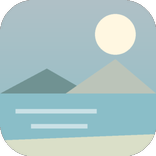
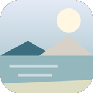

# 강릉 러닝 코스

---

`러닝 코스 · 강릉`

# 경포호, 4.3km 한 바퀴로 끝나는 가장 쉬운 첫 러닝

가로등이 끝까지 켜져 있어 처음 오는 사람도 길을 잃지 않는, 강원에서 가장 만만한 호수 순환로.

`4.3km` `26분` `쉬움` `풍경`

[**지도에서 출발점 열기**  →](https://map.kakao.com/?q=경포호)

### 어떤 길인지

경포호수공원 순환로는 한 바퀴가 약 4.3km다. 이 숫자가 이 코스의 거의 전부라고 해도 된다. 두 바퀴면 8.6km, 세 바퀴면 12.9km로 계산이 딱 떨어지니 훈련 계획을 짜기 편하다.

노면은 평탄하고 가로등이 잘 켜져 있다. 어두울 때 처음 와도 길을 헤맬 일이 없다는 게 현지 러너들이 공통으로 꼽는 장점이다. 현장에는 12km 코스를 안내하는 표지판도 서 있다.

거리를 키우고 싶으면 경포해변과 이어 붙이는 게 정석이다. 해변에서 호수 둘레길로 넘어가면 자연스럽게 8~9km가 나온다.

겨울에는 호수가 얼어붙는다. 바닷바람을 맞으며 언 호수를 끼고 도는 풍경은 이 코스에서만 나오는 그림이다.

### 더 알아두면 좋은 것

출발점은 경포해변 공영주차장이 편하다. 성수기에는 유료, 비수기에는 무료다.

강릉은 러닝 후 동선이 좋은 도시다. 안목해변 커피거리가 차로 몇 분이고 초당순두부마을도 가깝다. 아침런 다음 순두부, 그다음 커피가 현지에서 반쯤 공식 코스처럼 굳어져 있다.

일출런을 노린다면 호수보다 안목·경포해변 쪽이 맞다. 호수는 사방이 막혀 해가 늦게 보인다.

### 가기 전에 알아두면 좋아요

- 여름 성수기 주말 낮은 피하는 게 좋다. 관광객이 몰려 순환로가 산책 인파로 채워진다.
- 겨울 결빙기에는 호수 쪽 데크가 미끄럽다.

### 아직 확인 중인 것

- 화장실·급수대 위치
- 12km 표지판 코스의 실제 경로

### 지나는 곳

| | 장소 |
|---|---|
|  | **경포해수욕장** — 호수와 이어 붙이면 8~9km. 일출런 지점 |
|  | **안목해변** — 커피거리. 러닝 후 마무리 |
|  | **경포가시연습지** — 호수 옆 데크길. 쿨다운 산책 |
|  | **초당순두부마을** — 아침런 뒤 식사 |

이미지는 한국관광공사 사진의 색을 참고해 직접 그린 것입니다 · 원본 경포도립공원

---

`러닝 코스 · 강릉`

# 안목해변, 해 뜨는 걸 보면서 커피까지 이어지는 5km

바다를 오른쪽에 두고 달리다 커피거리에서 끝내는, 강릉에서만 가능한 아침 동선.

`5.0km` `32분` `쉬움` `일출`

[**지도에서 출발점 열기**  →](https://map.kakao.com/?q=안목해변)

### 어떤 길인지

경포호가 훈련용이라면 안목은 여행용이다. 해변을 따라 달리는 평탄한 구간이고, 동해라 일출이 정면으로 뜬다.

강문해변과 이어 붙이면 경포 쪽까지 자연스럽게 연결된다. 거리는 어디까지 가느냐로 조절하면 된다.

안목의 진짜 강점은 끝나는 지점이다. 백사장 바로 뒤가 커피거리라, 뛰고 나서 씻지 않아도 바로 앉을 데가 있다.

### 더 알아두면 좋은 것

일출 시각은 계절 따라 크게 달라진다. 겨울에는 7시 넘어서까지 어두우니 출발을 늦춰야 한다.

해변 구간은 모래와 포장로가 섞인다. 모래 위를 달리면 같은 거리도 훨씬 힘들다.

정동진까지 내려가면 일출 런트립을 하루 더 늘릴 수 있다.

### 가기 전에 알아두면 좋아요

- 해풍이 강한 날은 체감온도가 크게 떨어진다. 방풍은 계절과 무관하게 챙기는 게 낫다.
- 성수기 주말은 백사장에 사람이 많다.

### 아직 확인 중인 것

- 안목~강문 정확한 거리
- 샤워 시설 여부

### 지나는 곳

| | 장소 |
|---|---|
|  | **강문해변** — 경포 방향 연결 구간 |
|  | **경포호** — 4.3km 순환. 이어 붙이면 8~9km |
|  | **정동진역** — 일출 런트립을 늘릴 때 |
|  | **오죽헌** — 러닝 후 도심 관광 |

이미지는 한국관광공사 사진의 색을 참고해 직접 그린 것입니다 · 원본 안목해변
