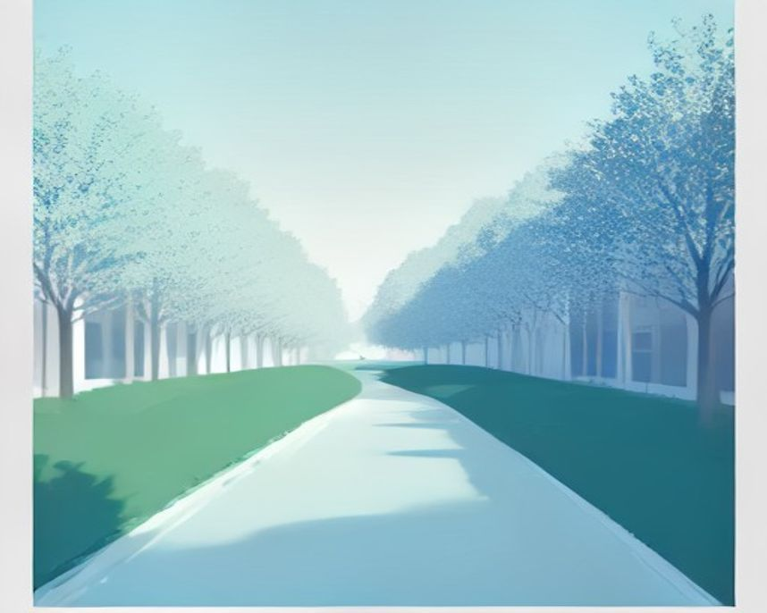

# 광주 러닝 코스

---

`러닝 코스 · 광주`

# 광주천, 자전거길과 나뉘어 있어 마음 놓고 뛰는 하천

도심을 관통하는 22km 하천 중 러너가 주로 쓰는 8~10km 구간. 폭이 넓어 부딪힐 일이 없다.

`10.0km` `60분` `쉬움` `평지`

[**지도에서 출발점 열기**  →](https://map.kakao.com/?q=광주천)

### 어떤 길인지

광주천은 충장로와 양림동, 학동 같은 도심을 따라 흐르며 전체 길이가 약 22km다. 그중 러너가 주로 쓰는 건 푸른길공원에서 광천동 방향으로 왕복하는 8~10km 구간이다.

이 코스의 강점은 폭이다. 자전거도로와 보행자도로가 나뉘어 있고 길 자체가 넓어서, 다른 하천 코스에서 흔한 부딪힘 스트레스가 적다.

곳곳에 운동기구와 쉼터가 있어 중간에 멈춰 스트레칭하기 좋다. 광주공원에서 중앙대교를 거쳐 양동시장으로 가는 구간은 짧게 끊어 뛰기에 알맞다.

### 더 알아두면 좋은 것

광천동과 치평동 등 서구 일대 천변길은 대중교통 접근성이 좋다.

기록을 재려면 동구 체육공원의 국제 규격 트랙이 상시 개방돼 있다.

영산강 합류부로 빠지면 거리를 크게 늘릴 수 있다.

### 가기 전에 알아두면 좋아요

- 도심 하천이라 다리 밑 구간은 낮에도 어둡다.
- 야간 조명은 구간마다 차이가 있다.

### 아직 확인 중인 것

- 화장실·급수대 위치
- 구간별 야간 조명
- 주차 가능 지점

### 지나는 곳

| | 장소 |
|---|---|
|  | **5·18기념공원** — 상무지구. 워밍업과 역사 산책 |
|  | **동구 체육공원 트랙** — 국제 규격. 상시 개방 |
|  | **무등산 증심사** — 트레일런 진입로 |
|  | **광주호 호수생태원** — 도심 밖 수변 코스 |

이미지는 한국관광공사 사진의 색을 참고해 직접 그린 것입니다 · 원본 광주호 호수생태원 (광주천 사진이 없어 같은 지역 수변 이미지로 대신함)
