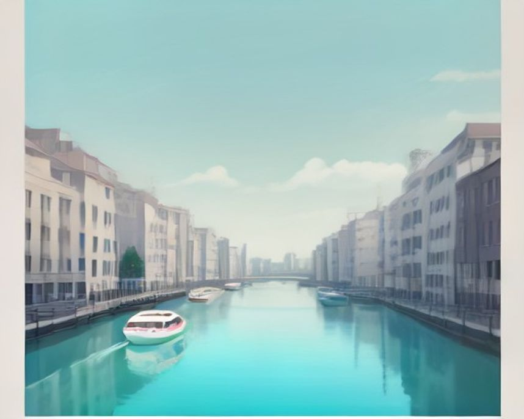
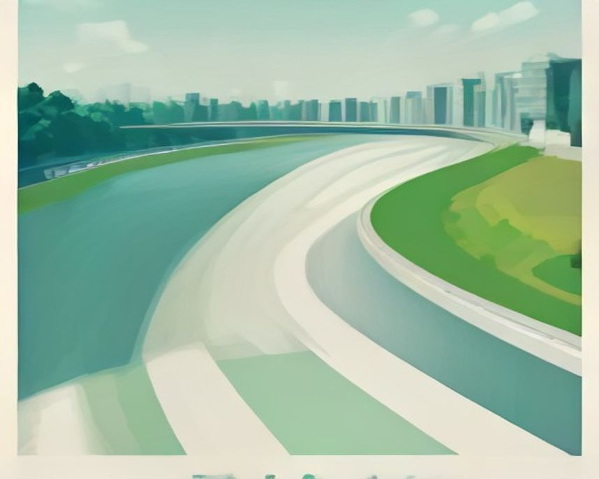
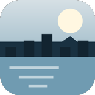
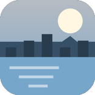

# 인천 러닝 코스

---

`러닝 코스 · 인천`

# 송도 센트럴파크, 고층 빌딩 사이 완전 평지 3.5km

수로를 따라 도는 순환로에 오르내림이 하나도 없다. 인천에서 첫 러닝을 시작하기 가장 쉬운 곳.

`3.6km` `22분` `쉬움` `평지`

[**지도에서 출발점 열기**  →](https://map.kakao.com/?q=송도)

### 어떤 길인지

송도의 매력은 도시가 통째로 계획된 곳이라는 데서 온다. 러닝로도 마찬가지다. 길이 끊기지 않고, 신호가 없고, 노면이 균일하다.

기본 루트는 G타워 앞 잔디광장에서 출발해 센트럴파크 수로길을 따라 워터프론트 산책로로 넘어가고, 랜드마크시티 1호 수변공원과 담빛공원 방향을 돌아 복귀하는 구성이다. 센트럴파크만 한 바퀴면 3.5~3.8km, 수변공원까지 이어 붙이면 5km를 넘긴다.

완전한 평지다. 무릎 부담이 적어 회복런이나 첫 5K에 적합하고, 고층 빌딩에 조명이 들어오는 밤 풍경도 좋다.

### 더 알아두면 좋은 것

거리를 크게 늘리고 싶으면 인천에서는 아라뱃길로 넘어가는 게 맞다. 센트럴파크는 5km 언저리에서 반복하는 코스지 장거리용은 아니다.

청라호수공원이 같은 성격의 대안이다.

### 가기 전에 알아두면 좋아요

- 주말 낮에는 관광객과 러너, 자전거가 한 길에 섞여 페이스 유지가 어렵다. 이른 아침을 권한다.
- 수로 옆 구간은 조명이 밝지만 바람이 통과한다.

### 아직 확인 중인 것

- 화장실·급수대 위치
- 주차장 요금

### 지나는 곳

| | 장소 |
|---|---|
|  | **랜드마크시티 1호 수변공원** — 코스 후반부. 인천대교가 보인다 |
|  | **청라호수공원** — 5km 순환. 송도 대신 쓰는 대안 |
|  | **인천대공원** — 숲과 평지. 초보용 |
|  | **월미도** — 바다뷰 짧은 코스 |

이미지는 한국관광공사 사진의 색을 참고해 직접 그린 것입니다 · 원본 송도 센트럴파크

---

`러닝 코스 · 인천`

# 경인 아라뱃길, 20km까지 직선으로 밀어붙이는 길

끊기는 데가 없다. 수도권에서 긴 거리를 통으로 소화할 수 있는 몇 안 되는 코스.

`20.0km` `122분` `어려움` `평지`

[**지도에서 출발점 열기**  →](https://map.kakao.com/?q=아라뱃길)

### 어떤 길인지

아라인천여객터미널에서 출발하면 편도 10km 이상이 그대로 나온다. 길게 잡으면 20km도 넘긴다.

이 코스의 성격은 사진 한 장에 다 들어 있다. 수로가 자로 그은 것처럼 곧게 뻗어 있고 양옆으로 자전거·보행로가 나란히 간다. 신호가 없고 갈림길도 없어서 한 번 페이스를 잡으면 끝까지 유지된다.

바꿔 말하면 지루하다. 풍경 변화가 거의 없어 정신적으로 버티는 훈련이 된다. 마라톤 대비 장거리 세션용이라고 보면 정확하다.

### 더 알아두면 좋은 것

심곡천 쪽으로 연계하면 코스를 조금 더 변주할 수 있다.

다음날 회복런은 송도나 인천대공원처럼 짧은 순환형이 맞다.

### 가기 전에 알아두면 좋아요

- 그늘이 거의 없다. 한여름 낮은 위험하고 겨울에는 수로 바람이 그대로 들어온다.
- 편의시설이 드문 구간이 길다. 반환 지점까지 편의점을 못 만날 수 있으니 물은 직접 챙겨야 한다.

### 아직 확인 중인 것

- 구간별 화장실 위치
- 야간 조명 범위

### 지나는 곳

| | 장소 |
|---|---|
|  | **아라인천여객터미널** — 표준 출발점 |
|  | **심곡천** — 코스 변주용 연계 구간 |
|  | **인천대공원** — 다음날 회복런 |
|  | **송도 센트럴파크** — 짧은 이지런으로 전환 |

이미지는 한국관광공사 사진의 색을 참고해 직접 그린 것입니다 · 원본 경인 아라뱃길
