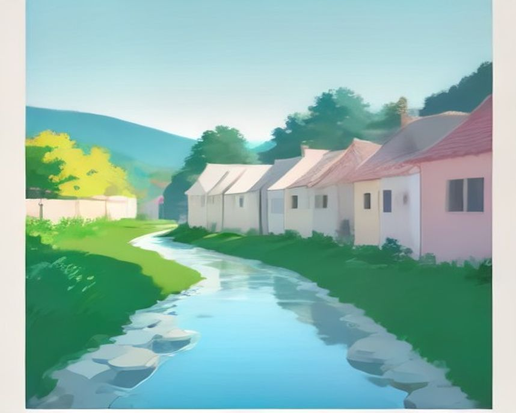
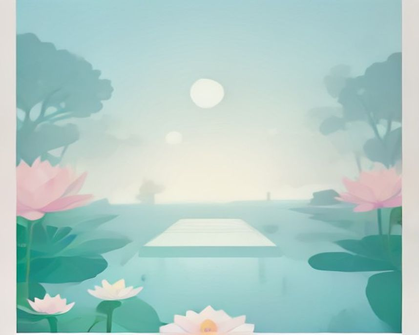

# 전주 러닝 코스

---

`러닝 코스 · 전주`

# 전주천, 한옥마을이 비어 있는 시간에만 나오는 코스

관광객이 들어차기 전 새벽. 같은 길인데 완전히 다른 도시가 된다.

`8.0km` `48분` `쉬움` `문화유산`

[**지도에서 출발점 열기**  →](https://map.kakao.com/?q=전주천)

### 어떤 길인지

지역 크루 전주러너스가 2018년 창립 이후 6개월간 직접 뛰며 정착시킨 라인이 한옥마을과 전주천을 잇는 코스다.

핵심은 시간대다. 한옥마을 구간은 새벽에 가야 한다. 낮에는 관광객 사이를 비집고 다녀야 하지만, 해 뜨기 전에는 기와지붕과 담장만 남은 길이 된다. 같은 코스인데 체감이 완전히 다르다.

전주천은 평탄하고 길이 이어져서 거리 조절이 자유롭다. 8km 안팎에서 끊는 구성이 무난하다.

### 더 알아두면 좋은 것

긴 거리는 덕진공원보다 전주천과 삼천천이 낫다는 게 현지 러너들 평가다. 전주천과 삼천 합류부를 왕복하면 장거리가 나온다.

스피드 훈련은 전북대 트랙이 전주 러너들의 성지다.

### 가기 전에 알아두면 좋아요

- 낮 한옥마을 구간은 관광객이 많아 러닝에 맞지 않는다.
- 새벽에는 조명이 어두운 구간이 있다.

### 아직 확인 중인 것

- 구간별 거리
- 화장실 위치
- 전북대 트랙 개방 시간

### 지나는 곳

| | 장소 |
|---|---|
|  | **덕진공원** — 회복런. 24시간 개방 |
|  | **삼천천 합류부** — 장거리 반환점 |
|  | **전북대 트랙** — 인터벌·스피드 훈련 |
|  | **전주한옥마을** — 새벽 구간. 낮에는 피할 것 |

이미지는 한국관광공사 사진의 색을 참고해 직접 그린 것입니다 · 원본 전주천

---

`러닝 코스 · 전주`

# 덕진공원, 24시간 열려 있는 연꽃 호수

전체 평탄한 데크길. 새벽이든 한밤이든 문이 닫히지 않는다.

`3.0km` `20분` `쉬움` `평지`

[**지도에서 출발점 열기**  →](https://map.kakao.com/?q=덕진공원)

### 어떤 길인지

덕진호가 공원의 3분의 2를 차지하고 데크길이 잘 조성돼 있다. 전체가 평탄해서 회복런과 첫 러닝에 맞는다.

연중무휴 24시간 개방이라 시간 제약이 없다. 새벽이나 야간에 뛰려는 사람에게 이 조건이 크다.

6월 연꽃 시즌이 절정이다. 음악분수도 있어 러닝보다 산책 목적으로 오는 사람이 많은 시기다.

### 더 알아두면 좋은 것

주차는 후문 전용 주차장이 넓다. 정문은 주차면이 적다. 옆 어린이회관 무료 주차장도 쓸 수 있다.

긴 거리가 필요하면 전주천이나 삼천으로 넘어가는 게 맞다. 덕진공원은 짧게 도는 코스다.

### 가기 전에 알아두면 좋아요

- 6월 연꽃철에는 산책하는 사람이 많다.
- 데크길은 비 온 뒤 미끄럽다.

### 아직 확인 중인 것

- 호수 한 바퀴 정확한 거리
- 야간 조명 범위

### 지나는 곳

| | 장소 |
|---|---|
|  | **전주천** — 거리를 늘릴 때 연결 |
|  | **후문 주차장** — 정문보다 넓다 |
|  | **어린이회관 주차장** — 무료 |
|  | **전북대 트랙** — 스피드 훈련 |

이미지는 한국관광공사 사진의 색을 참고해 직접 그린 것입니다 · 원본 덕진공원
