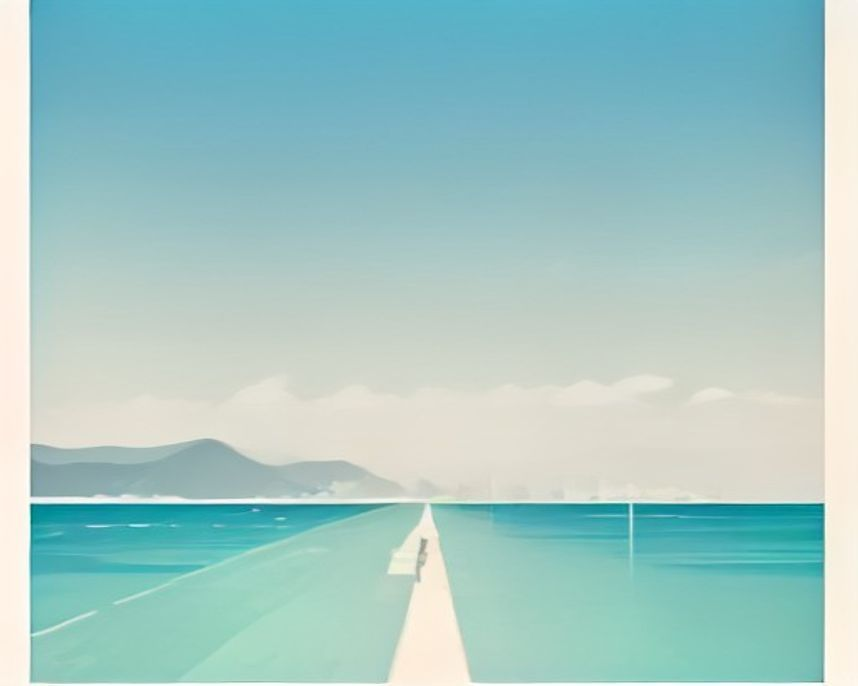

# 목포 러닝 코스

---

`러닝 코스 · 목포`

# 목포 평화광장, 신호도 오르막도 없이 20km

현지 러너가 코스를 잘 잡으면 20km가 나온다고 말하는 구간. 끊길 데가 없다.

`20.0km` `122분` `어려움` `평지`

[**지도에서 출발점 열기**  →](https://map.kakao.com/?q=평화광장에서)

### 어떤 길인지

평화광장에서 바다를 옆에 두고 해안선을 따라 출발한다. 평화광장 앞은 그 자체로 약 3km 해변 코스다. 춤추는바다분수와 야경이 있어 이 구간만 가볍게 도는 초보 러너도 많은데, 20km를 노리는 날에는 여기가 워밍업이 된다.

해안을 따라 약 6.8km를 가면 목포해상케이블카 아래를 지난다. 유달산과 고하도 사이 바다 위로 케이블카가 오가는 구간이다. 여기서 방향을 돌려 약 6.3km, 왔던 해안선을 되짚으면 갓바위 앞이다. 삿갓 쓴 사람 형상의 이 바위는 천연기념물로 지정돼 있고, 바다 위 보행 데크에서 바로 올려다볼 수 있다.

갓바위에서 약 2.9km를 더 가면 영산강하굿둑, 강과 바다가 나뉘는 지점이 길의 북쪽 끝이다. 현지 러너들이 말하는 대로 평화광장에서 하구둑을 지나 수변공원까지 코스를 잘 잡으면 20km가 나온다. 반환점을 어디에 두느냐로 거리를 조절할 수 있는 구조다.

이 길의 정체는 거리보다 조건이다. 전 구간에 신호가 없고 오르막이 없다. 긴 거리를 페이스 흐트러짐 없이 채워야 할 때 전남에서 이만한 조건을 찾기 어렵다는 게 현지 러너들의 결론이다. 20km라는 거리 자체가 어려움 등급의 이유일 뿐, 지형의 난도는 낮다.

노면은 해안 산책로와 광장 포장길로 이어지고 고도차가 거의 없다. 변수는 바람이다. 바다가 계속 옆에 있는 만큼 강풍인 날은 같은 페이스도 체감이 크게 달라진다. 갈 때 맞바람이면 올 때 뒷바람이라는 왕복 코스의 계산으로 힘을 배분하는 게 요령이다.

해안·하구 직선이 길어 후반 집중력이 떨어지기 쉽다. 출발 전에 물과 젤을 나눠 들고, 바람이 센 날에는 하굿둑까지 고집하지 말고 갓바위를 반환점으로 줄인다.

해질녘 출발이면 후반부를 노을 속에서 달린다. 목포 앞바다로 해가 잠기는 시간대의 해안선이 이 길의 가장 큰 보상이다. 광장으로 돌아오면 저녁 분수와 야경이 기다리는 한복판에서 스트레칭으로 마무리하면 된다.

### 더 알아두면 좋은 것

거리별 대안이 넓은 도시다. 옥암동 코스는 약 3.9km 평탄로에 41분, 갓바위 해안길은 약 4km, 유달산 둘레길은 약 6.7km에 오르내림이 있다. 20km가 부담스러운 날의 선택지다.

대반동 유달유원지에서 목포대교와 목포해양대로 이어지는 해안선 코스는 5~7km에 전망이 좋고 중간에 카페가 있다. 경치 위주의 짧은 해안 러닝이 필요하면 이쪽이 낫다.

목포와 무안에 걸친 옥암수변공원은 산책로가 잘 정비돼 초보도 부담이 없다. 하굿둑 방면과 이어지는 위치라 20km 코스의 앞뒤에 붙여 쓰기도 좋다.

훈련으로는 신호 없는 왕복 구조를 살린 일정 페이스 장거리에 맞는다. 대회 전 마지막 20km 점검처럼 끊기면 안 되는 훈련을 여기로 가져오는 이유다.

### 가기 전에 알아두면 좋아요

- 해안 구간은 바람이 강한 날 체감이 크게 달라진다. 출발 전에 풍속 예보부터 확인하자.
- 긴 코스인데 급수 지점 간격이 넓다. 물과 보급을 몸에 지니고 출발하는 게 기본이다.
- 그늘이 거의 없는 해안선이다. 여름 러닝이라면 해질녘 출발이 사실상 정답이다.
- 광장 주변은 저녁 산책 인파가 몰린다. 처음과 마지막 구간은 속도 욕심을 접자.
- 갓바위 보행 데크는 관람객이 우선이다. 이 구간만은 걷듯이 통과하는 게 맞다.

### 지나는 곳

| | 장소 |
|---|---|
| — | **평화광장** — 출발점. 춤추는바다분수가 있는 약 3km 해변 광장으로, 워밍업 구간을 겸한다. |
| — | **목포해상케이블카** — 약 6.8km 지점, 코스 서쪽 끝 표지. 유달산과 고하도 사이 바다 위로 케이블카가 오간다. |
| — | **갓바위** — 삿갓 쓴 사람 형상의 천연기념물 바위. 바다 위 보행 데크에서 올려다보는 중간 표지다. |
| — | **영산강하굿둑** — 강과 바다가 나뉘는 북쪽 반환점. 여기서 돌리면 코스 후반의 페이스 배분이 시작된다. |
