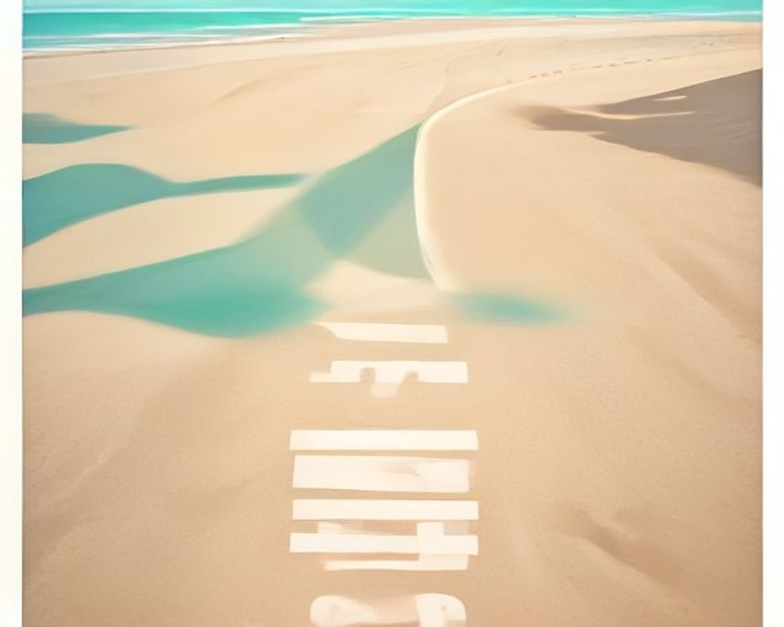

# 포항 러닝 코스

---

`러닝 코스 · 포항`

# 영일대 해변, 퇴근하고 나와 바로 뛰는 3.4km

백사장 옆 데크길에 조명이 잘 들어온다. 짧게 끊기 좋은 바다 코스.

`3.4km` `21분` `쉬움` `일출`

[**지도에서 출발점 열기**  →](https://map.kakao.com/?q=영일대)

### 어떤 길인지

영일대해수욕장 백사장 옆길에서 출발한다. 데크길과 자전거도로가 나란히 이어져 노면이 고르고 평탄하다. 700m가 채 되지 않는 지점에 영일대해상누각이 있어 초반부터 목표가 눈에 들어온다. 시내 한복판에 붙은 해변이라 퇴근하고 나와 그대로 신발만 갈아 신으면 되는 접근성이 강점이다.

영일대해상누각은 바다 위에 다리를 놓아 세운 정자다. 누각에 서면 영일만 건너편으로 제철소 불빛이 길게 늘어선다. 해가 진 뒤 이 방향으로 보이는 야경이 포항을 대표하는 장면으로 꼽힌다.

누각을 지나 1.6km 남짓 더 가면 환호공원이다. 언덕 위 공원이라 바다를 내려다보는 시야가 트이고, 공원 안에는 철제 트랙을 하늘로 감아올린 스페이스워크가 서 있다. 걸어 올라갈 수 있는 조형물이라 러닝을 마치고 들르는 사람이 많다.

해수욕장 구간만 왕복하면 약 3.4km, 송도 방향으로 연장하면 5km가 나온다. 고도차가 거의 없고 신호에 끊기는 지점도 적다. 야간 조명이 잘 갖춰져 있어 퇴근 후 러닝에 좋고, 짧게 끊어 자주 나오는 방식이 이 코스에 가장 잘 맞는다. 거리를 채우고 싶으면 왕복을 한 번 더 하면 된다.

해변 앞은 평탄하지만 행사와 관광객의 영향을 크게 받는다. 길게 뛰고 싶다면 환호공원 이후 해안 산책로를 연장하고, 강한 동해 바람이 불면 왕복 페이스를 같게 맞추지 않는다.

해가 기울 무렵이 가장 좋은 시간이다. 백사장 너머로 하늘색이 바뀌고 누각과 방파제에 불이 들어온다. 해변을 따라 카페와 식당이 붙어 있어 러닝 후 동선도 짧다. 다만 해풍이 강한 날은 같은 거리도 체감이 완전히 달라지니, 나서기 전에 바람 방향만 확인해 두면 된다.

### 더 알아두면 좋은 것

10km가 필요하면 포항항 여객선터미널에서 여남 방파제 끝까지 편도 5km, 왕복 10km 코스가 있다. 고저차가 거의 없어 기록 러닝에 유리하다.

동빈내항에서 송도해수욕장을 거쳐 포항운하까지 약 2.5km 구간은 차도와 분리돼 안전하다. 짧지만 도심 물길을 따라가는 결이 다른 코스라, 해변이 붐빌 때 대안으로 쓸 만하다.

형산강변은 10km에서 하프 거리로 철길숲과 연계된다. 바다 코스와 성격이 달라 장거리 세션을 붙이기에 낫고, 도심을 관통하는 구간이라 접근도 어렵지 않다.

환호공원 방면은 언덕이 섞인다. 평지 왕복이 지루해질 때 짧은 오르막 자극을 더하는 용도로 쓰면 되고, 공원 위에서 바다를 내려다보는 보상도 따라온다.

### 가기 전에 알아두면 좋아요

- 해풍이 강한 날은 체감이 크게 달라진다. 나갈 때 바람을 안고 시작하는 편이 낫다.
- 성수기 백사장 구간은 사람이 많다. 여름 저녁에는 자전거도로 쪽으로 붙어 달리자.
- 데크 구간은 비나 물보라에 젖으면 미끄럽다. 젖은 날에는 보폭을 줄이는 게 안전하다.
- 축제나 행사가 열리는 날에는 해변 동선이 통제될 수 있다. 우회 경로를 미리 봐 두자.
- 겨울 해변은 바람 탓에 기온보다 훨씬 춥게 느껴진다. 바람막이 한 겹을 더 챙기자.

### 지나는 곳

| | 장소 |
|---|---|
| — | **영일대해수욕장** — 출발점이 되는 백사장 옆길. 데크와 자전거도로가 나란히 나 있어 노면이 고르다. |
| — | **영일대해상누각** — 바다 위에 다리를 놓아 세운 정자. 영일만 건너편 제철소 불빛이 늘어서 야경 지점이 된다. |
| — | **환호공원** — 북쪽 반환점이 되는 언덕 위 공원. 바다를 내려다보는 시야가 트이고 스페이스워크 조형물이 서 있다. |
