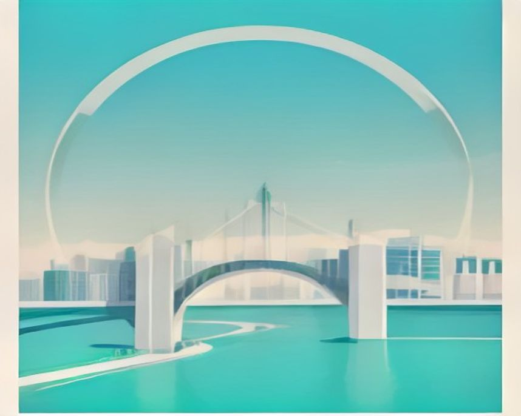

# 세종 러닝 코스

---

`러닝 코스 · 세종`

# 세종 이응다리, 금강 위에 놓인 원을 한 바퀴 도는 러닝

다리 자체가 순환 구조다. 호수공원과 묶으면 도심에서 코스가 완성된다.

`6.0km` `38분` `쉬움` `평지`

[**지도에서 출발점 열기**  →](https://map.kakao.com/?q=이응다리와)

### 어떤 길인지

세종의 러닝 지형은 단순하다. 세종호수공원과 금강보행교, 그리고 금강 자전거길. 이 셋을 어떻게 엮느냐가 전부다. 호수공원 둘레길에서 몸을 데운 뒤 남쪽으로 빠져 금강 둔치로 내려서면 3km 남짓 만에 이응다리 앞에 닿는다.

이응다리는 금강 위에 원형으로 놓인 보행 전용 다리다. 정식 이름은 금강보행교이고, 한글 자음 이응(ㅇ)을 닮은 생김새에서 별칭이 왔다. 한글을 만든 임금의 이름을 딴 도시답게 다리 모양부터 글자에서 가져온 셈이다. 위층은 보행자, 아래층은 자전거가 쓰는 복층 구조라 달리는 동안 자전거와 뒤엉킬 일이 적다.

다리 자체가 순환이라 짧게 도는 재미가 있고, 강 양안으로 빠져 금강 자전거길에 붙이면 거리를 얼마든지 늘릴 수 있다. 다리를 내려와 중앙공원 쪽으로 방향을 잡으면 3km쯤 뒤에 다시 호수공원으로 이어져 전체가 한 바퀴가 된다.

세종은 도시 자체가 최근에 계획된 곳이라 보행로 노면이 균일하고 신호 대기가 적다. 전 구간이 평지에 가깝고 턱이나 계단이 드물다. 호수공원은 평탄한 순환로에 폭도 넓어 첫 5K나 회복런에 맞고, 여럿이 나란히 달려도 부담이 없다.

이응다리는 보행과 자전거 동선이 층으로 나뉘어 있지만 주말에는 산책객이 많다. 호수공원에서 일정한 페이스를 가져가고 다리 구간은 풍경을 보는 연결로 쓰는 편이 자연스럽다.

해 질 무렵이 이 길의 시간이다. 금강 수면에 노을이 깔리고, 어두워지면 조명이 들어와 원의 윤곽이 그대로 드러난다. 다리 위에서는 강 양쪽으로 세종 신도심이 한눈에 잡힌다. 다리에서 중앙공원 잔디마당을 지나 국립세종수목원까지는 1.5km 남짓이라, 거리를 더 붙이고 싶을 때 그쪽으로 연장한다.

### 더 알아두면 좋은 것

거리를 늘리려면 금강 자전거길로 붙인다. 이응다리 양안에서 강을 따라 상류와 하류로 모두 이어져, 둔치를 타고 왕복 거리를 원하는 만큼 잡을 수 있다.

국립세종수목원은 중앙공원에서 1.5km 남짓이다. 코스를 연장할 때 반환점으로 쓰기 좋고, 러닝을 마친 뒤 걸어서 둘러보기에도 가까운 거리에 있다.

대전 갑천과 묶으면 충청권 이틀 런트립이 된다. 첫날 세종에서 짧게 회복런, 둘째 날 갑천에서 10km를 붙이는 식으로 나누면 이동 부담이 적다.

겨울에는 강바람이 정면으로 들어온다. 다리 구간을 코스 앞쪽에 배치하고 호수공원 안쪽으로 들어와 마무리하면 지친 후반부에 맞바람을 덜 맞게 된다.

### 가기 전에 알아두면 좋아요

- 다리 위는 바람이 강하게 통과한다. 얇은 바람막이 하나가 체감 차이를 만든다.
- 야간 조명이 예쁜 만큼 저녁에는 산책하는 사람이 많다. 주말 저녁에는 속도를 줄인다.
- 호수공원 순환로는 주말 낮에 가족 단위 이용객이 많다. 이른 아침이 한산하다.
- 늦은 시간에 다리를 넣을 계획이면 통행 시간을 미리 알아보고 가는 편이 안전하다.
- 금강 둔치 구간은 그늘이 적다. 한여름은 낮을 피하고 해 진 뒤로 옮기는 게 낫다.

### 지나는 곳

| | 장소 |
|---|---|
| — | **세종호수공원** — 출발점. 평탄한 호수 순환로에서 몸을 데운 뒤 금강 둔치로 내려서는 구성이 무난하다. |
| — | **금강보행교** — 이응다리. 금강 위에 원형으로 놓인 보행 전용교로, 한 바퀴 도는 것만으로 순환이 된다. |
| — | **세종중앙공원** — 다리에서 호수공원으로 되돌아오는 길목. 넓은 잔디마당이라 마무리 조깅과 정리운동에 쓴다. |
| — | **국립세종수목원** — 거리 확장 지점. 중앙공원에서 1.5km 남짓이라 6km가 짧게 느껴질 때 반환점으로 삼는다. |
