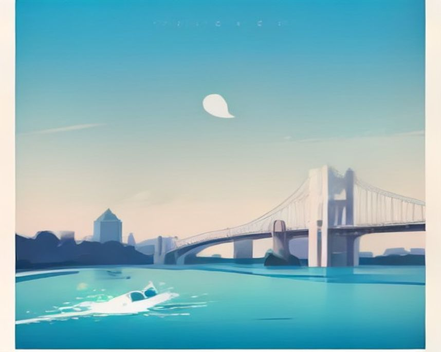
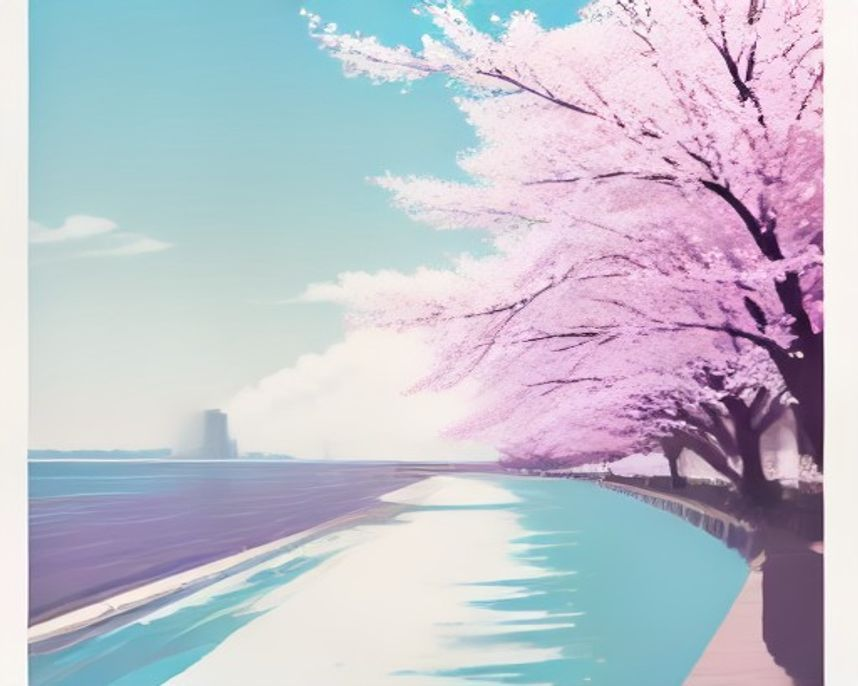
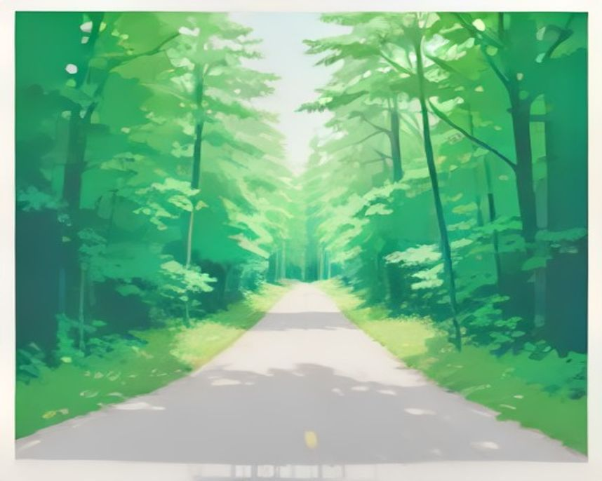
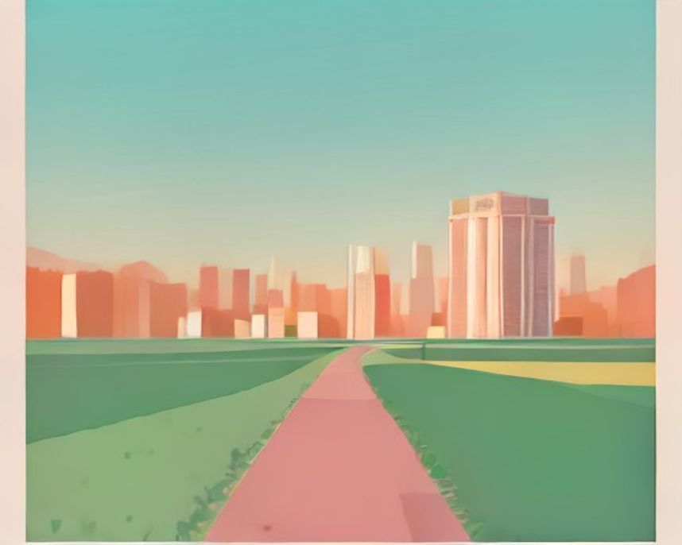
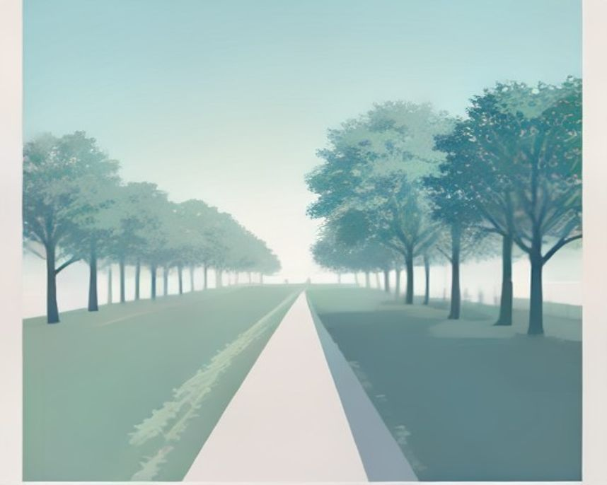

# 서울 러닝 코스

---

`러닝 코스 · 서울`

# 반포 한강공원, 분수가 켜지는 시간에 맞춰 달리는 밤

잠수교를 왕복하며 거리를 세고, 달빛무지개분수 앞에서 마무리하는 서울에서 가장 유명한 야간 러닝.

`10.0km` `58분` `보통` `야경`

[**지도에서 출발점 열기**  →](https://map.kakao.com/?q=반포)

### 어떤 길인지

서울 러너들이 성지라고 부르는 구간이다. 이유는 단순하다. 평지에 노면이 좋고, 거리를 세기 쉽고, 밤에 예쁘다. 이 세 가지가 한 곳에 다 있는 데가 생각보다 드물다.

거리를 세기 쉬운 건 잠수교 덕분이다. 편도가 약 1km라 다리를 몇 번 건넜는지만 세면 된다. 잠수교는 한강을 가로질러 달릴 수 있는 사실상 유일한 다리라, 남북을 오가며 코스를 짜는 재미도 있다.

10km를 채우려면 반포대교 북단에서 시작해 잠수교를 지나 한남대교까지 갔다 오면 된다. 이 라인에는 편의점 세 곳, 화장실 다섯 곳, 식수대가 걸려 있다.

4월부터 10월까지는 저녁마다 달빛무지개분수가 켜진다. 분수 시간을 마지막 바퀴에 맞춰두면 마무리가 훨씬 즐거워진다.

### 더 알아두면 좋은 것

거리를 더 늘리고 싶으면 반포에서 잠수교를 거쳐 뚝섬까지 최대 12km를 뽑을 수 있다. 여의도에서 청담까지 밀면 22km가 나온다.

다만 여의도를 빠져나가는 갈림길에서 잘못 들면 섬 가장자리를 계속 돌게 된다. 처음이라면 지도를 한 번 보고 가는 편이 낫다.

샤워는 반포에 없다. 여의도와 잠실 한강공원에 있다.

### 가기 전에 알아두면 좋아요

- 저녁에는 자전거와 산책하는 사람이 몰려 좁은 구간에서 페이스가 끊긴다. 기록을 재려면 평일 이른 아침이 낫다.
- 밤에는 반사 조끼나 불빛을 챙기는 게 좋다. 자전거길과 러닝길이 나뉘어 있지만 어두운 구간에서 자전거가 넘어오는 일이 있다.
- 한강변 곳곳에 아리수 급수대가 있어 물병을 들고 나가지 않아도 된다.

### 아직 확인 중인 것

- 구간별 화장실 정확한 위치
- 분수 운영 시간표

### 지나는 곳

| | 장소 |
|---|---|
|  | **세빛섬** — 야간 반환점. 조명이 가장 화려한 지점 |
|  | **반포 달빛광장** — 스트레칭·집합 장소 |
|  | **노들섬** — 코인라커 있음. 500원 동전 필요 |
|  | **잠수교** — 편도 1km. 거리 계산의 기준점 |

이미지는 한국관광공사 사진의 색을 참고해 직접 그린 것입니다 · 원본 반포한강공원

---

`러닝 코스 · 서울`

# 여의도 한강공원, 첫 5K를 여기서 끊는 이유

직선이 길고 오르내림이 없어 페이스만 보고 달릴 수 있는 코스. 서울 양대 마라톤의 출발선이기도 하다.

`5.0km` `30분` `쉬움` `평지`

[**지도에서 출발점 열기**  →](https://map.kakao.com/?q=여의도)

### 어떤 길인지

여의도의 장점은 지루함이다. 나쁜 뜻이 아니다. 직선이 길고 고저차가 거의 없어서, 달리는 내내 신경 쓸 게 페이스밖에 없다. 첫 5K를 도전하는 사람에게 이만한 조건이 없다.

평탄한 노면에 공간이 넓고, 달리면서 63빌딩과 국회의사당이 번갈아 보인다. 8km를 채우려면 여의도공원에서 출발해 마포대교와 원효대교를 지나 돌아오면 된다.

이 구간은 JTBC 서울마라톤과 동아일보 서울국제마라톤의 출발선이다. 대회를 준비 중이라면 실제 스타트 지점을 미리 밟아보는 것만으로도 당일 긴장이 줄어든다.

### 더 알아두면 좋은 것

여의나루역 안에 러너스테이션이 있다. 물품보관함과 탈의실, 파우더룸을 갖춰서 퇴근 후 곧장 뛰러 오기 좋다. 런플 앱으로 예약한다.

여의도 한강공원에는 샤워장이 있다. 서울에서 샤워까지 되는 한강공원은 여의도와 잠실뿐이다.

트랙이 필요하면 국회운동장과 안양천 신정교 트랙 340m가 가깝다.

### 가기 전에 알아두면 좋아요

- 벚꽃철 평일 저녁과 주말은 인터벌이 불가능하다고 보면 된다. 이 시기 여의도는 러닝길이 아니라 관광지가 된다.
- 4월에 훈련이 필요하면 이른 아침으로 옮기거나 안양천 쪽으로 빠지는 게 낫다.

### 아직 확인 중인 것

- 러너스테이션 운영 시간
- 샤워장 이용료

### 지나는 곳

| | 장소 |
|---|---|
|  | **여의도공원** — 8km 코스 출발점. 워밍업 구간 |
|  | **선유도공원** — 나무 그늘 산책로. 쿨다운 |
|  | **여의나루역 러너스테이션** — 물품보관·탈의·샤워 |
|  | **국회운동장 트랙** — 인터벌용 |

이미지는 한국관광공사 사진의 색을 참고해 직접 그린 것입니다 · 원본 여의도한강공원

---

`러닝 코스 · 서울`

# 남산 북측순환로, 서울에서 언덕을 배우는 6.6km

차가 안 들어오고 그늘이 이어지는 완만한 오르내림. 기록을 줄이려는 러너가 결국 오게 되는 곳.

`6.6km` `44분` `어려움` `업힐`

[**지도에서 출발점 열기**  →](https://map.kakao.com/?q=남산)

### 어떤 길인지

한강이 평지 훈련장이라면 남산은 언덕 훈련장이다. 명동역 3번 출구나 회현역 1번 출구에서 남산공원 입구로 올라가 북측순환로를 타고 팔각정이나 남산타워 아래까지 갔다가 돌아오는 게 기본이다. 편도 약 3.3km, 왕복 약 6.6km.

완만한 오르막과 내리막이 계속 반복되는 구조라, 평지에서만 뛰던 사람이 처음 오면 다리가 확실히 다르게 쓰인다. 대신 경사가 가파르지 않아 초·중급도 걷지 않고 완주할 만하다.

차량이 들어오지 않는다는 게 결정적이다. 신호 대기가 없으니 심박이 끊기지 않고, 노면도 좋다. 나무 그늘이 이어져 한여름에도 한강보다 낫다.

### 더 알아두면 좋은 것

국립극장에서 출발하면 약 7km가 된다.

짧은 업힐 반복만 필요하면 경복궁 돌담길이 대안이다. 경복궁역 4번 출구 바로 앞이고 차도가 없다. 2바퀴에 약 5.2km.

야간에는 고속터미널에서 서리풀공원과 우면산을 거쳐 사당역으로 빠지는 루트도 쓰인다.

### 가기 전에 알아두면 좋아요

- 그늘이 많아 여름에 유리하지만, 겨울 이른 아침에는 노면이 얼 수 있다.
- 관광객 동선과 겹치는 구간이 있어 주말 낮은 피하는 편이 낫다.

### 아직 확인 중인 것

- 구간별 경사도
- 겨울철 결빙 구간

### 지나는 곳

| | 장소 |
|---|---|
|  | **경복궁 돌담길** — 2바퀴 5.2km. 짧은 업힐 반복 |
|  | **청계천** — 도심 진입로. 성북천까지 이어진다 |
|  | **남산타워 아래** — 북측순환로 반환점 |
|  | **남산골한옥마을** — 러닝 후 걸어서 마무리 |

이미지는 한국관광공사 사진의 색을 참고해 직접 그린 것입니다 · 원본 남산공원(서울)

---

`러닝 코스 · 서울`

# 올림픽공원, 3.5km 순환에서 10km까지 늘려 쓰는 곳

안쪽만 돌면 3.5km, 바깥과 몽촌토성길까지 붙이면 10km. 그날 컨디션대로 길이를 정하는 코스.

`3.5km` `22분` `쉬움` `문화유산`

[**지도에서 출발점 열기**  →](https://map.kakao.com/?q=올림픽공원)

### 어떤 길인지

올림픽공원역 3번 출구로 나와 세계평화의 문으로 들어가면 바로 시작된다. 몽촌해자 산책길을 따라 몽촌토성 바깥을 도는 게 기본이고, 안쪽 순환만 약 3.5km다.

이 코스의 성격은 늘려 쓰기에 있다. 짧게 끝내려면 안쪽 한 바퀴, 더 뛰고 싶으면 바깥 루트와 몽촌토성길을 붙여 최대 10km까지 만든다. 공원 안이라 신호가 없고 24시간 열려 있다.

송파는 러닝 환경이 촘촘하다. 석촌호수는 한 바퀴 2.5km, 송파둘레길은 탄천 7.5km·한강 3.2km·성내천 6km·장지천 4.4km로 쪼개져 있어 원하는 거리를 골라 붙이면 된다.

### 더 알아두면 좋은 것

잠실 한강공원에 샤워장이 있어, 올림픽공원에서 뛰고 한강으로 빠져 씻고 돌아가는 동선이 된다.

잠실 한강 구간은 장거리와 기록 러닝에 좋다. 공원에서 워밍업하고 한강으로 나가 본 세션을 하는 구성이 흔하다.

### 가기 전에 알아두면 좋아요

- 석촌호수는 벚꽃철 주말 낮에 가면 안 된다. 서울에서 사람이 가장 몰리는 곳 중 하나다.
- 공원 내부는 자전거와 보행 동선이 섞이는 구간이 있다.

### 아직 확인 중인 것

- 몽촌토성길 정확한 거리
- 공원 내 급수대 위치

### 지나는 곳

| | 장소 |
|---|---|
|  | **석촌호수** — 1바퀴 2.5km. 거리 계산이 가장 쉽다 |
|  | **몽촌토성길** — 바깥 루트. 10km로 늘릴 때 붙인다 |
|  | **송파둘레길** — 탄천 7.5 / 한강 3.2 / 성내천 6 / 장지천 4.4km |
|  | **잠실 한강공원** — 샤워장 있음. 장거리 세션 |

이미지는 한국관광공사 사진의 색을 참고해 직접 그린 것입니다 · 원본 올림픽공원

---

`러닝 코스 · 서울`

# 뚝섬과 성수, 붉은 트랙을 따라 남산 노을까지

정비가 잘 된 평탄한 노면에 트랙 감성. 돌아오는 길에 남산 실루엣이 걸리는 저녁 코스.

`7.0km` `42분` `쉬움` `평지`

[**지도에서 출발점 열기**  →](https://map.kakao.com/?q=뚝섬)

### 어떤 길인지

뚝섬은 한강 구간 중에서도 노면이 좋기로 꼽힌다. 잠실대교에서 성수대교까지가 특히 잘 정비돼 있고 평탄해서, 트랙에서 도는 느낌으로 달릴 수 있다.

기본 루트는 뚝섬유원지역에서 출발해 자벌레를 지나 잠수교까지 갔다 오는 왕복 7km다. 자벌레 전망대와 요트장이 중간의 볼거리 역할을 한다.

성수 쪽에서 시작한다면 트리마제 앞 성덕정나들목으로 나가 잠실대교를 찍고 돌아오는 왕복 약 8km가 인기다. 45분에서 55분쯤 걸리고, 돌아오는 길에 남산이 보여 해질 무렵이 특히 좋다.

### 더 알아두면 좋은 것

서울숲은 서울숲역 3번 출구에서 바로 들어간다. 가을 단풍 터널 구간이 짧지만 인상적이다.

광진 방면으로 청담대교에서 성수대교까지 2.5km, 뚝섬유원지에서 성산대교까지 20km 구간이 있어 거리 확장이 자유롭다.

중랑천 동쪽 성수동 구간에 길이 생겨 청계천으로 돌지 않고 서울숲·한강 방향으로 바로 갈 수 있다.

### 가기 전에 알아두면 좋아요

- 주말에 자전거가 매우 많다. 한강 구간 중에서도 자전거 밀도가 높은 편이라 주말 낮 러닝은 권하지 않는다.

### 아직 확인 중인 것

- 자벌레 개방 시간
- 성덕정나들목 야간 조명

### 지나는 곳

| | 장소 |
|---|---|
|  | **서울숲** — 서울숲역 3번 출구 직결. 가을 단풍 터널 |
|  | **자벌레 전망대** — 7km 코스의 중간 지점 |
|  | **응봉산 팔각정** — 짧은 업힐. 야경 |
|  | **성수동 카페거리** — 러닝 후 마무리 |

이미지는 한국관광공사 사진의 색을 참고해 직접 그린 것입니다 · 원본 뚝섬한강공원

---

`러닝 코스 · 서울`

# 경의선숲길, 옛 철길 위를 달리는 도심 아침

홍대에서 연남까지 이어지는 폐선 부지. 낮엔 산책로지만 아침엔 온전히 러너의 길이 된다.

`4.6km` `28분` `쉬움` `평지`

[**지도에서 출발점 열기**  →](https://map.kakao.com/?q=경의선숲길)

### 어떤 길인지

옛 철길 자리에 만든 선형 공원이다. 홍제천 물소리가 붙는 구간이 있고, 봄 벚꽃철엔 서울에서 손꼽히는 풍경이 된다.

다만 조건이 하나 붙는다. 오전에 가야 한다. 저녁에는 산책하는 사람이 너무 많아 러닝이 사실상 어렵다. 홍대입구역 3번 출구로 나오면 바로 진입한다.

거리를 늘리려면 홍제천을 따라가거나 상암 쪽 하늘공원과 노을공원으로 붙이면 된다. 노을공원 4.5km는 언덕이 있어 마포권에서 업힐이 필요할 때 쓴다.

### 더 알아두면 좋은 것

하늘공원은 계단 구간이 길다. 뛰어서 올라갈 생각이라면 다리 상태를 보고 정하는 게 좋다.

마포권에서 평지 장거리가 필요하면 안양천 쪽이 낫다. 선유도공원·여의도공원과 연결된다.

### 가기 전에 알아두면 좋아요

- 저녁에는 산책 인구가 많아 러닝에 맞지 않는다. 이른 아침을 권한다.
- 벚꽃철 주말은 통행 자체가 느려진다.

### 아직 확인 중인 것

- 구간 전체 길이
- 야간 조명 범위

### 지나는 곳

| | 장소 |
|---|---|
|  | **하늘공원** — 억새밭. 계단 업힐 |
|  | **선유도공원** — 안양천·여의도와 연결 |
|  | **노을공원** — 4.5km 언덕 코스 |
|  | **홍제천** — 경의선숲길 연계 하천 |

이미지는 한국관광공사 사진의 색을 참고해 직접 그린 것입니다 · 원본 경의선숲길
