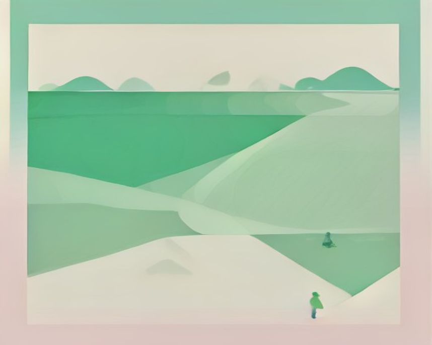

# 속초 러닝 코스

---

`러닝 코스 · 속초`

# 영랑호, 설악을 배경에 두고 도는 평지 순환로

사방이 트인 호수 둘레를 그대로 도는 코스. 페이스 유지가 쉬워 기록 감각을 잡기 좋다.

`7.7km` `46분` `쉬움` `풍경`

[**지도에서 출발점 열기**  →](https://map.kakao.com/?q=영랑호)

### 어떤 길인지

속초에서 러닝 얘기가 나오면 거의 영랑호로 수렴한다. 호수 둘레를 그대로 도는 평탄한 순환형으로, 달리는 내내 설악산 능선이 배경처럼 깔리고 맑은 날에는 울산바위의 바위 능선까지 수면 위로 또렷하게 잡힌다.

출발에서 약 3.6km, 순환로의 중간쯤에서 호수 위를 곧장 가로지르는 부교인 영랑호수윗길을 만난다. 짧게 끝내고 싶은 날은 여기로 건너 거리를 줄이면 되고, 그대로 물가를 따라가면 범바위와 영랑정을 지나 출발점으로 돌아온다. 부교 위에서는 물이 발밑에 바로 붙어, 호수 한가운데서 설악을 보는 각도가 나온다.

영랑호는 바다가 모래에 막히면서 생긴 석호다. 신라의 화랑 영랑이 이 호수의 경치에 반해 머물렀다는 이야기에서 이름이 왔다고 전해지고, 호숫가의 커다란 범바위와 정자 영랑정이 그 오랜 시간의 표지처럼 남아 있다.

전 구간이 평탄해 페이스가 흔들릴 일이 없다. 순환형이라 갈림길에서 헤맬 일도 없어, 시계만 보며 같은 리듬을 유지하는 기록 감각 훈련에 맞는다. 다만 그늘이 고르지 않아 한여름 낮보다는 아침저녁이 낫다.

해변 쪽 백사장·해맞이 구간은 약 2km로 짧다. 그 자체로는 러닝이 안 되지만 영랑호에 이어 붙이거나 쿨다운으로 쓰기에는 딱 맞는 길이다. 속초는 바다와 호수가 몇 백 미터 간격으로 붙어 있는 도시라, 호수 한 바퀴를 돌고 바다로 빠져 마무리하는 구성이 자연스럽게 나온다.

호숫가 대부분은 편하지만 범바위 쪽에서 리듬이 한 번 끊긴다. 기록주보다는 설악산 조망을 보며 한 바퀴 완주하는 여행 러닝으로 잡는 편이 맞다.

달리는 내내 수면과 설악이 함께 시야에 있어 풍경이 지루해질 틈이 적다. 뛰고 나서는 갯배를 타고 아바이마을로 건너가 밥을 먹는 동선이 짧다. 실향민들이 터를 잡아 만든 동네의 한 끼로 속초 런트립이 마무리된다.

### 더 알아두면 좋은 것

설악산 트레일런을 같이 계획한다면 영랑호는 전날 가볍게 뛰거나 다음 날 회복런으로 배치하는 게 몸에 낫다. 같은 날 둘 다는 무리다. 평지 순환로라 산에서 내려온 다리를 푸는 용도로 잘 맞는다.

거리 조절이 쉬운 코스다. 영랑호수윗길로 가로지르면 한 바퀴가 짧아지고, 해변 해맞이 구간 약 2km를 붙이면 10km 가까이로 늘어난다. 두 바퀴를 돌면 대회를 앞둔 장거리 훈련으로도 쓸 수 있다.

속초에는 영랑호와 청초호, 두 개의 석호가 있다. 러닝은 호수를 온전히 둘러 도는 영랑호 쪽이 낫고, 시가지와 붙은 청초호는 분위기가 사뭇 다르다. 두 호수를 다 둘러보면 속초라는 도시의 생김새가 읽힌다.

벚꽃 철에는 호수 둘레가 속초에서 손꼽히는 꽃길이 된다. 풍경이 좋아지는 만큼 인파도 늘어나는 시기라, 조용한 러닝이 목적이면 꽃철에는 이른 아침에 나가는 게 낫다.

### 가기 전에 알아두면 좋아요

- 호수 주변은 그늘이 고르지 않다. 한여름 낮은 피하고 아침이나 저녁에 나가는 게 좋다.
- 해변 구간으로 넘어갈 때 차도를 건너는 지점이 있다. 차량 흐름을 확인하고 건넌다.
- 부교 구간은 물 위 데크라 비 온 뒤나 이른 아침에 미끄러울 수 있다. 보폭을 줄이면 된다.
- 사방이 트인 호수라 바람을 막아 줄 것이 적다. 겨울에는 시내보다 체감온도가 낮다고 보면 된다.
- 산책 인파와 자전거가 섞이는 길이다. 폭이 좁아지는 구간에서는 한 줄로 달리는 게 안전하다.

### 지나는 곳

| | 장소 |
|---|---|
| — | **영랑호** — 출발점. 호수 둘레를 그대로 도는 순환로의 기점으로, 어느 방향으로 돌아도 다시 여기로 돌아온다. |
| — | **영랑호수윗길** — 출발 약 3.6km 지점, 호수 위를 곧장 가로지르는 부교. 거리를 줄이고 싶은 날 지름길이 된다. |
| — | **범바위** — 호숫가의 커다란 바위 조망 지점. 바위 주변에서 설악 능선과 호수가 한 화면에 들어온다. |
| — | **영랑정** — 호반의 정자. 출발점으로 돌아가기 전 마지막 표지로, 잠시 멈춰 호수를 되돌아보기 좋다. |
