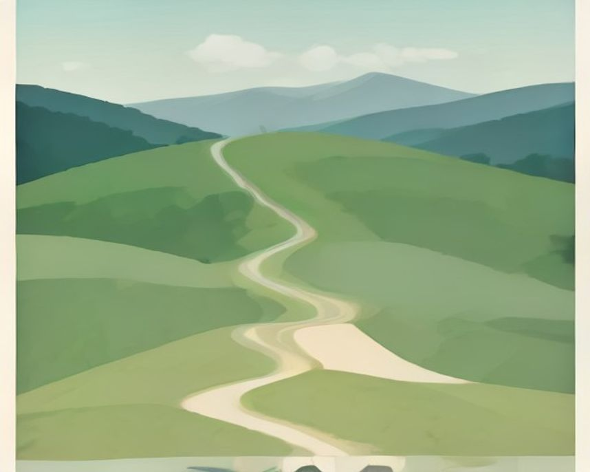

# 수원 러닝 코스

---

`러닝 코스 · 수원`

# 광교호수공원, 호수 두 개를 이어 7km를 만든다

원천호수 3km와 신대호수 3.5km를 순환보행로로 연결. 화장실 아홉 곳이 반경 1km 안에 있다.

`7.0km` `42분` `쉬움` `풍경`

[**지도에서 출발점 열기**  →](https://map.kakao.com/?q=광교호수공원)

### 어떤 길인지

호수가 두 개다. 원천호수 둘레 약 3km, 신대호수 둘레 약 3.5km. 둘을 잇는 순환보행로까지 쓰면 6.5~7km가 나온다. 하나만 돌 수도 있고 둘을 이을 수도 있으니 거리 조절이 자유롭다.

편의시설이 이 코스의 강점이다. 광교중앙역을 기점으로 한 11.3km 코스 기준으로 반경 1km 안에 화장실 9개, 식수대 1개, 쉼터 7개가 있다. 긴 거리를 돌면서 화장실 걱정을 안 해도 되는 코스는 흔치 않다.

입장료는 없고 연중무휴 상시 개방이다.

### 더 알아두면 좋은 것

주차는 공영주차장 유료다. 첫 1시간 무료, 이후 10분당 100원, 하루 최대 4,000원. 러닝 한 시간이면 무료로 끝난다.

수원역에서 버스 20~30분, 수원 시내에서 차로 5~15분이다.

거리를 더 원하면 수원화성 성곽길 5.7km로 넘어가는 조합이 좋다. 성격이 완전히 달라서 지루하지 않다.

### 가기 전에 알아두면 좋아요

- 주말 낮에는 산책 인파가 많다.
- 두 호수를 잇는 구간에서 방향을 놓치기 쉽다. 첫 방문이라면 한 호수만 도는 편이 낫다.

### 아직 확인 중인 것

- 연결 구간 정확한 거리
- 야간 조명 범위

### 지나는 곳

| | 장소 |
|---|---|
|  | **수원화성 성곽길** — 5.7km. 성곽 따라 도는 문화유산 코스 |
|  | **원천호수** — 둘레 약 3km |
|  | **신대호수** — 둘레 약 3.5km |
|  | **광교중앙역** — 11.3km 코스 기점 |

이미지는 한국관광공사 사진의 색을 참고해 직접 그린 것입니다 · 원본 광교호수공원

---

`러닝 코스 · 수원`

# 수원화성 성곽길, 성벽을 따라 도는 5.7km

세계유산 성곽을 한 바퀴. 오르내림이 섞여 평지 코스에 물렸을 때 좋다.

`5.7km` `36분` `보통` `문화유산`

[**지도에서 출발점 열기**  →](https://map.kakao.com/?q=수원화성)

### 어떤 길인지

화성 성곽을 따라 도는 5.7km 순환이다. 평지 하천 코스에 지겨워졌을 때 성격을 바꾸기 좋은 선택지다.

성곽길이라 노면이 일정하고 방향이 분명하다. 다만 팔달산 구간에서 오르내림이 붙어서 광교호수공원 같은 완전 평지와는 체감이 다르다.

문화유산 한복판을 달리는 경험 자체가 이 코스의 값어치다. 관광 동선과 겹치는 만큼 시간대 선택이 중요하다.

### 더 알아두면 좋은 것

같은 성곽 성격의 트레일로는 남한산성 둘레길이 있다. 거리와 고도가 한 단계 위다.

광교호수공원과 묶으면 하루에 평지와 언덕을 모두 소화할 수 있다.

### 가기 전에 알아두면 좋아요

- 낮에는 관광객이 많다. 이른 아침이 가장 한산하다.
- 계단과 성벽 옆 좁은 구간이 있어 속도를 내기 어려운 지점이 있다.

### 아직 확인 중인 것

- 누적 고도
- 야간 개방 여부

### 지나는 곳

| | 장소 |
|---|---|
|  | **광교호수공원** — 평지 코스로 전환 |
|  | **남한산성** — 한 단계 위의 성곽 트레일 |
|  | **팔달산 구간** — 성곽길에서 오르내림이 가장 큰 지점 |
|  | **행궁동** — 러닝 후 식사·카페 |

이미지는 한국관광공사 사진의 색을 참고해 직접 그린 것입니다 · 원본 수원화성
